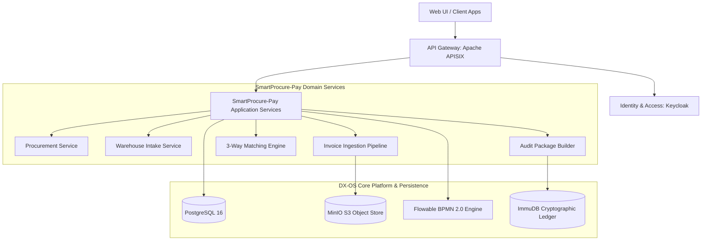

# SmartProcure Pay

> **Open-Source Smart Procure-to-Pay & 3-Way e-Invoice Reconciliation Platform**  
> *An open-core enterprise solution demonstrating digital transformation running on the DX-OS platform for the OLP Open Source Software Competition 2026.*

---

## 1. Overview

**SmartProcure Pay** is an open-source, intelligent Procure-to-Pay (P2P) platform designed to automate and safeguard the reconciliation of Purchase Orders (PO), Goods Receipt Notes (GRN), and electronic invoices (e-Invoices). 

SmartProcure Pay is engineered as an illustrative enterprise application operating atop the **DX-OS Open-Core** foundation. It replaces error-prone, fragmented, and manual verification routines with deterministic automated reconciliation, structured exception routing, and tamper-evident cryptographic audit trails.

### End-to-End Business Flow

```text
Purchase Order (PO)
       │
       ▼
Goods Receipt (GRN)
       │
       ▼
Invoice Ingestion (XML / PDF)
       │
       ▼
3-Way Matching Engine ──► [Discrepancy / Exception?] ──► Approval Workflow
       │                                                         │
       ├───────────────── [Passed / Resolved] ───────────────────┘
       ▼
Ready for Payment
       │
       ▼
Immutable Audit Sealing (ImmuDB)
```

---

## 2. Business Problem

Modern supply chain and financial operations face systemic bottlenecks and vulnerabilities in the invoice verification and payment settlement phase:

- **Manual Reconciliation Overhead**: Accounts payable departments spend thousands of hours cross-referencing paper or unstructured electronic invoices against procurement purchase orders and warehouse intake logs.
- **Invoice Fraud and Duplicate Billing**: Without automated multi-way validation, companies risk paying duplicate invoices, unauthorized rate increases, or phantom deliveries.
- **Siloed Stakeholder Workflows**: Purchasing agents (Buyers), warehouse receivers, accountants, and finance directors operate across disconnected systems without a shared source of operational truth.
- **Compliance & Audit Fragility**: Regulatory tax scrutiny (e.g., electronic invoice compliance) demands unalterable records. Traditional databases are susceptible to retroactive modifications or administrative tampering.

---

## 3. Proposed Solution

SmartProcure Pay delivers an enterprise-grade, open-source platform that unifies procurement, inventory receiving, and invoice settlement:

1. **Straight-Through Processing (STP) 3-Way Matching**: Deterministic, automated reconciliation validating Vendor Identity, Product Codes, Quantities, Unit Prices, Tax Rates, and Grand Totals across PO, GRN, and Invoice lines.
2. **Multi-Format e-Invoice Ingestion**: Support for standard electronic invoice formats (structured XML schemas according to tax standards) and document fallback (PDF/image uploads).
3. **Structured BPMN Exception Routing**: Automated isolation of discrepancies (quantity variances, price deviations, missing GRNs) into role-governed review workflows.
4. **Cryptographic Proof of Settlement**: Generation of deterministic cryptographic hash packages anchored to an immutable ledger for tamper-evident auditability.

---

## 4. DX-OS Architecture

SmartProcure Pay is built upon the **DX-OS Open-Core** architectural blueprint, separating core foundational infrastructure from domain business logic:



---

## 5. H-P-D-I Mapping

The system design aligns with the **Human - Process - Data - Intelligence (H-P-D-I)** framework *(all capabilities listed below represent planned roadmap features to be delivered across upcoming milestones)*:

| Dimension | Component & Responsibilities in SmartProcure-Pay *(Planned)* |
| :--- | :--- |
| **H (Human)** | - **Buyer**: Generates Purchase Orders and manages vendor communications.<br>- **Warehouse Staff**: Performs inventory intake and logs partial/damaged deliveries.<br>- **Accountant**: Ingests e-invoices, reviews reconciliation results, and schedules payments.<br>- **Finance Manager / CFO**: Authorizes high-value expenditures and resolves financial exceptions.<br>- **Admin**: Manages system configurations, tenant settings, and security governance.<br>- **Role-based digital workspace**: Dedicated, role-tailored operational dashboards and task queues. |
| **P (Process)** | - **Purchase Order workflow**: Authorizations, issuance, amendments, and fulfillment tracking.<br>- **Goods Receipt workflow**: Intake inspection, quantity verification, and inventory intake logging.<br>- **Deterministic 3-Way Matching**: Strict rule-based cross-validation across PO ↔ GRN ↔ Invoice lines.<br>- **Tolerance policies**: Configurable variance thresholds (e.g., fractional rounding, minor tax deviations).<br>- **Exception handling**: Automated isolation and escalation paths for mismatched invoices.<br>- **Approval workflow**: Multi-tier sign-off escalation based on department and monetary thresholds.<br>- **Payment blocking rules**: Automated quarantine preventing disbursement on disputed or unverified claims. |
| **D (Data)** | - **PO / GRN / Invoice structured data**: Relational domain models, line items, and lifecycle states.<br>- **Supplier data**: Vendor profiles, tax codes, bank details, and compliance metadata.<br>- **Match results**: Granular reconciliation records, discrepancy codes, and line-level flags.<br>- **Approval records**: Decision histories, electronic signatures, and approval timelines.<br>- **Audit trail**: Tamper-evident transaction logs, SHA-256 hashes, and ImmuDB receipts.<br>- **Analytics and reconciliation metrics**: STP rates, cycle times, variance statistics, and cash flow projections. |
| **I (Intelligence)** | - **OCR-assisted invoice extraction**: Automated text and tabular data extraction from scanned PDF/image invoices.<br>- **Semantic product matching using embeddings / AI**: Cross-referencing non-standard item descriptions between PO and Invoice.<br>- **AI confidence scoring**: Reliability ratings for fuzzy line-item pairing suggestions.<br>- **Intelligent anomaly/risk detection**: Flagging potential duplicate billing, pricing outliers, and fraud risks.<br>- **AI-assisted explanation of invoice mismatches**: Contextual root-cause explanations for complex reconciliation discrepancies.<br>- **Human-in-the-loop recommendations**: AI-driven resolution suggestions requiring human authorization. |

---

## 6. Planned Features: Status Breakdown

To ensure project transparency, system capabilities are explicitly categorized into currently implemented baseline foundation versus planned future milestones:

### Implemented (Phase 0 Baseline)
- [x] Monorepo workspace structure (`apps/`, `services/`, `packages/`, `infra/`, `database/`, `docs/`).
- [x] Strict Git branching model (`main`, `develop`, `feature/*`, `fix/*`, `docs/*`).
- [x] Open-source licensing compliance and verified dependency inventory.
- [x] Initial Docker Compose environment and networking skeleton.
- [x] Ten foundational project backlog issues created and tracked on GitHub.

### Planned (Subsequent Implementation Phases)
- [ ] **Domain Schema**: Relational database migration scripts for PO, GRN, Invoice, and Matching entities (*Planned - Issue #2*).
- [ ] **Identity & RBAC**: Keycloak OIDC integration with role definitions (*Planned - Issue #3*).
- [ ] **API Gateway**: Apache APISIX reverse proxy, rate limiting, and CORS (*Planned - Issue #4*).
- [ ] **Purchase Order Service**: Full lifecycle PO management and validation (*Planned - Issue #5*).
- [ ] **Goods Receipt Service**: Receiving intake and partial shipment tracking (*Planned - Issue #6*).
- [ ] **Invoice Ingestion Pipeline**: XML parsing, PDF upload, and MinIO storage (*Planned - Issue #7*).
- [ ] **3-Way Matching Engine**: High-performance multi-attribute reconciliation (*Planned - Issue #8*).
- [ ] **Exception Workflow**: Flowable BPMN discrepancy review and approvals (*Planned - Issue #9*).
- [ ] **Immutable Audit Sealing**: Cryptographic package hashing and ImmuDB integration (*Planned - Issue #10*).
- [ ] **Business Dashboard**: Unified web analytics UI for procurement and finance (*Planned - Phase 6*).

---

## 7. Technology Stack

All external open-source platforms and planned framework components are listed with verified licenses:

| Layer | Technology | Version | License | Role |
| :--- | :--- | :--- | :--- | :--- |
| **Gateway** | [Apache APISIX](https://apisix.apache.org/) | `3.9.x` | Apache-2.0 | API Gateway & Traffic Policy Controller |
| **Auth** | [Keycloak](https://www.keycloak.org/) | `24.0.x` | Apache-2.0 | Identity Provider, SSO, and RBAC |
| **Database** | [PostgreSQL](https://www.postgresql.org/) | `16-alpine` | PostgreSQL License | Primary Relational Transactional Database |
| **Object Store** | [MinIO](https://min.io/) | `RELEASE.2024-03-30` | GNU AGPLv3 | S3-Compatible Storage for Invoices |
| **BPMN Engine** | [Flowable](https://www.flowable.com/open-source/) | `6.8.x` | Apache-2.0 | Business Process & Exception Workflow Engine |
| **Ledger** | [ImmuDB](https://immudb.io/) | `v1.9.x` | Apache-2.0 | Cryptographically Verifiable Immutable Ledger |
| **Monitoring** | [Prometheus](https://prometheus.io/) | `v2.51.x` | Apache-2.0 | Telemetry & Performance Metrics |
| **Dashboard** | [Grafana](https://grafana.com/) | `10.4.x` | GNU AGPLv3 | Observability & Metrics Visualization |
| **Frontend UI** | [React](https://react.dev/) *(Planned)* | `18.x / 19.x` | MIT | Web User Interface |
| **Backend API** | [NestJS](https://nestjs.com/) *(Planned)* | `10.x` | MIT | Backend Application Framework |

For complete licensing details and integration classifications, refer to [OPEN_SOURCE_COMPONENTS.md](file:///d:/dự%20án%20đi%20thi/OPEN_SOURCE_COMPONENTS.md).

---

## 8. Project Structure

```text
SmartProcure-Pay/
├── apps/                         # User-facing applications
│   ├── web/                      # Web frontend client
│   └── api/                      # Main API gateway service
├── services/                     # Domain-specific backend microservices
├── packages/                     # Reusable monorepo shared packages
│   ├── contracts/                # API contracts, DTOs & OpenAPI definitions
│   ├── shared-types/             # TypeScript domain types & interfaces
│   └── shared-utils/             # Cryptographic helpers, formatters, loggers
├── infra/                        # Infrastructure-as-code & service configs
│   ├── keycloak/                 # Realm configurations & theme definitions
│   ├── apisix/                   # Gateway routes, plugins & upstream config
│   ├── postgres/                 # Database initialization scripts
│   ├── minio/                    # Bucket policies & life-cycle rules
│   ├── flowable/                 # BPMN 2.0 XML process definitions
│   ├── immudb/                   # Ledger configuration & key management
│   └── monitoring/               # Prometheus targets & Grafana dashboards
├── database/                     # Database evolution scripts
│   ├── migrations/               # DDL schema migration files
│   └── seed/                     # Seed datasets for development & testing
├── docs/                         # Technical and business documentation
│   ├── architecture/             # DX-OS design, C4 models & diagrams
│   ├── business/                 # Business logic, P2P specifications
│   ├── api/                      # OpenAPI specifications & endpoints
│   ├── workflow/                 # BPMN exception handling diagrams
│   ├── security/                 # Security threat models & RBAC matrix
│   ├── open-source/              # License compliance & governance policies
│   ├── project/                  # Initial issue backlog specifications
│   └── demo/                     # Demonstration scripts and scenarios
├── README.md                     # Main project documentation
├── LICENSE                       # MIT License
├── CHANGELOG.md                  # Semantic change log
├── CONTRIBUTING.md               # Contribution workflow and guidelines
├── OPEN_SOURCE_COMPONENTS.md     # Third-party OSS inventory and licenses
├── OUR_CONTRIBUTIONS.md          # Architectural attribution & team contributions
├── .gitignore                    # Git untracked file patterns
├── .env.example                  # Environment variable configuration template
└── docker-compose.yml            # Phase 0 container orchestration skeleton
```

---

## 9. Development Workflow

We enforce an issue-driven, peer-reviewed development methodology:

1. **Branch Conventions**:
   - `main`: Production / release / demo stable branch.
   - `develop`: Primary integration branch.
   - `feature/<issue-number>-<short-name>`: New feature implementations.
   - `fix/<issue-number>-<short-name>`: Bug fixes.
   - `docs/<issue-number>-<short-name>`: Documentation additions.
2. **Commit Standard**: Conventional Commits format (`feat(procurement): implement PO creation`).
3. **Pull Requests**: Pull Requests must target `develop` and link issues via `Closes #<issue>`.

Detailed guidelines are documented in [CONTRIBUTING.md](file:///d:/dự%20án%20đi%20thi/CONTRIBUTING.md).

---

## 10. Quick Start (Phase 0 Baseline)

### Prerequisites
- [Git](https://git-scm.com/) (>= 2.40)
- [Node.js](https://nodejs.org/) (>= 20.x LTS)
- [Docker](https://www.docker.com/) & Docker Compose (optional for Phase 0 verification)

### Setup Instructions

1. **Clone the repository**:
   ```bash
   git clone https://github.com/hieunofun/SmartProcure-Pay.git
   cd SmartProcure-Pay
   ```

2. **Switch to integration branch**:
   ```bash
   git checkout develop
   ```

3. **Configure environment variables**:
   ```bash
   cp .env.example .env
   # Edit .env with local configuration parameters
   ```

4. **Inspect infrastructure skeleton**:
   ```bash
   # Verify docker-compose skeleton syntax
   docker compose config
   ```

*(Note: Business logic, web UI, and backend services will be deployed in subsequent milestones according to the project roadmap).*

---

## 11. Open Source & Licensing

- **Original Code**: Code developed by the SmartProcure-Pay team is licensed under the [MIT License](file:///d:/dự%20án%20đi%20thi/LICENSE).
- **Third-Party Open Source**: Upstream components (Keycloak, APISIX, PostgreSQL, MinIO, Flowable, ImmuDB, Prometheus, Grafana) are utilized under their respective open-source licenses.
- **Compliance Policy**: Full open-source governance and compliance rules are defined in [LICENSE_POLICY.md](file:///d:/dự%20án%20đi%20thi/docs/open-source/LICENSE_POLICY.md).

---

## 12. Roadmap

```text
┌──────────────┐     ┌──────────────┐     ┌──────────────┐     ┌──────────────┐
│   Phase 0    │ ──► │   Phase 1    │ ──► │   Phase 2    │ ──► │   Phase 3    │
│  Bootstrap   │     │ Domain Schema│     │ Gateway/Auth │     │ P2P Services │
└──────────────┘     └──────────────┘     └──────────────┘     └──────────────┘
                                                                       │
┌──────────────┐     ┌──────────────┐     ┌──────────────┐             │
│   Phase 6    │ ◄── │   Phase 5    │ ◄── │   Phase 4    │ ◄───────────┘
│ UI & OLP Demo│     │ ImmuDB Audit │     │ 3-Way Engine │
└──────────────┘     └──────────────┘     └──────────────┘
```

- **Phase 0 (Current)**: Monorepo layout, Git branching workflow, Open-source documentation, Initial 10 backlog issues.
- **Phase 1**: Database domain schema design and migrations (Issue #2).
- **Phase 2**: Identity and API Gateway integration (Keycloak & Apache APISIX) (Issues #3, #4).
- **Phase 3**: Procurement, Warehouse, and Invoice ingestion pipelines (Issues #5, #6, #7).
- **Phase 4**: Deterministic 3-Way Matching Engine & Flowable BPMN approval workflow (Issues #8, #9).
- **Phase 5**: ImmuDB tamper-evident audit package sealing & verification endpoint (Issue #10).
- **Phase 6**: Web analytics dashboard, end-to-end integration testing, and OLP competition submission.

---

## 13. Team & Contributors

- **Project Lead & Architecture**: SmartProcure-Pay Development Team
- **Competition**: Vietnam National Olympiad in Informatics (OLP) - Open Source Software Category 2026
- **Repository**: [https://github.com/hieunofun/SmartProcure-Pay](https://github.com/hieunofun/SmartProcure-Pay)