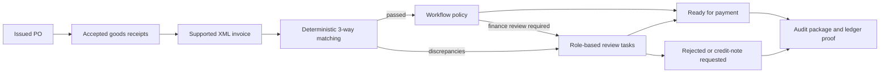

# SmartProcure Pay

Procure-to-Pay and three-way invoice reconciliation for the OLP PMNM 2026 DX-OS Open-Core topic.

SmartProcure replaces manual PO / GRN / invoice comparison with deterministic matching, role-based exception handling and verifiable audit evidence. The application code is MIT-licensed. The integrated ImmuDB 1.11.0 server/client uses **BUSL-1.1 source-available licensing**, with a scoped repository exception; competition eligibility remains an open delivery gate. See [component provenance](OPEN_SOURCE_COMPONENTS.md) and [license policy](docs/open-source/LICENSE_POLICY.md).

## Current implementation

The implementation baseline was verified on **7 October 2026** at `develop@42dd7a3`. The first ten backend/foundation issues have merged. The business UI, semantic AI and OCR are follow-up work; a closed initial backlog does not mean the whole proposed product is complete.

Clone **develop** for the current implementation. `main` still contains the initial repository snapshot and has no tagged demo release.

| Capability | Implemented behavior | Evidence |
| --- | --- | --- |
| Application foundation | React/Vite web, modular NestJS API, npm workspaces, Docker, CI | [#1](https://github.com/hieunofun/SmartProcure-Pay/issues/1) / [PR #11](https://github.com/hieunofun/SmartProcure-Pay/pull/11) |
| Structured data | PostgreSQL migrations 001-014, constraints, indexes and reference seed | [#2](https://github.com/hieunofun/SmartProcure-Pay/issues/2) / [PR #12](https://github.com/hieunofun/SmartProcure-Pay/pull/12) |
| Identity and access | Keycloak OIDC/PKCE, independently verified JWTs and role guards | [#3](https://github.com/hieunofun/SmartProcure-Pay/issues/3) / [PR #13](https://github.com/hieunofun/SmartProcure-Pay/pull/13) |
| API gateway | APISIX routing, authentication checks, CORS and rate limits | [#4](https://github.com/hieunofun/SmartProcure-Pay/issues/4) / [PR #14](https://github.com/hieunofun/SmartProcure-Pay/pull/14) |
| Procurement | PO creation, draft editing, issuance, cancellation and optimistic locking | [#5](https://github.com/hieunofun/SmartProcure-Pay/issues/5) / [PR #15](https://github.com/hieunofun/SmartProcure-Pay/pull/15) |
| Receiving | GRN lifecycle, accepted/rejected quantities and cumulative fulfillment | [#6](https://github.com/hieunofun/SmartProcure-Pay/issues/6) / [PR #16](https://github.com/hieunofun/SmartProcure-Pay/pull/16) |
| Invoice ingestion | Supported XML adapters, private MinIO archival, checksums and duplicate checks | [#7](https://github.com/hieunofun/SmartProcure-Pay/issues/7) / [PR #17](https://github.com/hieunofun/SmartProcure-Pay/pull/17) |
| Three-way matching | Deterministic item resolution; quantity, price, tax, currency and total rules | [#8](https://github.com/hieunofun/SmartProcure-Pay/issues/8) / [PR #18](https://github.com/hieunofun/SmartProcure-Pay/pull/18) |
| Workflow | Flowable BPMN, straight-through processing, role tasks and durable recovery | [#9](https://github.com/hieunofun/SmartProcure-Pay/issues/9) / [PR #19](https://github.com/hieunofun/SmartProcure-Pay/pull/19) |
| Audit | Canonical packages, Merkle hashes, native ledger proof validation, JSON/PDF export | [#10](https://github.com/hieunofun/SmartProcure-Pay/issues/10) / [PR #20](https://github.com/hieunofun/SmartProcure-Pay/pull/20) |

### Remaining product scope

- **Business UI:** the current web app demonstrates login, RBAC and API diagnostics; PO/GRN/invoice/task/audit workspaces are not implemented yet.
- **OCR:** PDF bytes are archived, but PDF-only ingestion returns `OCR_REQUIRED / NOT_CONFIGURED`. No text extraction or image-upload support is claimed.
- **Semantic AI:** item matching uses existing references, normalized SKU or normalized description equality. Different product names are not resolved with embeddings; confidence fields remain NULL.
- **Invoice trust:** supported XML parsing does not verify signatures, certificate trust or tax-authority authenticity. Seller tax ID is compared with the PO supplier; there is no external tax-risk lookup.
- **Finance:** `READY_FOR_PAYMENT` means workflow clearance. Bank transfers, payment orders, automatic vendor messages and CFO PKI signatures are not implemented.
- **Operations:** multi-tenancy, lakehouse/BI, a full monitoring deployment and a validated ten-year retention/recovery policy are future work.

## Business flow and boundaries



Accepted GRN quantities, prior trusted invoices and historical matching policy determine available quantity and discrepancies. Matching does not itself authorize payment. Clean invoices use STP by default; the clean-invoice cap and exception finance threshold are separate workflow policies. The default STP cap is NULL, so the exception finance threshold alone does not require CFO review of every large clean invoice.

Audit seals finalized evidence and detects later changes; hashing is not encryption or a legal digital signature. Ledger proofs require continuity of the verifier's persisted trust state. See the [workflow specification](docs/business/INVOICE_WORKFLOW_MODULE.md) and [audit specification](docs/business/IMMUTABLE_AUDIT_MODULE.md).

## DX-OS architecture

The mandatory headless foundations are integrated: **Identity/SSO, API Gateway, structured/object data and Workflow**. They expose services to the application layer; operators may use upstream administration consoles, while business user interfaces belong in the application.

The domain backend is one modular NestJS application, not a fleet of separately deployed procurement microservices. [DX-OS architecture and H-P-D-I mapping](docs/architecture/DX_OS_OVERVIEW.md) describe each component and its reuse boundary.

| Layer | Current components | Responsibility |
| --- | --- | --- |
| Core services | Keycloak, APISIX, PostgreSQL, MinIO, Flowable, ImmuDB/native verifier | Identity, traffic policy, persistence, process execution and audit proof |
| H-P-D-I workspace | React web, role guards, domain APIs | Current login/role demonstration; operational workspaces follow in the next backlog |
| Procurement application | PO, GRN, invoice, matching, workflow and audit modules | Procure-to-Pay business rules above the generic foundations |

## Technology and licensing

| Component | Integrated version | License / status |
| --- | --- | --- |
| Keycloak | 24.0.5 | Apache-2.0 |
| Apache APISIX | 3.19.0 | Apache-2.0 |
| PostgreSQL | 16-alpine | PostgreSQL License |
| MinIO | RELEASE.2025-10-15T17-29-55Z | AGPL-3.0; built from pinned unmodified upstream source |
| Flowable REST | 8.0.0, pinned image digest | Apache-2.0 |
| ImmuDB server and Go client | 1.11.0, pinned image/client | BUSL-1.1; future Change License Apache-2.0 |
| React / Vite / NestJS | Locked by package-lock.json | MIT |
| TypeScript | Locked by package-lock.json | Apache-2.0 |
| Prometheus / Grafana | Planned deployment | APISIX exports metrics; no complete monitoring stack is claimed |

[OPEN_SOURCE_COMPONENTS.md](OPEN_SOURCE_COMPONENTS.md) is the version/license inventory. [OUR_CONTRIBUTIONS.md](OUR_CONTRIBUTIONS.md) separates original application work from reused software. Internal authorization of the BUSL component is not organizer acceptance.

## Run from source

### Prerequisites

Git, Docker Engine/Desktop with Compose v2, and available local ports. Install Node.js >=20 and npm >=10 for host builds and tests. The root `.env` is consumed by Docker Compose; host API code reads process environment variables directly.

```bash
git clone --branch develop https://github.com/hieunofun/SmartProcure-Pay.git
cd SmartProcure-Pay
cp .env.example .env
```

PowerShell: use `Copy-Item .env.example .env` for the copy command. The example credentials are public local-demo values and must be replaced for any deployment.

### Docker runtime

```bash
docker compose config --quiet
docker compose up --build -d --wait --wait-timeout 240
docker compose exec -T smartprocure-api node infra/workflow/bootstrap-flowable.cjs
docker compose exec -T smartprocure-api node infra/audit/bootstrap-immudb.cjs
docker compose ps
```

The Flowable bootstrap checks and deploys the BPMN resource idempotently. The ledger bootstrap creates/checks the exact schema and proof service; it does not manufacture business seals. First builds include Go-based MinIO/verifier images and may take several minutes.

| Entry point | Default URL / purpose |
| --- | --- |
| **Application through APISIX** | **http://localhost:9080** |
| Public API health through gateway | http://localhost:9080/api/health |
| Keycloak realm | http://localhost:8080/realms/smartprocure |
| Direct API health | http://localhost:4000/health |
| Swagger, when ENABLE_SWAGGER=true | http://localhost:4000/docs |
| MinIO operator console | http://localhost:9001 |

Port 3000 in the Docker stack serves static web files directly. With the default relative `/api` URL, use port 9080 for working API routing. Host Vite development on port 3000 has its own `/api` proxy to APISIX.

The imported realm provides `admin.demo`, `buyer.demo`, `warehouse.demo`, `accountant.demo` and `finance.demo` with the local-demo password `DemoPassword123!`. Browser login uses Authorization Code + PKCE; the `smartprocure-ci` password-grant client is for DEV/CI validation only.

### Reference data

Migrations are applied when the primary PostgreSQL volume is first initialized. Existing volumes do not automatically receive new SQL migrations. Apply pending migrations deliberately; do not delete volumes to upgrade data.

The reference seed is a database illustration: PO 100 units, accepted GRNs 98, a previous invoice for 60 and a candidate for the remaining 38. It is not a complete ingestion/matching/workflow demo, and its historical invoice states must not be presented as completed live API processing.

Bash:

```bash
docker compose exec -T smartprocure-postgres sh -c 'psql -v ON_ERROR_STOP=1 -U "$POSTGRES_USER" -d "$POSTGRES_DB"' < database/seed/001_seed_scenario.sql
```

PowerShell:

```powershell
Get-Content -Raw database/seed/001_seed_scenario.sql | docker compose exec -T smartprocure-postgres sh -c 'psql -v ON_ERROR_STOP=1 -U "$POSTGRES_USER" -d "$POSTGRES_DB"'
```

Stop the local services with `docker compose down`. Persistent volumes are retained.

## Validation

```bash
npm ci
npm run build
npm run lint
npm test
npm run test:e2e --workspace=apps/api -- --runInBand
```

At baseline `42dd7a3`, local build/lint passed with **445 unit tests in 27 suites** and **204 HTTP E2E tests in 8 suites**. HTTP tests use mocks for external orchestration/persistence dependencies; they are not proof of a full live stack.

[Baseline CI run 37591846165](https://github.com/hieunofun/SmartProcure-Pay/actions/runs/37591846165) passed Docker, schema, Keycloak, APISIX, PO, GRN, MinIO/ingestion, matching, Flowable and real ledger proof/recovery validation. Matching coverage is measured for the pure matching domain, not for the entire repository. [.github/workflows/ci.yml](.github/workflows/ci.yml) contains the reproducible acceptance sequence; its fault/tamper probes require a disposable test stack.

## Documentation and delivery

- [DX-OS architecture](docs/architecture/DX_OS_OVERVIEW.md)
- [Next delivery backlog and team allocation](docs/project/MVP_ROADMAP.md)
- [Historical initial issue specifications](docs/project/INITIAL_ISSUES.md)
- [PO](docs/business/PURCHASE_ORDER_MODULE.md), [GRN](docs/business/GOODS_RECEIPT_MODULE.md), [ingestion](docs/business/INVOICE_INGESTION_MODULE.md), [matching](docs/business/THREE_WAY_MATCHING_MODULE.md), [workflow](docs/business/INVOICE_WORKFLOW_MODULE.md), [audit](docs/business/IMMUTABLE_AUDIT_MODULE.md)
- [Identity/RBAC](docs/security/IDENTITY_AND_RBAC.md) and [gateway](docs/architecture/API_GATEWAY.md)
- [Changelog](CHANGELOG.md) and [contribution process](CONTRIBUTING.md)

Confirmed team accounts: [huybitvvt](https://github.com/huybitvvt) and [hieunofun](https://github.com/hieunofun). The third member is pending. Working allocation: huybitvvt owns documentation/frontend/release preparation; hieunofun owns backend/AI/ledger work. Unassigned OCR/data/demo tasks remain available for the third member.

Use the `issue -> branch -> tests -> PR -> peer review` lifecycle. Current work targets `develop`; reviewed demo releases belong on `main` with a real version tag. No released version is claimed by the current Unreleased changelog.
