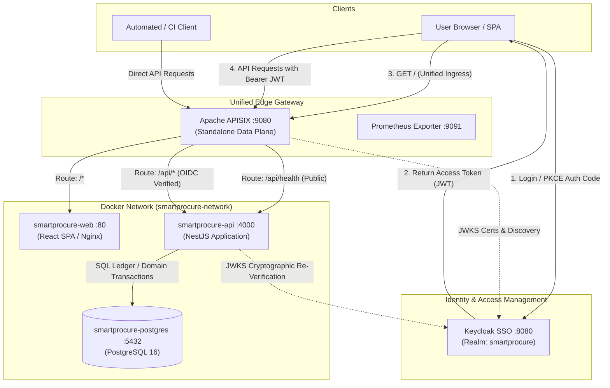
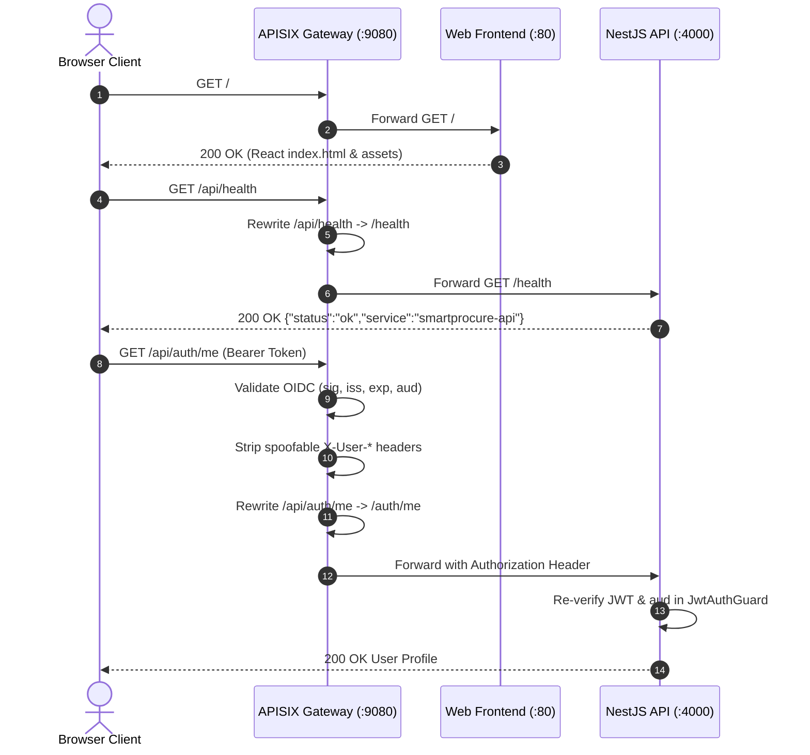
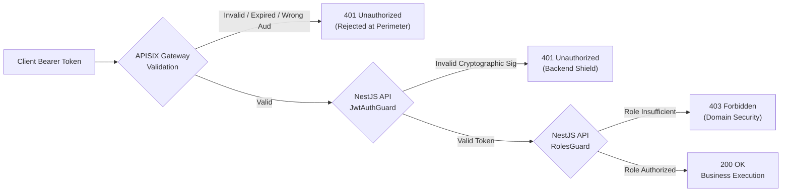

# API Gateway Architecture & Apache APISIX Integration

This document defines the architecture, design choices, routing policies, security boundaries, and operational considerations for the **Apache APISIX API Gateway** integrated into **SmartProcure-Pay** (GitHub Issue #4).

---

## 1. Architectural Role & Context

In the SmartProcure-Pay platform, **Apache APISIX** serves as the **unified edge entry point** (`:9080`) for all external browser and programmatic API clients. It decouples client-facing ingress traffic from internal microservices, enforcing edge security policies, authentication pre-checks, rate limiting, and cross-origin resource sharing (CORS).

---

## 2. Upstream Selection & Version Decision

### Version Evaluation
- **Selected Version**: `apache/apisix:3.19.0-debian`
- **Release Date**: September 28, 2026
- **License**: Apache-2.0
- **Rationale**:
  1. **Security Vulnerability Remediations**: The 3.19.0 release remediates a critical Denial of Service (DoS) memory exhaustion vulnerability present in prior releases when parsing malformed batch requests.
  2. **Enhanced Claim Validation**: Version 3.19.0 introduces robust `claim_validator.audience` enforcement with `match_with_client_id: true`, providing native rejection of audience-mismatched JWTs without custom Lua scripting.
  3. **Official Docker Debian Support**: Multi-architecture Debian-based container images are actively maintained and tested upstream.
  4. **Strict Rejection of `:latest`**: Pinned to the exact release string (`3.19.0-debian`) to ensure build determinism and supply-chain reproducibility.

---

## 3. Deployment Mode: Standalone Data Plane vs. etcd

### Decision
SmartProcure-Pay deploys Apache APISIX in **Standalone Mode** (`deployment.role: data_plane`, `config_provider: yaml`).

### Rationale
| Criteria | Standalone Mode (Selected) | Traditional etcd Mode |
| :--- | :--- | :--- |
| **Git as Source of Truth** | All routes, upstreams, and plugins reside directly in Git (`infra/apisix/apisix.yaml`). | Routes are stored in etcd key-value store, requiring state synchronization. |
| **Infrastructure Overhead** | Zero additional containers; APISIX runs independently. | Requires deploying and maintaining a dedicated etcd cluster (3 containers in HA). |
| **CI / Local Reproducibility** | Starts deterministically in < 2 seconds in GitHub Actions and local developer machines. | Susceptible to etcd leader election delays, volume persistence quirks, and port contention. |
| **Attack Surface** | No public or internal Admin API exposed. Configuration is immutable inside read-only mounts. | Exposes Admin API on port 9180 requiring secret management and network isolation. |
| **Hot Reloading** | APISIX worker processes watch `apisix.yaml` and hot-reload changes on file modification. | Dynamic updates pushed via HTTP PUT/POST to Admin API. |

---

## 4. Routing Strategy & Path Rewriting

APISIX provides a clean same-origin model for the web application:
- The React application is served on root `/*`.
- All backend endpoints are exposed under `/api/*`.

### Route Table

| Route ID | Matching URI | Priority | Target Upstream | Plugins | Access Level |
| :--- | :--- | :--- | :--- | :--- | :--- |
| `rate-limit-test` | `/api/rate-limit-test` | `20` | `smartprocure-api:4000/health` | `proxy-rewrite`, `cors`, `limit-count` (5/10s), `prometheus` | Public Test |
| `public-api-health` | `/api/health` | `10` | `smartprocure-api:4000/health` | `proxy-rewrite`, `cors`, `limit-count` (100/60s), `prometheus` | Public |
| `protected-api` | `/api/*` | `5` | `smartprocure-api:4000/*` | `proxy-rewrite`, `openid-connect`, `cors`, `limit-count`, `prometheus` | Bearer Token Required |
| `public-web` | `/*` | `0` | `smartprocure-web:80` | None | Public Web |

---

## 5. Defense-in-Depth Authentication Flow

A fundamental design requirement of SmartProcure-Pay is **Defense in Depth**:

### Dual Cryptographic Verification
1. **APISIX Gateway Layer (`openid-connect` plugin)**:
   - Validates RS256 signature using public keys fetched from Keycloak JWKS endpoint (`/protocol/openid-connect/certs`).
   - Validates standard claims: issuer (`iss` validated against trusted `claim_validator.issuer.valid_issuers`), expiration (`exp`), not-before (`nbf`).
   - Validates audience (`claim_validator.audience.required: true`, `match_with_client_id: true` matching `smartprocure-api`).
   - Rejects unauthenticated or invalid tokens immediately (`401 Unauthorized`), preventing unauthorized traffic from loading backend application workers.
2. **NestJS Application Layer (`JwtAuthGuard` & `AuthService`)**:
   - NestJS **does NOT trust** perimeter headers blindly.
   - NestJS extracts the original `Authorization: Bearer <token>` header passed through APISIX.
   - Performs independent cryptographic signature validation against Keycloak JWKS.
   - Enforces `KEYCLOAK_AUDIENCE=smartprocure-api`.
   - Normalizes the `AuthenticatedUser` principal from verified JWT claims.
3. **Role-Based Authorization Layer (`RolesGuard`)**:
   - NestJS remains the **sole authoritative decision-maker** for business role access control.
   - APISIX does not perform deep business role checks, avoiding route duplication and keeping gateway configuration minimal.

---

## 6. Keycloak Relationship & Client Architecture

Keycloak acts as the centralized OpenID Connect Identity Provider. Three distinct clients are registered:

1. `smartprocure-web`:
   - **Type**: Public SPA client (Authorization Code Flow with PKCE S256).
   - **Redirect URIs**: `http://localhost:3000/*`, `http://localhost:9080/*` (and `127.0.0.1` equivalents).
   - **Web Origins**: `http://localhost:3000`, `http://localhost:9080`.
   - **Audience Mappers**: Injects `smartprocure-api` and `smartprocure-gateway` into token audience claim.
2. `smartprocure-ci`:
   - **Type**: Dedicated CI/DEV test client with Direct Access Grants enabled for headless token issuance during automated test suites.
   - **Audience Mappers**: Injects `smartprocure-api` and `smartprocure-gateway`.
3. `smartprocure-gateway`:
   - **Type**: Confidential infrastructure client for APISIX gateway token introspection and metadata validation.
   - **Credentials**: Managed via environment variable (`APISIX_OIDC_CLIENT_SECRET`).

---

## 7. Anti-Spoofing & Identity Headers

To prevent spoofing attacks:
- APISIX `proxy-rewrite` removes any client-supplied identity headers (`X-User-Sub`, `X-User-Name`, `X-User-Email`, `X-User-Roles`) from the incoming request before proxying to NestJS.
- NestJS never constructs security contexts from headers; it only derives identity from the cryptographically verified JWT payload.

---

## 8. Cross-Origin Resource Sharing (CORS) Policy

### Ownership Strategy
- **APISIX is the sole external CORS authority** for all traffic entering through the gateway `:9080`.
- The `cors` plugin is enabled on API routes with explicit allowed origins:
  - `http://localhost:9080`
  - `http://localhost:3000`
  - `http://127.0.0.1:9080`
  - `http://127.0.0.1:3000`
- `allow_credential: true` is enabled without wildcard origins (`*`), compliant with browser security standards.
- Backend NestJS checks `ENABLE_CORS !== 'false'`. In container deployments behind APISIX, `ENABLE_CORS: "false"` is configured to prevent duplicate conflicting headers.

---

## 9. Rate Limiting Policy

- Managed via APISIX built-in `limit-count` plugin.
- **Policy**: `local` (in-memory counter on the APISIX instance).
- **Default Protected API Quota**: `100` requests per `60` seconds per client IP (`remote_addr`).
- **Rejected Response**: Returns HTTP `429 Too Many Requests`.
- **Production Consideration**: In multi-instance or Kubernetes cluster deployments, `policy: "redis"` or `policy: "redis-cluster"` should be adopted for a distributed shared counter across all gateway pods.

---

## 10. Observability: Prometheus & Access Logging

### Prometheus Metrics
- APISIX Prometheus exporter is enabled in `config.yaml` on internal port `9091` (`/apisix/prometheus/metrics`).
- Metrics are isolated from the public entry point (`:9080`) to prevent unauthorized reconnaissance.
- Emits standard APISIX metrics: `apisix_http_status`, `apisix_http_requests_total`, `apisix_node_info`, latency histograms.

### Access Logging & Secret Scrubbing
- Access logs are streamed to standard output (`/dev/stdout`), and error logs to `/dev/stderr`.
- The default APISIX log format records client IP, request method, URI, HTTP status code, response byte length, and latency.
- It strictly omits sensitive authentication artifacts (`Authorization: Bearer` tokens, refresh tokens, client secrets, passwords).

---

## 11. Security Boundaries & Threat Modeling

| Threat Vector | Mitigation Strategy | Enforcing Component |
| :--- | :--- | :--- |
| **Token Forgery / Tampering** | Cryptographic RS256 signature verification against Keycloak JWKS | APISIX Gateway + NestJS API |
| **Audience Confusion** | Explicit validation that token `aud` claim matches `smartprocure-api` | APISIX (`claim_validator`) + NestJS |
| **Header Injection / Spoofing** | Gateway removes incoming `X-User-*` headers; backend only trusts verified JWT | APISIX (`proxy-rewrite`) + NestJS |
| **Admin API Exploitation** | Admin API is completely disabled in standalone data plane mode (`enable_admin: false`) | APISIX (`config.yaml`) |
| **DDoS / Request Flooding** | Rate limiting per remote IP (`limit-count` with HTTP 429) | APISIX Gateway |
| **Cross-Origin Hijacking** | Strict origin allowlist with credentials; preflight validation | APISIX (`cors` plugin) |
| **Metrics Data Leakage** | Prometheus metrics bound to separate internal port `9091`, unexposed on `:9080` | APISIX (`plugin_attr`) |
