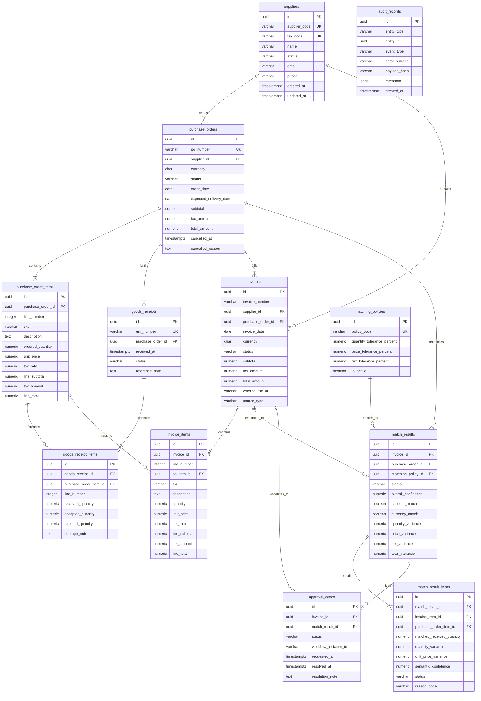

# SmartProcure-Pay Relational Data Model

This document specifies the PostgreSQL domain schema, entity responsibilities, relationships, cardinalities, constraints, and audit models for **SmartProcure-Pay**.

---

## 1. Architecture Overview

As part of the **DX-OS Open-Core** architecture, the PostgreSQL database functions as the **System of Record (SoR)** for all structured business entities across the Procure-to-Pay (P2P) lifecycle. It guarantees ACID transactional guarantees, strict numerical precision, non-destructive deletion rules, and deterministic quantity tracking required for 3-Way Matching reconciliation.

```text
┌─────────────────┐       ┌─────────────────┐       ┌─────────────────┐
│ Purchase Order  │ ──►   │  Goods Receipt  │ ──►   │ 3-Way Matching  │
│  (Procurement)  │       │   (Warehouse)   │       │   Reconcile     │
└─────────────────┘       └─────────────────┘       └─────────────────┘
         │                                                   ▲
         ▼                                                   │
┌─────────────────┐                                          │
│     Invoice     │ ─────────────────────────────────────────┘
│   (Accounting)  │ ──► [Exception] ──► Approval ──► Ready to Pay
└─────────────────┘
```

---

## 2. Mermaid Entity-Relationship Diagram (ERD)



---

## 3. Entity Responsibilities & Table Catalog

| Table | Domain Role | Primary Key | Key Constraints |
| :--- | :--- | :--- | :--- |
| **`suppliers`** | Master vendor catalog with legal identity and status tracking. | UUID (`gen_random_uuid()`) | `UNIQUE(supplier_code)`, `UNIQUE(tax_code)`, `CHECK(status IN ('ACTIVE', 'INACTIVE', 'BLOCKED'))` |
| **`purchase_orders`** | Official purchase orders issued to suppliers. | UUID (`gen_random_uuid()`) | `UNIQUE(po_number)`, `FK -> suppliers (RESTRICT)`, `CHECK(status)`, Non-negative monetary amounts |
| **`purchase_order_items`** | Line items representing contracted goods/services. | UUID (`gen_random_uuid()`) | `UNIQUE(purchase_order_id, line_number)`, `ordered_quantity > 0`, `unit_price >= 0` |
| **`goods_receipts`** | Warehouse Goods Receipt Notes (GRN) logging physical delivery. | UUID (`gen_random_uuid()`) | `UNIQUE(grn_number)`, `FK -> purchase_orders (RESTRICT)`, `CHECK(status)` |
| **`goods_receipt_items`** | Line-level item inspection logging accepted and rejected goods. | UUID (`gen_random_uuid()`) | `UNIQUE(goods_receipt_id, line_number)`, `received_quantity > 0`, `accepted + rejected <= received` |
| **`invoices`** | Supplier invoices ingested via digital e-invoice or OCR extraction. | UUID (`gen_random_uuid()`) | `UNIQUE(supplier_id, invoice_number)`, `FK -> purchase_orders (RESTRICT)`, `CHECK(status)` |
| **`invoice_items`** | Line items on the invoice with progressive resolution to PO items. | UUID (`gen_random_uuid()`) | `UNIQUE(invoice_id, line_number)`, `quantity > 0`, `unit_price >= 0`, `po_item_id NULLABLE` |
| **`matching_policies`** | Configurable reconciliation tolerance parameters. | UUID (`gen_random_uuid()`) | `UNIQUE(policy_code)`, Non-negative tolerance percentages |
| **`match_results`** | Header-level evaluation outcomes of 3-Way Matching runs. | UUID (`gen_random_uuid()`) | `FK -> invoices (RESTRICT)`, `FK -> purchase_orders (RESTRICT)`, `CHECK(status)` |
| **`match_result_items`** | Item-level reconciliation results with variance calculations. | UUID (`gen_random_uuid()`) | `FK -> match_results (RESTRICT)`, `FK -> invoice_items (RESTRICT)`, `confidence BETWEEN 0 AND 100` |
| **`approval_cases`** | Exception cases escalated to finance managers for authorization. | UUID (`gen_random_uuid()`) | `FK -> invoices (RESTRICT)`, `FK -> match_results (RESTRICT)`, `CHECK(status)` |
| **`audit_records`** | Append-only event log capturing domain state modifications. | UUID (`gen_random_uuid()`) | Immutable structure, `JSONB` metadata payload |

---

## 4. Relationships and Cardinalities

1. **Suppliers to Purchase Orders & Invoices**:
   - `suppliers (1) ──< purchase_orders (N)`: A supplier may have zero or many purchase orders. A purchase order belongs to exactly one supplier.
   - `suppliers (1) ──< invoices (N)`: A supplier may submit zero or many invoices. An invoice belongs to exactly one supplier.
2. **Purchase Orders to Downstream Artifacts**:
   - `purchase_orders (1) ──< goods_receipts (N)`: A purchase order can be fulfilled via multiple shipments (partial deliveries).
   - `purchase_orders (1) ──< invoices (N)`: A purchase order can be billed via multiple progressive invoices.
   - `purchase_orders (1) ──< match_results (N)`: Each invoice evaluation against a PO produces a match result record.
3. **Line-Level Item Hierarchy**:
   - `purchase_order_items (1) ──< goods_receipt_items (N)`: Multiple deliveries can receive fractions of the same PO item.
   - `purchase_order_items (1) ──< invoice_items (0..N)`: Invoiced items reference PO items. The reference is **nullable** at raw ingest, resolved during matching.
4. **Matching & Exception Resolution**:
   - `invoices (1) ──< match_results (N)`: Allows re-running reconciliation when new GRNs arrive.
   - `match_results (1) ──< match_result_items (N)`: Full item-by-item variance ledger.
   - `invoices (1) ──< approval_cases (N)`: Escalations for invoices exceeding tolerance thresholds.

---

## 5. Numerical and Monetary Precision Standards

Floating-point types (`REAL`, `FLOAT`, `DOUBLE PRECISION`) are **strictly prohibited** across all financial and inventory calculations to avoid IEEE 754 precision leakage.

| Column Category | PostgreSQL Type | Scale / Range | Purpose |
| :--- | :--- | :--- | :--- |
| **Quantities** | `NUMERIC(18, 4)` | Up to 14 integer digits, 4 decimal places | Accurate for fractional measurements (liters, kilograms, meters). |
| **Unit Prices** | `NUMERIC(18, 4)` | Up to 14 integer digits, 4 decimal places | Prevents rounding errors on wholesale unit purchases. |
| **Monetary Totals** | `NUMERIC(18, 2)` | Up to 16 integer digits, 2 decimal places | Standard financial ledger currency representation. |
| **Tax Rates** | `NUMERIC(7, 4)` | Up to 3 integer digits, 4 decimal places | Fractional percentages (e.g. `0.0800` for 8%, `0.1000` for 10%). |
| **Currency** | `CHAR(3)` | 3 uppercase ASCII characters | ISO-4217 standard (`VND`, `USD`, `EUR`). |

---

## 6. Non-Destructive Data Retention & Soft Deletion

In compliance with financial auditability and regulatory compliance standards:

1. **Foreign Key Protection (`ON DELETE RESTRICT`)**:
   - Deleting a parent entity (e.g. a `supplier` referenced by a `purchase_order`, or a `purchase_order` referenced by a `goods_receipt` or `invoice`) is **blocked** by database foreign key constraints (`ON DELETE RESTRICT`).
2. **Soft Deletion & Document Cancellation**:
   - Documents are cancelled through explicit state transitions:
     - `purchase_orders.status = 'CANCELLED'`
     - `goods_receipts.status = 'CANCELLED'`
     - `invoices.status = 'CANCELLED'`
   - Cancellation requires audit metadata:
     - `cancelled_at TIMESTAMPTZ`: Exact UTC timestamp of cancellation.
     - `cancelled_reason TEXT`: Mandatory business justification.

---

## 7. Duplicate Invoice Protection

To prevent double payment fraud:

$$\text{CONSTRAINT uq\_supplier\_invoice UNIQUE (supplier\_id, invoice\_number)}$$

- Uniqueness is scoped to the **supplier**, acknowledging that different suppliers may independently issue the same invoice number (e.g., `INV-001`).
- The same supplier cannot issue two invoices with identical numbers.

---

## 8. Partial Receipt and Partial Invoicing Model

The schema directly supports complex partial fulfillment workflows:

1. **Partial Delivery**:
   - `ordered_quantity` in `purchase_order_items` represents the contract commitment.
   - Each shipment creates a `goods_receipts` entry with `goods_receipt_items.accepted_quantity`.
   - The total delivered goods equals the sum of `accepted_quantity` across all non-cancelled GRNs.
2. **Partial Invoicing & Quantity Ceiling**:
   - When a new invoice arrives, the Matching Engine verifies that the invoiced quantity does not exceed the remaining uninvoiced goods:
     $$\text{Available to Invoice} = \sum (\text{GRN.accepted\_quantity}) - \sum (\text{Previous Invoices.quantity})$$
   - If an invoice requests more than the available quantity, the system flags a **Quantity Discrepancy Exception**.
