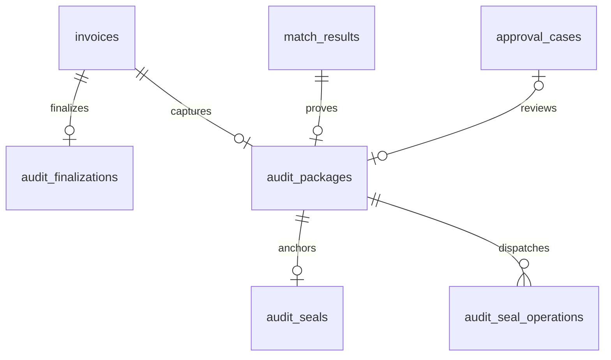

# SmartProcure-Pay Relational Data Model

This document specifies the PostgreSQL domain schema, entity responsibilities, relationships, cardinalities, constraints, and audit models for **SmartProcure-Pay**.

---

## 1. Architecture Overview

As part of the **DX-OS Open-Core** architecture, the PostgreSQL database functions as the **System of Record (SoR)** for all structured business entities across the Procure-to-Pay (P2P) lifecycle. It guarantees ACID transactional guarantees, strict numerical precision, non-destructive deletion rules, and deterministic quantity tracking required for 3-Way Matching reconciliation.

```text
┌─────────────────┐       ┌─────────────────┐       ┌─────────────────┐
│ Purchase Order  │ ──►   │  Goods Receipt  │ ──►   │ 3-Way Matching  │
│  (Procurement)  │       │   (Warehouse)   │       │   Reconcile     │
└─────────────────┘       └─────────────────┘       └─────────────────┘
         │                                                   ▲
         ▼                                                   │
┌─────────────────┐                                          │
│     Invoice     │ ─────────────────────────────────────────┘
│   (Accounting)  │ ──► [Exception] ──► Approval ──► Ready to Pay
└─────────────────┘
```

---

## 2. Mermaid Entity-Relationship Diagram (ERD)

```mermaid
erDiagram
    suppliers ||--o{ purchase_orders : issues
    suppliers ||--o{ invoices : submits
    suppliers ||--o{ invoice_ingestions : uploads
    purchase_orders ||--o{ invoice_ingestions : binds
    invoice_ingestions ||--o| invoices : produces
    invoice_ingestions ||--|{ invoice_files : archives
    
    purchase_orders ||--|{ purchase_order_items : contains
    purchase_orders ||--o{ goods_receipts : fulfills
    purchase_orders ||--o{ invoices : bills
    purchase_orders ||--o{ match_results : reconciles
    
    purchase_order_items ||--o{ goods_receipt_items : references
    purchase_order_items ||--o{ invoice_items : maps_to
    
    goods_receipts ||--|{ goods_receipt_items : contains
    
    invoices ||--|{ invoice_items : contains
    invoices ||--o| match_results : evaluated_in
    invoices ||--o| approval_cases : escalates_to
    approval_cases ||--o{ approval_tasks : mirrors
    approval_cases ||--o{ approval_decisions : records
    approval_tasks ||--o| approval_decisions : completes
    approval_cases ||--o{ workflow_operations : coordinates
    
    matching_policies ||--o{ match_results : applies_to
    match_results ||--|{ match_result_items : details
    match_results ||--o{ approval_cases : justifies
    
    suppliers {
        uuid id PK
        varchar supplier_code UK
        varchar tax_code UK
        varchar name
        varchar status
        varchar email
        varchar phone
        timestamptz created_at
        timestamptz updated_at
    }
    
    purchase_orders {
        uuid id PK
        varchar po_number UK
        uuid supplier_id FK
        char currency
        varchar status
        date order_date
        date expected_delivery_date
        numeric subtotal
        numeric tax_amount
        numeric total_amount
        timestamptz cancelled_at
        text cancelled_reason
    }
    
    purchase_order_items {
        uuid id PK
        uuid purchase_order_id FK
        integer line_number
        varchar sku
        text description
        numeric ordered_quantity
        numeric unit_price
        numeric tax_rate
        numeric line_subtotal
        numeric tax_amount
        numeric line_total
    }
    
    goods_receipts {
        uuid id PK
        varchar grn_number UK
        uuid purchase_order_id FK
        timestamptz received_at
        varchar status
        text reference_note
    }
    
    goods_receipt_items {
        uuid id PK
        uuid goods_receipt_id FK
        uuid purchase_order_item_id FK
        integer line_number
        varchar lot_number
        numeric received_quantity
        numeric accepted_quantity
        numeric rejected_quantity
        text damage_note
    }

    goods_receipt_policies {
        uuid id PK
        varchar policy_code UK
        numeric over_delivery_tolerance_percent
        boolean is_active
        timestamptz created_at
        timestamptz updated_at
    }
    
    invoices {
        uuid id PK
        varchar invoice_number
        varchar invoice_number_normalized
        varchar seller_tax_code
        varchar buyer_tax_code
        uuid supplier_id FK
        uuid purchase_order_id FK
        date invoice_date
        char currency
        varchar status
        numeric subtotal
        numeric tax_amount
        numeric total_amount
        varchar external_file_id
        varchar source_type
    }
    
    invoice_ingestions {
        uuid id PK
        uuid purchase_order_id FK
        uuid supplier_id FK
        uuid invoice_id FK,UK
        varchar status
        varchar error_code
        text error_message
        varchar created_by_subject
        timestamptz created_at
        timestamptz updated_at
    }

    invoice_files {
        uuid id PK
        uuid ingestion_id FK
        varchar file_kind
        varchar object_key UK
        varchar original_filename
        varchar media_type
        bigint size_bytes
        char sha256
        varchar processing_status
        varchar parse_error_code
        text parse_error_message
        timestamptz created_at
    }

    invoice_items {
        uuid id PK
        uuid invoice_id FK
        integer line_number
        uuid po_item_id FK
        varchar sku
        text description
        numeric quantity
        numeric unit_price
        numeric tax_rate
        numeric line_subtotal
        numeric tax_amount
        numeric line_total
    }
    
    matching_policies {
        uuid id PK
        varchar policy_code UK
        numeric quantity_tolerance_percent
        numeric price_tolerance_percent
        numeric tax_tolerance_percent
        numeric total_tolerance_percent
        boolean is_active
    }
    
    match_results {
        uuid id PK
        uuid invoice_id FK,UK
        uuid purchase_order_id FK
        uuid matching_policy_id FK
        varchar status
        numeric overall_confidence
        boolean supplier_match
        boolean currency_match
        numeric quantity_variance
        numeric price_variance
        numeric tax_variance
        numeric total_variance
        varchar rule_version
        text_array discrepancy_codes
        jsonb policy_snapshot
        numeric evaluation_duration_ms
        timestamptz completed_at
    }
    
    match_result_items {
        uuid id PK
        uuid match_result_id FK
        uuid invoice_item_id FK
        uuid purchase_order_item_id FK
        numeric matched_received_quantity
        numeric quantity_variance
        numeric unit_price_variance
        numeric semantic_confidence
        varchar status
        varchar reason_code
        numeric tax_rate_variance
        numeric line_total_variance
        text_array discrepancy_codes
        jsonb details
    }
    
    approval_cases {
        uuid id PK
        uuid invoice_id FK
        uuid match_result_id FK
        varchar status
        varchar workflow_instance_id
        varchar case_type
        varchar assigned_role
        varchar current_stage
        varchar decision
        text decision_reason
        varchar requested_by_subject
        varchar resolved_by_subject
        jsonb match_snapshot
        varchar workflow_definition_key
        varchar workflow_definition_version
        timestamptz requested_at
        timestamptz resolved_at
        text resolution_note
    }
    
    audit_records {
        uuid id PK
        varchar entity_type
        uuid entity_id
        varchar event_type
        varchar actor_subject
        varchar payload_hash
        jsonb metadata
        timestamptz created_at
    }
```



---

## 3. Entity Responsibilities & Table Catalog

| Table | Domain Role | Primary Key | Key Constraints |
| :--- | :--- | :--- | :--- |
| **`suppliers`** | Master vendor catalog with legal identity and status tracking. | UUID (`gen_random_uuid()`) | `UNIQUE(supplier_code)`, `UNIQUE(tax_code)`, `CHECK(status IN ('ACTIVE', 'INACTIVE', 'BLOCKED'))` |
| **`purchase_orders`** | Official purchase orders issued to suppliers. | UUID (`gen_random_uuid()`) | `UNIQUE(po_number)`, `FK -> suppliers (RESTRICT)`, `CHECK(status)`, Non-negative monetary amounts |
| **`purchase_order_items`** | Line items representing contracted goods/services. | UUID (`gen_random_uuid()`) | `UNIQUE(purchase_order_id, line_number)`, `ordered_quantity > 0`, `unit_price >= 0` |
| **`goods_receipts`** | Warehouse Goods Receipt Notes (GRN) logging physical delivery. | UUID (`gen_random_uuid()`) | `UNIQUE(grn_number)`, `FK -> purchase_orders (RESTRICT)`, `CHECK(status)` |
| **`goods_receipt_items`** | Line-level item inspection logging accepted and rejected goods. | UUID (`gen_random_uuid()`) | `UNIQUE(goods_receipt_id, line_number)`, `received_quantity > 0`, `accepted + rejected <= received` |
| **`invoices`** | Supplier invoices ingested via digital e-invoice or OCR extraction. | UUID (`gen_random_uuid()`) | `UNIQUE(supplier_id, invoice_number)`, `FK -> purchase_orders (RESTRICT)`, `CHECK(status)` |
| **`invoice_items`** | Line items on the invoice with progressive resolution to PO items. | UUID (`gen_random_uuid()`) | `UNIQUE(invoice_id, line_number)`, `quantity > 0`, `unit_price >= 0`, `po_item_id NULLABLE` |
| **`invoice_ingestions`** | PO/supplier-bound upload lifecycle, including unsuccessful parse and pending OCR. | UUID (`gen_random_uuid()`) | Restrictive PO/supplier/invoice FKs; nullable unique `invoice_id`; PARSED iff linked invoice; checked status |
| **`invoice_files`** | Raw object metadata and SHA-256; bytes live only in private MinIO. | UUID (`gen_random_uuid()`) | Restrictive ingestion FK; unique object key and `(ingestion_id,file_kind)`; XML/PDF only; positive size; 64-character hex checksum; checked processing status |
| **`matching_policies`** | Configurable reconciliation tolerance parameters. | UUID (`gen_random_uuid()`) | `UNIQUE(policy_code)`, Tolerance percentages bounded between 0% and 100% |
| **`match_results`** | Header-level evaluation outcomes of 3-Way Matching runs. | UUID (`gen_random_uuid()`) | `FK -> invoices (RESTRICT)`, `FK -> purchase_orders (RESTRICT)`, `CHECK(status)` |
| **`match_result_items`** | Item-level reconciliation results with variance calculations. | UUID (`gen_random_uuid()`) | `FK -> match_results (RESTRICT)`, `FK -> invoice_items (RESTRICT)`, `confidence BETWEEN 0 AND 100` |
| **`approval_cases`** | Exception cases escalated to finance managers for authorization. | UUID (`gen_random_uuid()`) | `FK -> invoices (RESTRICT)`, `FK -> match_results (RESTRICT)`, `CHECK(status)` |
| **`audit_records`** | Relational audit persistence foundation capturing domain state events and metadata payloads (cryptographic sealing via ImmuDB in Issue #10). | UUID (`gen_random_uuid()`) | Structured event log, `JSONB` metadata payload |

---

## 4. Relationships and Cardinalities

1. **Suppliers to Purchase Orders & Invoices**:
   - `suppliers (1) ──< purchase_orders (N)`: A supplier may have zero or many purchase orders. A purchase order belongs to exactly one supplier.
   - `suppliers (1) ──< invoices (N)`: A supplier may submit zero or many invoices. An invoice belongs to exactly one supplier.
2. **Purchase Orders to Downstream Artifacts**:
   - `purchase_orders (1) ──< goods_receipts (N)`: A purchase order can be fulfilled via multiple shipments (partial deliveries).
   - `purchase_orders (1) ──< invoices (N)`: A purchase order can be billed via multiple progressive invoices.
   - `purchase_orders (1) ──< match_results (N)`: Each invoice evaluation against a PO produces a match result record.
3. **Line-Level Item Hierarchy**:
   - `purchase_order_items (1) ──< goods_receipt_items (N)`: Multiple deliveries can receive fractions of the same PO item.
   - `purchase_order_items (1) ──< invoice_items (0..N)`: Invoiced items reference PO items. The reference is **nullable** at raw ingest, resolved during matching.
4. **Matching & Exception Resolution**:
   - `invoices (1) ── match_results (0..1)`: Migration 012 enforces one match result per invoice for the Issue #8 MVP; repeated requests conflict. Rematching requires a future explicit design.
   - `match_results (1) ──< match_result_items (N)`: Full item-by-item variance ledger.
   - `invoices (1) ── approval_cases (0..1)`: Migration 013 allows one exception or clean-finance workflow per invoice. Default clean STP creates no case.

---

## 5. Numerical and Monetary Precision Standards

Floating-point types (`REAL`, `FLOAT`, `DOUBLE PRECISION`) are **strictly prohibited** across all financial and inventory calculations to avoid IEEE 754 precision leakage.

| Column Category | PostgreSQL Type | Scale / Range | Purpose |
| :--- | :--- | :--- | :--- |
| **Quantities** | `NUMERIC(18, 4)` | Up to 14 integer digits, 4 decimal places | Accurate for fractional measurements (liters, kilograms, meters). |
| **Unit Prices** | `NUMERIC(18, 4)` | Up to 14 integer digits, 4 decimal places | Prevents rounding errors on wholesale unit purchases. |
| **Monetary Totals** | `NUMERIC(18, 2)` | Up to 16 integer digits, 2 decimal places | Standard financial ledger currency representation. |
| **Tax Rates** | `NUMERIC(7, 4)` | Up to 3 integer digits, 4 decimal places | Fractional percentages (e.g. `0.0800` for 8%, `0.1000` for 10%). |
| **Currency** | `CHAR(3)` | 3 uppercase ASCII characters | ISO-4217 standard (`VND`, `USD`, `EUR`). |

---

## 6. Non-Destructive Data Retention & Soft Deletion

In compliance with financial auditability and regulatory compliance standards:

1. **Foreign Key Protection (`ON DELETE RESTRICT`)**:
   - 100% of foreign keys across the schema enforce `ON DELETE RESTRICT`.
   - Deleting a master entity (e.g. a `supplier` referenced by a `purchase_order`, or a `purchase_order` referenced by a `goods_receipt` or `invoice`) is blocked.
   - Deleting a `purchase_order_item` that has already been linked to an `invoice_item` (via `po_item_id`) or a reconciliation result (`match_result_items.purchase_order_item_id`) is strictly rejected by `ON DELETE RESTRICT` to preserve historical financial auditability.
2. **Soft Deletion & Document Cancellation Constraints**:
   - Documents are cancelled through explicit state transitions:
     - `purchase_orders.status = 'CANCELLED'`
     - `goods_receipts.status = 'CANCELLED'`
     - `invoices.status = 'CANCELLED'`
   - Cancellation requires metadata consistency enforced by database CHECK constraints (`chk_po_cancellation`, `chk_grn_cancellation`, `chk_invoice_cancellation`):
     - When `status = 'CANCELLED'`: `cancelled_at TIMESTAMPTZ` MUST NOT be NULL, and `cancelled_reason TEXT` MUST NOT be NULL or blank (`trim(cancelled_reason) != ''`).
     - When `status != 'CANCELLED'`: `cancelled_at` and `cancelled_reason` MUST be NULL.

---

## 7. Duplicate Invoice Protection

To prevent double payment fraud:

$$\text{CONSTRAINT uq\_supplier\_invoice UNIQUE (supplier\_id, invoice\_number)}$$

- Uniqueness is scoped to the **supplier**, acknowledging that different suppliers may independently issue the same invoice number (e.g., `INV-001`).
- The same supplier cannot issue two invoices with identical numbers.
- **Current Issue #2 Guarantee**: The PostgreSQL `UNIQUE (supplier_id, invoice_number)` constraint enforces exact binary (case-sensitive and whitespace-sensitive) uniqueness at the database level. Submitting `INV-001` twice for the same supplier is blocked, while case or whitespace variations (e.g. `inv-001` or `INV 001`) are distinct in standard SQL binary equality.
- **Ingestion Normalization (Issue #7, migration 011)**: NFKC → trim → uppercase → remove whitespace, ASCII hyphens and underscores; preserve slash and other punctuation. A partial unique index `uq_invoice_supplier_normalized` covers `(supplier_id, invoice_number_normalized) WHERE invoice_number_normalized IS NOT NULL`. Original numbers and exact uniqueness remain. Existing rows keep NULL normalized values; ingestion also compares legacy canonical identities without rewriting them. Legacy backfill needs collision review.

---

## 8. Partial Receipt and Partial Invoicing Model

The schema directly supports complex partial fulfillment workflows:

1. **Partial Delivery**:
   - `ordered_quantity` in `purchase_order_items` represents the contract commitment.
   - Each shipment creates a `goods_receipts` entry with `goods_receipt_items.accepted_quantity`.
   - The physically accepted matching quantity sums `accepted_quantity` only across `RECEIVED` GRNs; DRAFT/CANCELLED and rejected/gross quantities do not contribute.
2. **Partial Invoicing & Quantity Ceiling**:
   - When a new invoice arrives, the Matching Engine verifies that the invoiced quantity does not exceed the remaining uninvoiced goods:
     $$\text{Available to Invoice} = \sum (\text{GRN.accepted\_quantity}) - \sum (\text{Previous Invoices.quantity})$$
   - If an invoice requests more than the available quantity, the system flags a **Quantity Discrepancy Exception**.
   - Issue #8 counts only prior `PASSED` result quantities in `MATCHED`/`APPROVED`/`READY_FOR_PAYMENT`, excluding the current invoice. The effective ceiling also caps against `orderedQuantity * (1 + quantityTolerancePercent / 100) - previousValidInvoiced`, with a floor of zero. Split lines aggregate before allocation.
3. **Goods Receipt Schema Extensions (Issue #6 - Migration 010)**:
   - **Lot / Batch Tracking**: Nullable `lot_number VARCHAR(100)` added to `goods_receipt_items`. Multiple GRN lines can reference the same PO item across distinct lots.
   - **GRN Numbering Sequence**: Concurrency-safe sequence `goods_receipt_number_seq` generates formatted identifiers `GRN-YYYY-XXXXXX`.
   - **Warehouse Receipt Policy**: Dedicated table `goods_receipt_policies` controls warehouse over-delivery tolerance (`over_delivery_tolerance_percent NUMERIC(5,2)` between 0.00% and 100.00%). A partial unique index `uq_goods_receipt_policies_active` (`WHERE is_active = true`) guarantees exactly one active warehouse receipt policy deterministically.

---

## 9. Cross-Document Relational Integrity Architecture

To prevent disjoint document mappings, the database enforces relational consistency at the storage layer via automated validation triggers:

1. **GRN Item $\rightarrow$ PO Item Consistency**:
   - Triggers: `trg_check_grn_item_po_consistency` on `goods_receipt_items` (BEFORE INSERT OR UPDATE) and `trg_check_grn_parent_po_consistency` on `goods_receipts` (BEFORE UPDATE OF purchase_order_id).
   - **Rule**: Every `goods_receipt_item` must reference a `purchase_order_item` that belongs to the exact same `purchase_order` referenced by its parent `goods_receipt`. Attempting to link items across different Purchase Orders raises an exception (`ERRCODE = 'check_violation'`).
2. **Invoice Item $\rightarrow$ PO Item Consistency**:
   - Triggers: `trg_check_invoice_item_po_consistency` on `invoice_items` (BEFORE INSERT OR UPDATE) and `trg_check_invoice_parent_po_consistency` on `invoices` (BEFORE UPDATE OF purchase_order_id).
   - **Rule**: When `invoice_items.po_item_id` is NOT NULL, it must reference a `purchase_order_item` that belongs to the exact same `purchase_order` referenced by its parent `invoice`. Unresolved items (`po_item_id IS NULL`) remain valid for progressive ingestion.
3. **Reconciliation & Match Results Consistency**:
   - Triggers: `trg_check_match_result_document_consistency` on `match_results` and `trg_check_match_result_item_consistency` on `match_result_items`.
   - **Rule**: `match_results.purchase_order_id` must match the parent invoice's `purchase_order_id`. Furthermore, item-level match items must belong to the respective document headers.
4. **Approval Escalations Consistency**:
   - Trigger: `trg_check_approval_case_document_consistency` on `approval_cases`.
   - **Rule**: When `match_result_id` is specified on an approval case, its referenced match result must belong to the exact same `invoice_id` as the approval case.
5. **Tolerance Boundary Constraints**:
   - `matching_policies` enforces `CHECK (quantity_tolerance_percent >= 0 AND quantity_tolerance_percent <= 100)` (and identically for `price_tolerance_percent` and `tax_tolerance_percent`).

## 10. Deterministic Matching Extensions (Issue #8, Migration 012)

Migration 006 tables remain; old migrations are unchanged. Migration 012 adds:

| Table | Additions / guarantees |
|---|---|
| matching_policies | total_tolerance_percent NUMERIC(5,2) NOT NULL DEFAULT 0, checked 0..100; partial unique active index; MATCH_DEFAULT seeded only when no active policy exists (quantity/price/tax/total = 0/1/0/0) |
| match_results | unique invoice_id; discrepancy_codes TEXT[] and policy_snapshot JSONB NOT NULL with empty legacy defaults; nullable evaluation_duration_ms NUMERIC(12,3), nonnegative; completed_at TIMESTAMPTZ |
| match_result_items | unique (match_result_id,invoice_item_id); tax_rate_variance NUMERIC(7,4), line_total_variance NUMERIC(18,2), discrepancy_codes TEXT[], details JSONB, all NOT NULL with zero/empty defaults |

New composite indexes cover goods_receipts(PO,status), goods_receipt_items(PO item,GRN), match_results(PO,status), match_result_items(PO item,result). Existing invoice_items(invoice_id) index is reused. Migration fails clearly for multiple historical active policies or invoice results rather than repairing history. Each new result records the immutable 3WM-1.0 policy snapshot; legacy empty snapshots are not invented historical evidence. Deterministic confidence fields stay NULL. [Matching module semantics](../business/THREE_WAY_MATCHING_MODULE.md) define variance summaries and transactional status/audit ownership.

## 11. Invoice Workflow Extensions (Issue #9, Migration 013)

| Table | Additions / guarantees |
| --- | --- |
| approval_cases | UNIQUE(invoice_id), case_type, assigned_role/current_stage, decision/decision_reason, requested_by_subject/resolved_by_subject, immutable match_snapshot JSONB, workflow_definition_key/version; adds STARTING/FAILED/CREDIT_NOTE_REQUESTED while retaining all migration 007 statuses |
| approval_tasks | UUID PK, approval_case_id FK RESTRICT, unique flowable_task_id, task_key/name, assigned_role/assignee_subject, OPEN/CLAIMED/COMPLETED/CANCELLED status, action/reason, created/claimed/completed timestamps, role/state/reason checks |
| approval_decisions | UUID PK, case/task FKs RESTRICT with same-case composite FK, one decision per task, action/reason, actor_subject/roles, previous/new case and invoice states, created_at; ordinary UPDATE/DELETE rejected by trigger |
| workflow_policies | UUID PK, unique policy_code, nullable NUMERIC(18,2) STP maximum, required NUMERIC(18,2) finance threshold, is_active, timestamps; finite nonnegative checks, partial unique active index; WORKFLOW_DEFAULT NULL / 100000000.00 |
| workflow_operations | UUID PK, case/task FKs RESTRICT with same-case composite FK, START/CLAIM/COMPLETE intent, PENDING/APPLIED/FAILED status, JSONB payload, original actor/roles, dispatch timestamp, retry_safe/error_code and created/updated timestamps; one unapplied operation per case |

Indexes support status/date case reads, role/status task inboxes and case task/decision/operation history. Duplicate historical approval cases cause a clear migration failure. Match snapshots preserve both matching and workflow policy evidence; a trigger rejects rewrites. No old migration is edited and no DISCREPANCY_REVIEW invoice status is introduced.

Flowable uses its own PostgreSQL database/volume. Application PostgreSQL owns business history; the two stores do not share an ACID transaction. Stable business keys, committed operation intents, row/advisory locks and explicit reconciliation connect engine state to task mirrors. See [Invoice Workflow Module](../business/INVOICE_WORKFLOW_MODULE.md) for state transitions, BPMN, recovery and production boundaries.

## 12. Immutable audit extensions (Issue #10, Migration 014)

Migrations 001–013 remain unchanged. `014_create_immutable_audit.sql` adds four tables; all business foreign keys use `ON DELETE RESTRICT`.

| Table | Evidence and guarantees |
| --- | --- |
| audit_finalizations | invoice UUID primary key, match/case references, final business state, finalized_at, frozen source_snapshot JSONB, actor_subject, FINALIZATION/BACKFILL capture mode, PENDING/BUILT/FAILED state and safe error metadata. Created inside the terminal business transaction. Snapshot/identity updates are rejected. |
| audit_packages | UUID primary key; one package per invoice; match/case references; package/canonicalization versions; package_json, lowercase 64-hex package SHA-256 and Merkle root; positive leaf_count; final state, built_at and created_at. All ordinary updates/deletes rejected. |
| audit_seals | UUID primary key; unique invoice/package/stable seal_key; package SHA/root; actual ImmuDB transaction ID/hash, verified state ID/hash, JSON receipt; PENDING/SEALED/FAILED state, seal/verification timestamps, last verification result/error. SEALED requires genuine non-null receipt fields. Composite FK guarantees the package and invoice agree. |
| audit_seal_operations | UUID primary key; package FK; SEAL/VERIFY operation; PENDING/APPLIED/FAILED state; actor_subject, safe error_code, retry_safe, dispatch/creation/update timestamps. A partial unique index permits at most one unapplied SEAL per package. |

Final states are READY_FOR_PAYMENT, REJECTED and CREDIT_NOTE_REQUESTED; verification outcomes are VERIFIED, TAMPERED, LEDGER_MISMATCH, UNAVAILABLE and initial NOT_VERIFIED. Hash/ID/status checks, document-link consistency triggers and indexes are verified by `validate-schema.sql`.



ImmuDB has a separate SQL table `smartprocure_audit_seals`, keyed by `smartprocure:audit:invoice:<UUID>:v1`. It stores invoice/package identity, package version/SHA/root, final state and seal timestamp. Application code only inserts and retrieves; it never updates an existing logical seal. A separate PostgreSQL-wire pool and native official Go proof verifier access that service. PostgreSQL and ImmuDB do not share ACID. See [Immutable Audit Module](../business/IMMUTABLE_AUDIT_MODULE.md) for proof validation and recovery.
