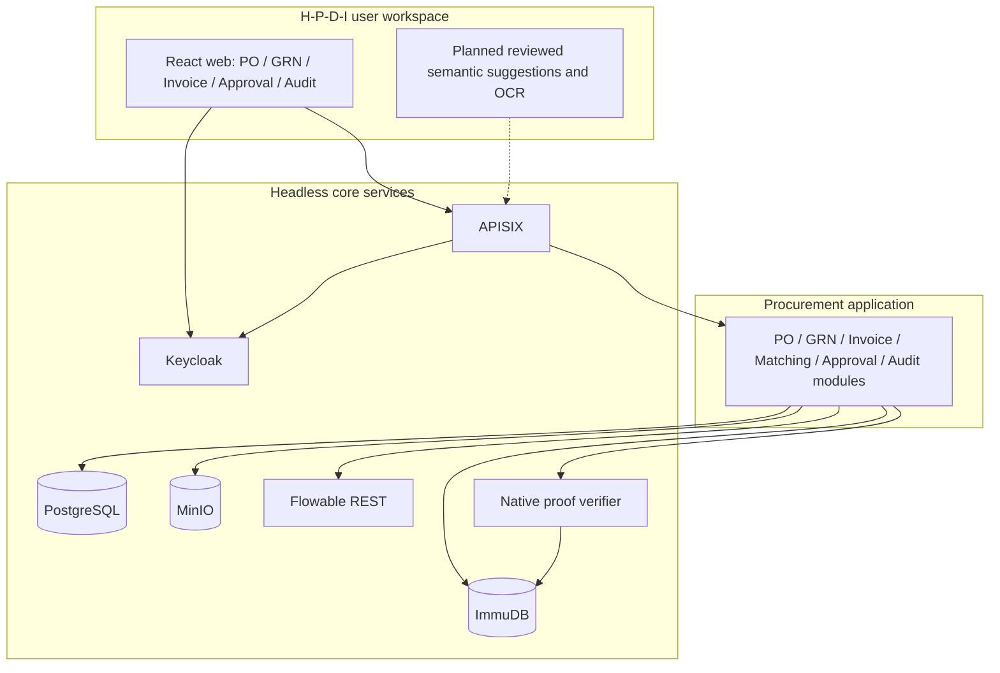

# DX-OS architecture and component responsibilities

Integration architecture updated 9 October 2026. The DX-OS foundations are deployed as headless services; the domain backend is a modular NestJS API. React provides role-aware PO/GRN, invoice, approval and audit workspaces. The [MVP backlog](../project/MVP_ROADMAP.md) records the remaining AI/OCR, trust, demo and release work.

## Three architectural layers

The diagram describes logical responsibilities, not separate deployments for each domain module. NestJS modules run in one API process. The reusable foundations have generic protocols and do not own purchasing rules. Upstream administration consoles are operational tools, not procurement business UI.

## Mandatory foundation services

| Capability | Component | Responsibility | Application-owned behavior |
| --- | --- | --- | --- |
| Identity / SSO | Keycloak | OIDC login, sessions, role claims, signing keys | Domain role authorization and user-facing task access |
| API Gateway | APISIX | Routing, CORS, token prechecks, rate limits, metrics exporter | Domain validation and independently verified backend JWT principal |
| Structured data | PostgreSQL | Transactions, NUMERIC precision, constraints, locks, indexed records | PO/GRN/invoice models, policies and supported state transitions |
| Unstructured data | MinIO | Private object persistence and retrieval | Bounded uploads, invoice metadata, SHA-256 file linkage |
| Workflow | Flowable REST | BPMN deployment, user tasks and process execution | Deterministic role routing, finance thresholds, decisions and recovery intents |

Keycloak and APISIX both participate in trust validation. The backend also verifies Bearer JWTs; spoofable identity headers are not an authorization authority. The gateway forwards `/api/*` to the backend without that prefix, while the root routes to the web container.

## Audit extension

ImmuDB stores independent audit package identities and roots. An internal Go verifier uses the pinned official client to verify native proofs and retain trusted state. PostgreSQL stores business records, frozen packages and durable operations; it remains mutable application storage.

The existing ImmuDB 1.11.0 server/client uses BUSL-1.1. This is a scoped source-available exception, not an OSI-approved classification or evidence of organizer approval. The [component inventory](../../OPEN_SOURCE_COMPONENTS.md) and [license policy](../open-source/LICENSE_POLICY.md) record the exact terms. Resolve competition eligibility before the demo release.

## H-P-D-I mapping

| Space | Current implementation | Remaining workspace capability |
| --- | --- | --- |
| Human | SSO, authenticated actors, role-aware workspaces and task ownership | Task pagination, delegation and broader team queues |
| Process | PO/GRN forms and lifecycles, matching evidence, STP/exception tasks and guarded quantity reservations | Payment execution and vendor communications |
| Data | Structured records, raw file hashes, policy snapshots, audit packages and proof reports | Operational analytics and validated long-term retention/restore procedures |
| Intelligence | Deterministic normalization and validation | OCR extraction, embeddings, confidence scoring and reviewed AI suggestions |

Rule matching is not a semantic AI implementation. A normalized description comparison cannot establish that "HP 85A" and "HP CE285A" are equivalent. AI suggestions must preserve deterministic financial checks and historical matching evidence.

## Data lifecycle and consistency

1. PostgreSQL is the hot operational store for current document states and task decisions.
2. MinIO retains original XML/PDF bytes and file evidence. No public object URL is exposed by the invoice APIs.
3. Terminal invoice outcomes capture an audit snapshot before asynchronous ledger sealing.
4. Durable recovery operations reconcile PostgreSQL with Flowable/ImmuDB after failures. These stores do not form a distributed ACID transaction.
5. Independent proof checks detect changed evidence. Verifier trust-state continuity and backups are required; hashing does not encrypt the document or provide a legal signature.

A lakehouse, multi-tenant isolation, full telemetry stack, validated ten-year retention and CFO PKI signing are not implemented by this architecture baseline.

## Implementation specifications

- [Identity and RBAC](../security/IDENTITY_AND_RBAC.md)
- [API gateway](API_GATEWAY.md)
- [Domain data model](DATA_MODEL.md)
- [Invoice ingestion](../business/INVOICE_INGESTION_MODULE.md)
- [Three-way matching](../business/THREE_WAY_MATCHING_MODULE.md)
- [Workflow and recovery](../business/INVOICE_WORKFLOW_MODULE.md)
- [Immutable audit and proof boundaries](../business/IMMUTABLE_AUDIT_MODULE.md)
