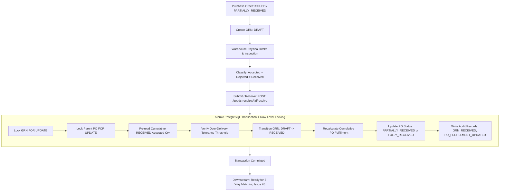
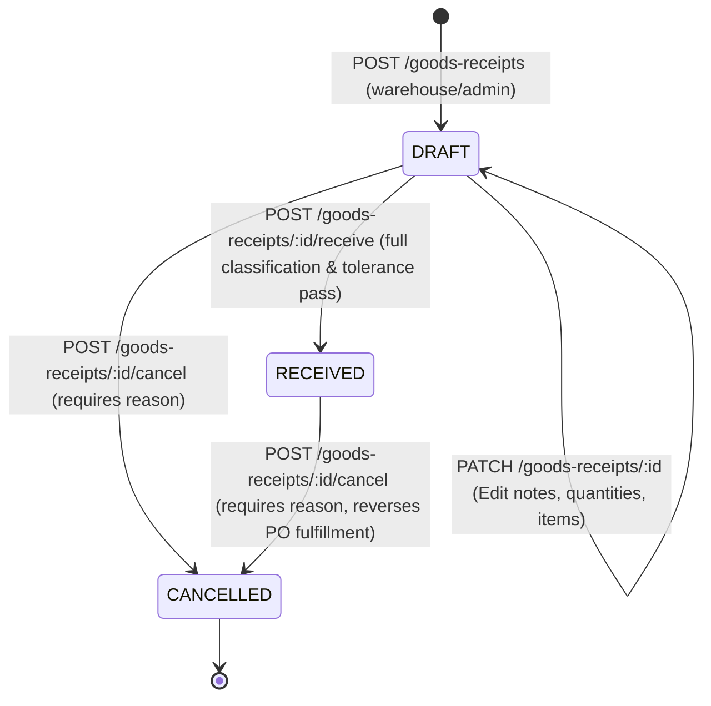

# Goods Receipt Module Specification & Implementation

This document specifies the business domain rules, lifecycle transitions, quantity conservation logic, concurrency controls, and integration contracts for the **Goods Receipt (GRN) Module** in **SmartProcure-Pay** (Issue #6).

---

## 1. Executive Summary & Purpose

The Goods Receipt module functions as the operational bridge between external physical deliveries and downstream automated financial reconciliation (3-Way Matching). It enables warehouse personnel to register incoming physical deliveries, inspect goods for defects or damage, classify accepted versus rejected items, track batch/lot numbers, enforce configurable over-delivery tolerance thresholds, and drive the fulfillment state of parent Purchase Orders.



---

## 2. GRN Lifecycle State Machine

The module implements a strict 3-state lifecycle backed by database constraints:



### State Semantics
1. **`DRAFT`**:
   - Represents ongoing shipment data entry or uncompleted inspection in the warehouse.
   - Quantities in `DRAFT` status **DO NOT** count towards PO fulfillment.
   - Allows partial classification (`accepted_quantity + rejected_quantity <= received_quantity`).
   - Line items, notes, and intake timestamps can be revised.
2. **`RECEIVED`**:
   - Finalized intake record representing physically verified, classified goods.
   - All lines must satisfy full classification: $\text{accepted\_quantity} + \text{rejected\_quantity} = \text{received\_quantity}$.
   - Accepted quantities count directly towards PO cumulative fulfillment and downstream 3-Way Matching.
   - Header and item rows become completely immutable.
3. **`CANCELLED`**:
   - Terminal state representing a voided or retracted receipt.
   - Requires non-empty, trimmed `cancelled_reason` and records `cancelled_at`.
   - Any accepted quantities previously counted from this GRN are immediately reversed from PO fulfillment calculations.
   - Irreversible: A cancelled GRN cannot be edited, re-opened, or cancelled again.

---

## 3. Quantity Conservation & Inspection Rules

### 3.1 Line-Level Conservation
For every line item across all lifecycle states:
$$\text{received\_quantity} > 0$$
$$\text{accepted\_quantity} \ge 0$$
$$\text{rejected\_quantity} \ge 0$$
$$\text{accepted\_quantity} + \text{rejected\_quantity} \le \text{received\_quantity}$$

### 3.2 Final Submission Classification Rule
Upon final receipt submission (`POST /goods-receipts/:id/receive`), inspection must be complete for all lines:
$$\text{accepted\_quantity} + \text{rejected\_quantity} = \text{received\_quantity}$$
If any line item contains unclassified quantity ($\text{accepted} + \text{rejected} < \text{received}$), finalization is rejected with `HTTP 409 Conflict`.

### 3.3 Rejection Reason & Damage Notes
- When $\text{rejected\_quantity} > 0$, `damage_note` is **mandatory** (trimmed, non-empty string).
- When $\text{rejected\_quantity} = 0$, `damage_note` is optional (nullable).

### 3.4 Received vs. Accepted Semantics
Over-delivery thresholds apply strictly to **cumulative accepted quantity**, not gross received quantity.
- *Example*: A supplier physically delivers 110 units against an order of 100 units. The warehouse inspects the delivery, accepts 100 units, and rejects 10 units with `damage_note: "10 units damaged in transit"`.
- Under 0.00% over-delivery tolerance, this receipt is **valid** because $\text{proposedAccepted} = 100 \le 100$. The PO reaches `FULLY_RECEIVED`.

---

## 4. Lot / Batch Tracking

To support batch traceability without imposing unnecessary friction on services or non-lot commodities:
- `lot_number` is a nullable string (max 100 characters, trimmed).
- Each GRN line represents a single `(purchase_order_item_id, lot_number)` combination.
- If a delivery for a single PO line contains multiple batches/lots, it is entered as multiple lines referencing the same `purchase_order_item_id` with distinct `lot_number` values.
- Lot numbers are not required to be globally unique across distinct shipments.

---

## 5. Configurable Over-Delivery Policy

Over-delivery thresholds are decoupled from invoice matching tolerances (`matching_policies`) and managed in a dedicated storage table:

### 5.1 Storage Schema (`goods_receipt_policies`)
```sql
CREATE TABLE goods_receipt_policies (
    id UUID PRIMARY KEY DEFAULT gen_random_uuid(),
    policy_code VARCHAR(50) NOT NULL UNIQUE,
    over_delivery_tolerance_percent NUMERIC(5,2) NOT NULL DEFAULT 0.00,
    is_active BOOLEAN NOT NULL DEFAULT true,
    created_at TIMESTAMPTZ NOT NULL DEFAULT CURRENT_TIMESTAMP,
    updated_at TIMESTAMPTZ NOT NULL DEFAULT CURRENT_TIMESTAMP,
    CONSTRAINT chk_over_delivery_tolerance_range CHECK (
        over_delivery_tolerance_percent >= 0.00 AND over_delivery_tolerance_percent <= 100.00
    )
);
CREATE UNIQUE INDEX uq_goods_receipt_policies_active ON goods_receipt_policies (is_active) WHERE is_active = true;
```

### 5.2 Deterministic Active Policy
The partial unique index `uq_goods_receipt_policies_active` ensures that exactly one policy can have `is_active = true`. A default policy (`policy_code = 'DEFAULT'`, `0.00%` tolerance) is seeded.

### 5.3 Over-Delivery Formula
For each PO item:
$$\text{previousAccepted} = \sum_{\substack{\text{GRN.status} = \text{'RECEIVED'} \\ \text{PO line matches}}} \text{gri.accepted\_quantity}$$
$$\text{proposedAccepted} = \text{previousAccepted} + \text{currentGRN.accepted\_quantity}$$
$$\text{allowedAccepted} = \text{ordered\_quantity} \times \left(1 + \frac{\text{overDeliveryTolerancePercent}}{100}\right)$$

If $\text{proposedAccepted} > \text{allowedAccepted}$, finalization is rejected with `HTTP 409 Conflict`. All calculations are executed via `decimal.js` with exact numeric string inputs.

---

## 6. Concurrency Control & Row-Level Locking

To prevent race conditions where concurrent warehouse receipts read stale cumulative figures and over-deliver:

```mermaid
sequenceDiagram
    autonumber
    actor W1 as Warehouse Agent 1
    actor W2 as Warehouse Agent 2
    participant API as NestJS Backend
    participant DB as PostgreSQL Database

    Note over DB: PO Ordered: 100 | Accepted: 80 | Remaining: 20
    W1->>API: POST /goods-receipts/GRN-A/receive (Accepts 20)
    W2->>API: POST /goods-receipts/GRN-B/receive (Accepts 20)
    
    API->>DB: [Tx 1] BEGIN; SELECT ... FROM goods_receipts WHERE id = A FOR UPDATE;
    API->>DB: [Tx 2] BEGIN; SELECT ... FROM goods_receipts WHERE id = B FOR UPDATE;
    
    API->>DB: [Tx 1] SELECT ... FROM purchase_orders WHERE id = PO FOR UPDATE;
    Note over DB: Tx 1 acquires exclusive lock on PO row.
    API->>DB: [Tx 2] SELECT ... FROM purchase_orders WHERE id = PO FOR UPDATE;
    Note over DB: Tx 2 BLOCKS waiting for Tx 1 to release PO lock.

    API->>DB: [Tx 1] Re-read accepted sum: 80. Proposed: 80 + 20 = 100 <= 100 (Pass)
    API->>DB: [Tx 1] Update GRN A -> RECEIVED; PO status -> FULLY_RECEIVED; COMMIT;
    Note over DB: Tx 1 commits. PO lock released to Tx 2.

    Note over DB: Tx 2 resumes inside transaction.
    API->>DB: [Tx 2] Re-read accepted sum inside Tx: 100. Proposed: 100 + 20 = 120 > 100 (Fail)
    API->>DB: [Tx 2] ROLLBACK;
    API-->>W1: HTTP 200 OK (GRN A Received, PO FULLY_RECEIVED)
    API-->>W2: HTTP 409 Conflict (Over-delivery tolerance exceeded)
```

**Key Concurrency Invariants**:
1. Row lock on `purchase_orders` (`FOR UPDATE`) is acquired before reading cumulative receipts.
2. Cumulative receipts are computed **inside** the locked transaction, never cached or pre-calculated externally.
3. Rolled-back transactions leave zero audit trails and zero state modifications in the database.

---

## 7. PO Fulfillment Status Lifecycle & Cancellation Reversal

### 7.1 Status Derivation Logic
Fulfillment status is derived deterministically from the cumulative accepted quantity across all `RECEIVED` goods receipts:
- **`FULLY_RECEIVED`**: For every line item in the PO, $\text{cumulativeAccepted} \ge \text{orderedQuantity}$.
- **`PARTIALLY_RECEIVED`**: At least one line has $\text{cumulativeAccepted} > 0$, but not all lines meet `orderedQuantity`.
- **`ISSUED`**: All lines have $\text{cumulativeAccepted} = 0$.

### 7.2 Cancellation Reversal
Cancelling a `RECEIVED` GRN triggers an atomic recalculation excluding the cancelled GRN:
- If cumulative accepted drops below ordered quantity: $\text{FULLY\_RECEIVED} \rightarrow \text{PARTIALLY\_RECEIVED}$.
- If all accepted receipts are cancelled: $\text{PARTIALLY\_RECEIVED} \rightarrow \text{ISSUED}$.
- PO `version` increments on each status update.
- Status transition generates a `PO_FULFILLMENT_UPDATED` audit record.

---

## 8. Role-Based Access Control (RBAC) Matrix

| Endpoint | Method | Warehouse | Admin | Buyer | Accountant | Finance Manager |
| :--- | :---: | :---: | :---: | :---: | :---: | :---: |
| `POST /goods-receipts` | Create Draft | **Allowed** | **Allowed** | Denied (403) | Denied (403) | Denied (403) |
| `GET /goods-receipts` | List GRNs | **Allowed** | **Allowed** | **Allowed** | **Allowed** | **Allowed** |
| `GET /goods-receipts/:id` | Get GRN Detail | **Allowed** | **Allowed** | **Allowed** | **Allowed** | **Allowed** |
| `PATCH /goods-receipts/:id` | Update Draft | **Allowed** | **Allowed** | Denied (403) | Denied (403) | Denied (403) |
| `POST /goods-receipts/:id/receive` | Finalize / Receive | **Allowed** | **Allowed** | Denied (403) | Denied (403) | Denied (403) |
| `POST /goods-receipts/:id/cancel` | Cancel GRN | **Allowed** | **Allowed** | Denied (403) | Denied (403) | Denied (403) |
| `GET /goods-receipts/policy` | View Policy | **Allowed** | **Allowed** | Denied (403) | Denied (403) | Denied (403) |
| `PATCH /goods-receipts/policy` | Update Policy | Denied (403) | **Allowed** | Denied (403) | Denied (403) | Denied (403) |

---

## 9. Numerical Precision Standards

- All quantity API payloads require **strict JSON strings** matching regex `^[0-9]+(\.[0-9]{1,4})?$`.
- Native JavaScript numbers (e.g. `10` or `1.5`) are rejected by DTO validators with `HTTP 400 Bad Request` to eliminate IEEE-754 precision loss.
- PostgreSQL columns are typed as `NUMERIC(18, 4)` and queried with string conversions (`::text`).
- Arithmetic is executed via `decimal.js` with exact scale preservation.

---

## 10. Audit Trail & Downstream Integration

### 10.1 Audit Event Types
- `GRN_CREATED`: Logged when a new DRAFT GRN is created.
- `GRN_UPDATED`: Logged when a DRAFT GRN header or items are modified.
- `GRN_RECEIVED`: Logged upon successful finalization.
- `GRN_CANCELLED`: Logged when a DRAFT or RECEIVED GRN is cancelled.
- `PO_FULFILLMENT_UPDATED`: Logged when parent PO status changes due to GRN finalization or cancellation.

### 10.2 Downstream Contracts (Issue #7 & #8)
- **Invoice Ingestion (Issue #7)**: Invoice line mapping references `purchase_order_items`, and calculates available quantities against `goods_receipt_items.accepted_quantity` where `goods_receipts.status = 'RECEIVED'`.
- **3-Way Matching Engine (Issue #8)**: Evaluates line-level matching triad:
  $$\text{Invoice Item Qty} \Longleftrightarrow \text{PO Item Ordered Qty} \Longleftrightarrow \sum \text{GRN Item Accepted Qty}$$
