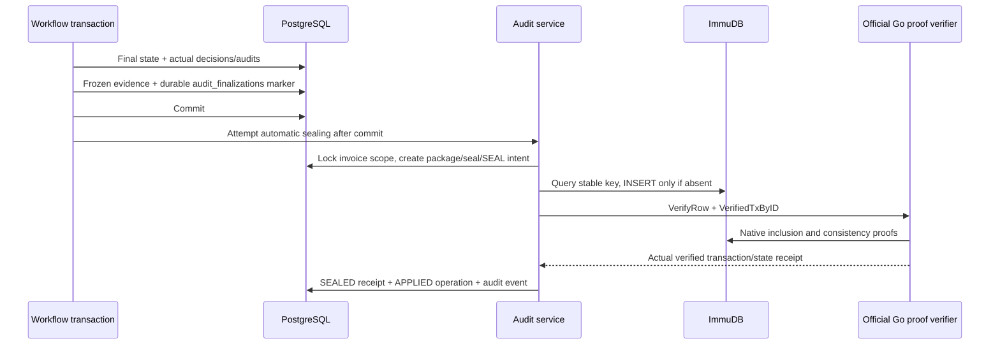
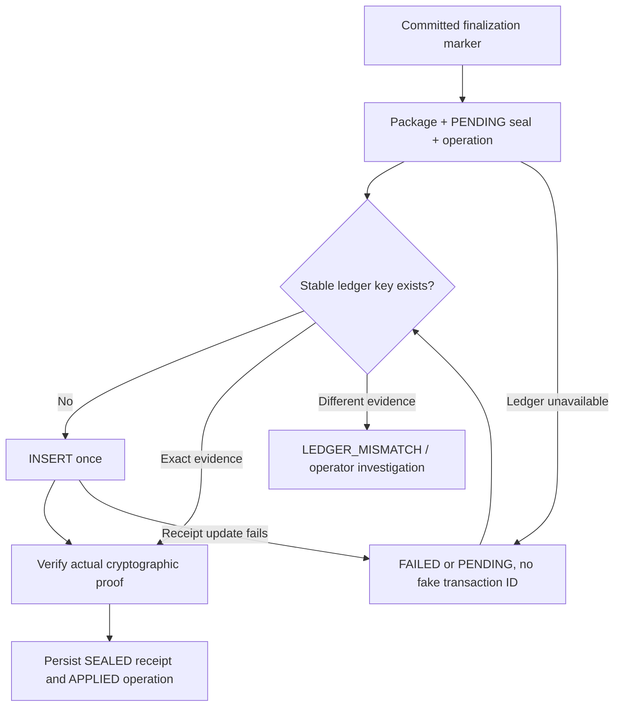

# Immutable audit sealing — Issue #10

SmartProcure captures each finalized invoice's business evidence in PostgreSQL, hashes it deterministically and commits its identity/root to an independent ImmuDB ledger. PostgreSQL remains mutable application storage; a trigger alone cannot establish independent immutability. The ledger and real client-side proofs make the seal tamper-evident and verifiable. No legal digital signature, PKI, invoice certificate, payment execution or Semantic AI is implemented.

## Finalization boundary and automatic sealing

| Actual business outcome | Package finalBusinessState | Required evidence |
| --- | --- | --- |
| Clean MATCHED/PASSED STP → READY_FOR_PAYMENT | READY_FOR_PAYMENT | Completed PASSED match; no approval case/process by default |
| Approved exception → APPROVED → READY_FOR_PAYMENT | READY_FOR_PAYMENT | Terminal APPROVED case, actual tasks/decisions |
| Workflow rejection → REJECTED | REJECTED | Terminal REJECTED case and rejection reason |
| Invoice EXCEPTION, case CREDIT_NOTE_REQUESTED | CREDIT_NOTE_REQUESTED | Terminal request decision; invoice intentionally stays EXCEPTION |

RECEIVED, PARSED, PENDING_MATCH, MATCHED, active EXCEPTION and STARTING/PENDING cases are not eligible. Existing matching and workflow rules remain authoritative; no matching rerun or reconstructed decisions are used.



The marker is committed with the business outcome and contains the ordered frozen source snapshot. This prevents a delayed ledger write from silently capturing later business edits. Remote calls are outside the business transaction. Automatic failure leaves recoverable evidence; business finalization remains committed. This is durable orchestration, not distributed ACID.

## Package composition and ordering

`SMARTPROCURE-AUDIT-1` includes versioned metadata, invoice/match/case identity, final business state, capturedAt, stored-once builtAt, capture mode, structured business evidence and a leaf manifest.

Evidence includes supplier ID/code/tax code/name/status; PO header/lines; relevant GRN headers/status/received_at and items with received/accepted/rejected quantities, lot and damage notes; invoice identity/header/items; file object key/kind/size/media type/processing status/SHA-256; exact persisted match and line details/variances/rule/policy/discrepancy codes; actual approval case, workflow definition/version/policy snapshot, tasks and decisions; related business audit identities, metadata and timestamps.

Every SQL array has explicit ordering: PO/invoice items by line_number then ID; GRNs by received_at then ID; GRN items by parent receipt order then line_number/ID; matching items by invoice line_number then ID; tasks/decisions/events by created_at then ID; files by file kind then ID. The source cutoff is the stored finalization timestamp. GRNs/GRN items and audit events created after that cutoff do not become retroactive evidence; edits to captured source rows do change the current root. Related invoice files and terminal task/decision rows are rebuilt in full, so additions to them also change the baseline. Relevant audit events are scoped to the invoice, PO, GRNs, match, case/tasks and ingestion records. AUDIT_* sealing/verification events are excluded to prevent verification from changing its own evidence.

Supplier contact information is omitted. Credential/token/authorization fields are excluded from nested metadata. Raw XML/PDF bytes are never embedded: private MinIO objects are linked by immutable archival references and SHA-256. Changing a file's relational hash/reference is detected; verification does not automatically download and rehash every MinIO object. Real CI separately proves archived bytes equal DB/package file hashes.

## Canonicalization and hashing

`SP-CJSON-1` is project canonical JSON, not a claim of RFC 8785 compliance. Object keys are recursively sorted lexicographically, arrays retain the explicit business order, and strings use JSON encoding including Unicode. Boolean/null values use standard JSON. Only safe integer JSON numbers are allowed; financial NUMERIC values and large IDs/sizes remain exact strings. Undefined, sparse arrays, cyclic values, fractional/non-finite/unsafe numbers and unsupported object instances are rejected. UUIDs are lowercase. TIMESTAMPTZ values are normalized to UTC ISO-8601 with six fractional digits; database microseconds are preserved. Date-only values remain date strings.

The stored builtAt is reused for package inspection/rebuild. Current relational reconstruction uses the original capturedAt cutoff, never Date.now in the business tree. The Merkle tree hashes business evidence; build metadata is authenticated separately by the full-package hash.

`SP-MERKLE-1` uses Node crypto SHA-256:

```text
leaf = SHA256(UTF8("SMARTPROCURE-AUDIT-LEAF-v1\0" + type + "\0" + identifier + "\0" + canonicalJson(data)))
node = SHA256(UTF8("SMARTPROCURE-AUDIT-NODE-v1\0") || leftHashBytes || rightHashBytes)
```

An odd final node at each level is duplicated. A single leaf is its own root; empty trees are rejected. Hashes are lowercase 64-hex. Meaningful leaves are SUPPLIER, PO_HEADER, PO_ITEM, GRN_HEADER, GRN_ITEM, INVOICE_HEADER, INVOICE_ITEM, INVOICE_FILE, MATCH_RESULT, MATCH_ITEM, APPROVAL_CASE, APPROVAL_TASK, APPROVAL_DECISION and AUDIT_EVENT, each with a stable identifier, canonical data and SHA-256.

`package_sha256 = SHA256(UTF8(canonicalJson(full package manifest)))` additionally authenticates metadata and the manifest. It is distinct from the business Merkle root. `audit_records.payload_hash` for new audit-module events is SHA-256 of SP-CJSON-1 event metadata, including its roles array; it is neither a package hash nor Merkle root. Historical audit rows are not rewritten to invent hashes.

## Exact ledger and proof integration

ImmuDB **1.11.0** is pinned to official image `codenotary/immudb:1.11.0@sha256:460cb34bb0a690ee743336a174c59f2f24edf79dd00c26d936717495db32d1cf` (linux/amd64). The exact tagged license is **BUSL-1.1**, not Apache-2.0. Its Additional Use Grant allows production except defined paid competitive hosted/embedded offerings; internal organization/affiliate use and unpaid products are outside that competitive definition. Apache-2.0 is the future Change License under the per-version four-year terms. The full [inventory provenance and license limitations](../../OPEN_SOURCE_COMPONENTS.md#immudb-and-pdf-issue-10-provenance) apply to both server and official Go client.

The API uses a separate `pg.Pool`, with configured host/port/database/user/password, bounded connection/query timeout and optional verified TLS. It never reuses the application PostgreSQL pool. SQL is static/parameterized; client-supplied arbitrary SQL is not accepted.

`smartprocure_audit_seals` contains seal_key (primary key), invoice_id, audit_package_id, package_version, package_sha256, merkle_root, final_business_state and sealed_at. The stable key is `smartprocure:audit:invoice:<lowercaseUUID>:v1`. Insert-only application logic checks for an existing exact entry before dispatch or recovery. An existing different identity/root causes conflict, never overwrite.

The tagged wire functions are `SELECT immudb_state()`, `SELECT immudb_verify_row('table','primary-key')` and `SELECT immudb_verify_tx(1)`. Source inspection shows the last two wrappers fetch verifiable data and return string true without client cryptographic validation. Bootstrap proves exact dispatch behavior but never treats that boolean as sufficient proof or inserts fake production seals.

The exact tagged database CurrentState implementation omits Db, so the SQL state function's db column is empty; its transaction/hash fields are genuine. Bootstrap asserts this version-specific limitation. The native client authenticates the configured database and independently verifies receipt state; no database-name evidence is invented from the empty wire field.

An internal verifier therefore links the official Go client **v1.11.0** and uses native gRPC **VerifyRow** (row values/inclusion/dual proof) and **VerifiedTxByID** (transaction consistency proof). Persistent client state and server identity survive restarts. The recorded state transaction/hash is also reverified independently. SDK proof code is used without a custom cryptographic implementation. Native gRPC port 3322 is necessary and remains internal; no npm SDK is added.

The real receipt includes key/root/identity, row transaction ID and actual transaction-header ALH, verified database state ID/hash, real row proof and transaction header, method/outcome and sealed time. Receipt fields originate from the verified ledger, not fabricated local values.

## Persistence, idempotency and recovery

Migration 014 adds audit_finalizations, audit_packages, audit_seals and audit_seal_operations, with RESTRICT FKs, unique invoice/package/key constraints, consistent lowercase hash/status checks and immutable package/snapshot guards. An unapplied SEAL is unique per package. Short PostgreSQL transactions and an invoice-scoped session advisory lock serialize sealing; concurrent requests may return deterministic 409 while in flight. Exactly matching existing ledger evidence is adopted idempotently. Verification intents are also recorded.



`node infra/audit/reconcile-audit-seals.cjs` runs inside the API container and is **report-only by default**. It reports terminal eligibility, marker/package/seal/ledger presence, root agreement and status. `--invoice <UUID>` targets an invoice. Explicit `--apply` builds/seals pending or historical evidence. Example:

```sh
docker compose exec -T smartprocure-api node infra/audit/reconcile-audit-seals.cjs
docker compose exec -T smartprocure-api node infra/audit/reconcile-audit-seals.cjs --apply --invoice <UUID>
```

Recovery queries the stable ledger key first. If the insert succeeded but PostgreSQL receipt persistence failed, it verifies/adopts that exact entry without a second logical seal. No automatic reseal repairs tampering. A scheduled operator/system CLI is required for ongoing retries after the initial automatic attempt; there is no hidden startup mutation or background retry daemon. Historical rows captured after Issue #9 are labeled BACKFILL: their earlier uncaptured state cannot be reconstructed or proven.

## Verification and reports

Verification independently loads the original persisted package; recomputes its canonical package SHA; recomputes leaves/manifest/Merkle root from structured evidence; rebuilds CURRENT relational business evidence using the original cutoff; compares current/stored/ledger roots and identities; verifies actual row/transaction proofs and the recorded receipt anchor. All required checks must pass for VERIFIED.

| Outcome | Meaning | HTTP |
| --- | --- | --- |
| VERIFIED | All package/source/ledger/proof checks pass | 200 |
| TAMPERED | Package hash/tree or current business evidence differs | 200 |
| LEDGER_MISMATCH | Ledger identity/root/receipt/proof disagrees | 200 |
| UNAVAILABLE | Required ledger/proof service cannot be reached | 503 |

UNAVAILABLE takes priority when proof cannot be checked; otherwise ledger mismatch precedes local tamper if both occur. Missing invoice/package/seal is 404; nonterminal eligibility or in-flight mutation is 409. Errors contain safe codes/messages, not SQL/stacks/credentials.

Authenticated admin/accountant/finance_manager can GET `/audit/invoices/:invoiceId`, `/verify`, `/report.json`, `/report.pdf`. POST `/audit/invoices/:invoiceId/seal` is admin-only recovery. Buyer/warehouse get 403 and unauthenticated callers 401. Separately callable verification does not mean public business-data disclosure.

JSON report version SMARTPROCURE-AUDIT-REPORT-1 contains invoice/PO/supplier, final state, versions, package SHA/root/count, stable key, actual receipt/transaction/state/proof outcome, current/sealed roots, checks, leaf hash manifest, workflow reasons and timing. `reportPayloadSha256` hashes canonical payload excluding itself. Reports are independently saveable and contain no raw invoice bytes or secrets.

PDFKit 0.20.2 (MIT) renders human-readable PDF with Noto Sans (OFL-1.1), required fields, discrepancies/decisions, leaf appendix and conspicuous warning for any non-VERIFIED outcome. It prints the JSON payload SHA and embeds the exact paired report.json. Separately requested JSON/PDF exports have distinct verification timestamps and hashes; the PDF attachment is its exact matching payload. PDF bytes are not ledger-anchored.

## Real acceptance and performance

`infra/audit/validate-immutable-audit.sh` boots/checks the exact real schema and verifier, then tests Keycloak → APISIX → NestJS → PostgreSQL → MinIO/Flowable → ImmuDB. CI retains all Issue #1–#9 checks. It exercises clean STP; approved/adjusted/rejected/credit-note workflows; deterministic regeneration; actual ledger proof; private MinIO byte/hash linkage; DB business tamper while original seal remains valid; package mutation guard and controlled fixture corruption; receipt mismatch; real ImmuDB stop/restart; durable discovery; concurrent sealing; PostgreSQL failure after ledger insert without duplicates; report-only historical discovery/explicit backfill; JSON hash; proper PDF parsing and RBAC. All destructive fixture probes run in the disposable CI stack, with no production tamper endpoint.

Unit tests independently derive algorithm steps for canonical JSON, exact numeric strings, Unicode, timestamps, null/boolean, leaves/domain separation, single/odd/multiple trees, package construction/eligibility, report hashing and the verification decision matrix. Service orchestration and HTTP E2E use explicitly mocked repository/ledger/auth boundaries. Those mocks do not establish cryptographic acceptance; real CI does.

Verification returns separately measured packageBuildMs (current relational snapshot queries), hashMs (package/current hashing) and ledgerVerifyMs (ledger reads and native proof request). Real acceptance prints one-line fixture timings. Docker startup/authentication setup is excluded. No sub-second/high-throughput SLA is claimed for audit verification.

## Operational limitations

- Initial proof trust uses first-contact state; preserve and back up verifier state separately from the ledger. Replacing both ledger and trusted state weakens continuity. No external public timestamp authority or PKI signature is added.
- Authentication is enabled. Development SQL ports are loopback; API/verifier use internal Docker networking. Production must omit host publications, protect credentials and require appropriate network/TLS controls. `.env.example` and Compose defaults are development-only.
- Legitimate later changes to captured PO/supplier/GRN/invoice data are detectable differences from this finalization baseline; no distinction from malicious edits is inferred. New records after the capture cutoff are excluded. The application does not attest every earlier change before capture.
- Database administrators can bypass PostgreSQL triggers; independent hashes/ledger checks still detect changed package/source evidence. ImmuDB maintains historical verifiable transactions, but a privileged ledger writer can create a later row revision; identity/root/transaction receipt checks reject it as the original seal. The application never updates logical seals.
- The single verifier serializes trust-state writes with a bounded conflict response; outages/busy responses require recovery rather than fake success. Multi-instance proof workers require coordinated trust-state management.
- BUSL production/distribution limitations remain applicable. Go/npm transitive dependencies and base images retain their own terms. The project does not relicense upstream components as MIT.
