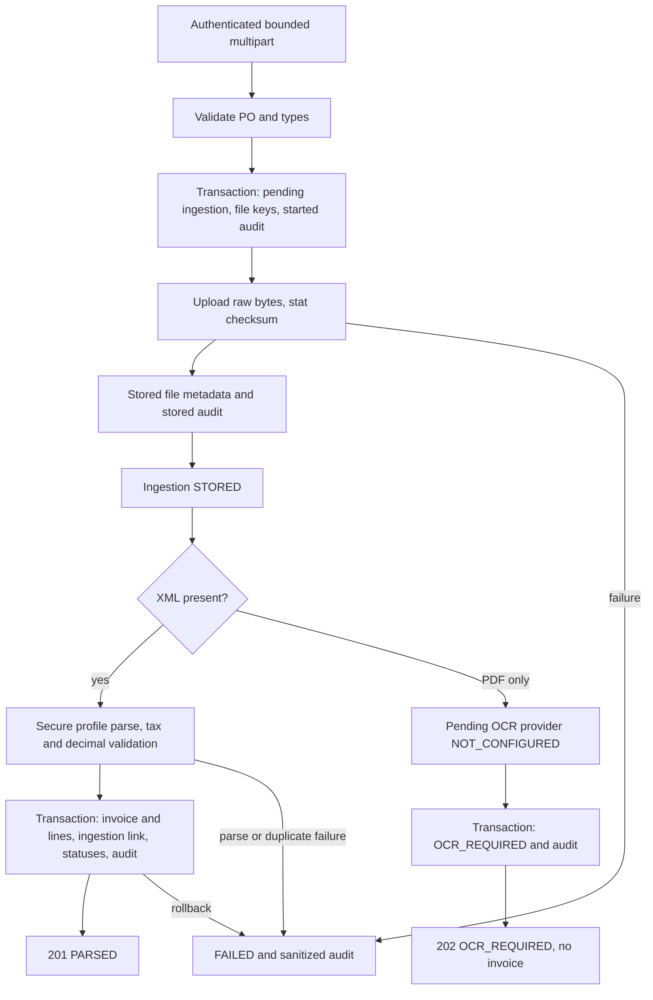

# Invoice ingestion — Issue #7

The module archives raw XML/PDF in a private MinIO bucket and creates structured invoices from two supported XML adapters: the internal SmartProcureInvoice v1 profile and a verified Matbao-invoice/MIFI PBan 2.0.0 VAT subset. Matching, PO-line resolution and `PENDING_MATCH` belong to Issue #8. No OCR extraction is claimed.

## API and authorization

Through APISIX use `/api` before each backend path:

| Method/path | Roles | Behavior |
| --- | --- | --- |
| `POST /invoices/ingest` | accountant, admin | Multipart ingestion |
| `GET /invoices` | accountant, admin, finance_manager, buyer | Paginated headers |
| `GET /invoices/:id` | same read roles | Header and lines |
| `GET /invoices/:id/files` | same read roles | Metadata only |
| `GET /invoice-ingestions/:id` | same read roles | Status, safe errors and file metadata |

Uploads require `purchaseOrderId` (UUID) and at least one `xml`/`pdf` file. At most one of each is permitted. Unknown files, fields, repeated files and supplier overrides are rejected. XML+PDF is supported. Warehouse has no invoice upload/read role. Existing Keycloak JWT and RBAC guards apply before multipart handling.

```bash
curl -H "Authorization: Bearer $ACCOUNTANT_TOKEN" \
  -F "purchaseOrderId=$PO_ID" \
  -F 'xml=@infra/invoice/fixtures/valid-vn-einvoice.xml;type=application/xml' \
  http://localhost:9080/api/invoices/ingest
```

XML success returns `201 { ingestionId, invoiceId, status: "PARSED", files }`. PDF-only returns `202 { ingestionId, invoiceId: null, status: "OCR_REQUIRED", reason: "NOT_CONFIGURED", files }`. Swagger documents the binary fields and response codes; existing production Swagger opt-in remains in effect. File endpoints never return a public download URL.

List defaults: `page=1`, `limit=20`, maximum limit 100. Filters: exact `status`, `supplierId`, `purchaseOrderId`, original `invoiceNumber`. SQL is parameterized, sorting is deterministic, monetary/quantity/rate/size fields are strings. Page is bounded to 1,000,000.

## PO and tax identity

The backend derives `supplier_id` from the PO. Allowed PO states are `ISSUED`, `PARTIALLY_RECEIVED`, `FULLY_RECEIVED`; all others fail. PO and supplier rows are locked and checked again in structured persistence to prevent races with cancellation or supplier changes. Supplier must exist; ingestion of an already issued PO does not impose a new supplier ACTIVE requirement.

Seller tax code is compared using NFKC → trim → uppercase → remove whitespace and ASCII formatting hyphens. Mismatch is `422 SELLER_TAX_CODE_MISMATCH` with no structured row. Supplier master tax code is never changed. Original seller/buyer tax strings are persisted. Buyer tax code is not compared: the repository has no canonical buyer company/legal-entity tax-code field.

Invoice identity uses NFKC → trim → uppercase → remove whitespace, ASCII `-` and `_`. `INV-001`, `inv 001`, `INV_001` become `INV001`; `/` and other punctuation remain meaningful. Empty or overlong canonical values fail. The original parsed number is preserved separately. A precheck compares normalized new identities and legacy rows with NULL normalized identity. Existing exact uniqueness remains and the partial PostgreSQL unique index is the final authority for concurrent new uploads. Duplicate ingestion is `409 DUPLICATE_INVOICE`, retaining raw files, failed ingestion and audit.

Migration 011 adds nullable identity/tax columns without rewriting legacy data. Legacy normalized values remain NULL: backfill requires an audited collision review. External writers must follow this normalization policy; the partial index does not canonicalize legacy or direct SQL inserts automatically.

## Supported XML profile: SmartProcureInvoice v1

This remains an **internal/project interchange profile**, not certification of TCT Decree 123/Circular 78, nor universal Vietnamese provider compatibility. `valid-vn-einvoice.xml` uses Vietnamese field names but is a synthetic project fixture. `SmartProcureInvoiceV1Parser` accepts the following exact case-sensitive tags with `SmartProcureInvoice version="1"` as the single root. No implicit aliases are accepted.

| XML path below root | Canonical field | Rule |
| --- | --- | --- |
| `NguoiBan/MST` | sellerTaxCode | Required, ≤50 characters |
| `NguoiMua/MST` | buyerTaxCode | Required, ≤50 characters; extraction only |
| `ThongTinChung/SHDon` | invoiceNumber | Required, ≤100 characters, original retained |
| `ThongTinChung/NLap` | invoiceDate | Valid `YYYY-MM-DD` |
| `ThongTinChung/DVTTe` | currency | Three letters, uppercase on persistence |
| `DanhSachHangHoa/HangHoa/MHHDVu` | sku | Optional, ≤100 characters |
| `.../THHDVu` | description | Required, ≤10,000 characters |
| `.../SLuong` | quantity | Positive NUMERIC(18,4) |
| `.../DGia` | unitPrice | Nonnegative NUMERIC(18,4) |
| `.../TSuat` | taxRate | Percentage `10` or `10%` → `0.1000`; `8` → `0.0800` |
| `.../ThTien` | lineSubtotal | NUMERIC(18,2) |
| `.../TienThue` | taxAmount | NUMERIC(18,2) |
| `.../TongTien` | lineTotal | NUMERIC(18,2) |
| `TongTien/TgTCThue` | subtotal | Sum of line subtotals |
| `TongTien/TgTThue` | taxAmount | Sum of line taxes |
| `TongTien/TgTTTBSo` | totalAmount | Subtotal + tax |

Invoices require 1–1000 lines. `InvoiceXmlParser` exposes `profile`, `supports`, `parse`. `InvoiceXmlParserService` selects SmartProcureInvoiceV1Parser or MatbaoInvoiceV200Parser from the parsed root/version structure, never filename, request provider name or a nested signature object. Register further adapters only with verified samples, mappings and tests.

For the internal profile, every financial XML value is parsed as a string. Unsigned plain decimal notation only; scientific notation, localized commas, excess lexical scale (including extra trailing zeros), overflow and negative values are rejected before SQL. An isolated decimal.js context at precision 60 avoids changes from other modules' global settings. Quantity/prices have four decimals, rates four decimals, money two decimals. VAT percentage allows at most two decimals and a range 0–100; division by 100 is exact. No financial `Number`, `parseFloat`, native rounding or approximate assertions are used.

Profile calculation: line subtotal = half-up round(quantity × unitPrice, 2); tax = half-up round(line subtotal × fractional rate, 2); line total = their sum. Invoice totals sum the rounded lines. Declared values must equal the calculations exactly; values are never silently corrected. The fixture includes `1.2500 × 0.8040 = 1.005`, rounded exactly to `1.01`. Unknown fields/attributes, mixed content, discounts, allowances, surcharges and special rounding concepts fail `UNSUPPORTED_INVOICE_FEATURE`; repeated/missing scalar fields fail format validation.

## Verified external XML profile: Matbao-invoice/MIFI PBan 2.0.0

This additional adapter is based on the provider's public [ordinary-invoice XML example](https://matbao.in/articles/cau-truc-hoa-don-theo-nd-123), published 2022-03-17. Buyer MST, VAT-group fields and signature containers were cross-checked against the provider's [published Decision 1510 field tables](https://matbao.in/articles/quyet-dinh-so-1510-qd-tct-bo-sung-quyet-dinh-1450-2020). These references establish a concrete external tag layout; they do not establish certification, current legal compliance or compatibility with every provider/version. Detailed source/fixture provenance is in [fixtures/README.md](../../infra/invoice/fixtures/README.md).

`valid-vietnam-provider-einvoice.xml` is a sanitized, independently authored fixture preserving the verified layout. All business data, tax placeholders, number, goods, amounts and QR text are fictional. No provider code, article prose, complete sample, certificate or actual invoice data was copied. Only public format/documentation was referenced; the provider has not granted an OSS license, and none is assigned to its documentation. New adapter code and test data belong to this MIT-licensed project; no dependency is added.

Selection requires the direct unnamespaced `HDon/DLHDon/TTChung/PBan` to equal `2.0.0`. A single business payload is required. The supported subset is ordinary VAT (`KHMSHDon=1`), VND, B2B with both tax codes, and goods/service lines (`TChat=1`), with 1–1000 lines. Invoice number is the original positive 1–8 digit `SHDon` string, including leading zeros; the existing supplier+number identity policy applies. Series/year are not added to duplicate identity, so numbering reuse across series requires a future domain/schema decision.

| Verified path below `HDon/DLHDon` | Canonical output / validation |
| --- | --- |
| `NDHDon/NBan/MST`, `NDHDon/NMua/MST` | sellerTaxCode / buyerTaxCode, required ≤14 characters; existing seller/PO binding applies |
| `TTChung/SHDon`, `NLap`, `DVTTe` | invoiceNumber, valid YYYY-MM-DD invoiceDate, currency VND |
| `NDHDon/DSHHDVu/HHDVu/MHHDVu`, `THHDVu` | Optional sku ≤50, required description ≤500 |
| `.../SLuong`, `DGia`, `TSuat` | Positive quantity / nonnegative unitPrice at 18,4; numeric percentage converted to rate 7,4 |
| `.../ThTien` | Declared lineSubtotal reconciled with rounded quantity × price |
| No line-tax/line-total tag in this layout | Derive taxAmount using half-up subtotal × rate; lineTotal is subtotal + tax |
| `NDHDon/TToan/THTTLTSuat/LTSuat/TSuat`, `ThTien`, `TThue` | Exactly one group per rate; compare declared subtotal/tax to sums of computed line amounts |
| `NDHDon/TToan/TgTCThue`, `TgTThue`, `TgTTTBSo` | Exact subtotal, taxAmount, totalAmount; reconcile against all lines/groups |

The provider example prints monetary values with four-place zero padding. This adapter accepts up to six lexical money decimal places **only when removing trailing zeros leaves an exactly representable NUMERIC(18,2) value**. `201.2600` becomes `201.26` without changing its value; `201.2601` fails precision validation. No monetary value is rounded to fit PostgreSQL. Quantity/prices still require ≤4 places, VAT percentages ≤2, and overflow is rejected. Shared `invoice-xml-validation.ts` retains the isolated Decimal context and financial rules; the internal adapter continues to reject excess lexical scale, including trailing zeros. Every previous precision regression remains in place.

Recognized metadata is validated as scalar text and retained only in the raw archive: header title/series/payment/provider-tax metadata, seller name/address/contact, buyer name/address, line unit, total text, DLQRCode and MCCQT. Line STT, when present, must be sequential. DLHDon Id is metadata, not a trust decision. TLCKhau, STCKhau and TTCKTMai are accepted only as exact zero, as in the public example. Nonzero discounts, adjustments/replacements (TTHDLQuan), foreign currency/exchange, exempt/special VAT, fees, allowances, custom TTKhac and alternate rounding are rejected; unknown financial fields are never discarded.

Optional DSCKS/NBan, NMua or CQT Signature subtrees are archived only and never used to select business data. Parsing **does not verify digital signatures, certificate chains, tax-authority approval or authenticity**. Those are separate capabilities. All XML still passes the same UTF-8, DTD/ENTITY/XXE, malformed/reference and safe-error checks before either adapter runs.

## XML and upload security

XML requires a compatible MIME (`application/xml`, `text/xml`, `application/*+xml`) and UTF-8 XML text; BOM/whitespace are accepted. Null/control bytes and invalid UTF-8 fail. UTF-16 and other declarations are unsupported. Malformed XML is archived then fails `422 MALFORMED_XML`. All DOCTYPE/ENTITY declarations are rejected before parsing. The parser has no network/filesystem resolver; only standard built-in character references are decoded. DTD/external entities cannot be resolved.

PDF requires `application/pdf` and a `%PDF-1.x` or `%PDF-2.x` signature at the start. This validates the upload type; it does not assert PDF semantic validity or OCR extraction. Filename and extension never determine parser or key selection.

Defaults: XML 5 MiB (`INVOICE_XML_MAX_BYTES=5242880`), PDF 20 MiB (`INVOICE_PDF_MAX_BYTES=20971520`). Multer bounds each buffered file to the larger configured limit and the service enforces the individual limit; two files and one bounded text field only. Config limits must be positive safe integers ≤100 MiB. APISIX has a 30 MiB total request ceiling, so raising backend limits also requires an intentional gateway ceiling change. Over-limit uploads return 413. Rejects before ingestion creation have no archival guarantee.

## Storage and integrity

MinIO is an unmodified external AGPLv3 infrastructure service. Registry checks on 2026-10-05 returned denied/not-found for previously planned community image tags. Upstream now directs source-only container builds. `infra/minio/Dockerfile` builds official release `RELEASE.2025-10-15T17-29-55Z`, immutable commit `9e49d5e7a648f00e26f2246f4dc28e6b07f8c84a`, without source modifications. Build/runtime base images are pinned by verified digests. This avoids inventing an available upstream container tag. The upstream community repository is archived; production maintenance/upgrades require separate review.

Compose activates `smartprocure-minio`, a persistent volume and a bounded healthcheck. API credentials/defaults are **DEV/CI ONLY**. Production must override all secrets, provision a scoped service identity separate from root, restrict storage to a private internal network, and terminate/configure TLS appropriately. Do not publish MinIO API/console to public interfaces. Development binds both ports to `127.0.0.1`. `MINIO_ENDPOINT`, `MINIO_PORT`, `MINIO_ACCESS_KEY`, `MINIO_SECRET_KEY`, `MINIO_BUCKET_INVOICES`, `MINIO_USE_SSL` configure the API client. Compose uses the internal service hostname and port 9000.

The invoices bucket is created lazily with no anonymous policy. The service fails closed for preexisting buckets with any bucket resource policy; scoped IAM identities provide access. The API identity needs bucket-existence/create and GetBucketPolicy permissions plus object put/stat/read permissions. Raw bytes never enter PostgreSQL. Keys are `invoices/YYYY/MM/<server-ingestion-UUID>/<server-file-UUID>.xml|pdf` in UTC. Original filename is metadata only, sanitized for control bytes and length. Node crypto hashes the original buffer, saves lowercase SHA-256 in `invoice_files` and MinIO metadata `sha256`, then verifies metadata and size using stat. ETag is never treated as SHA-256. The acceptance script also downloads the real bytes, recomputes SHA-256 and checks anonymous GET returns 403.

## Lifecycle, persistence and recovery



`invoice_ingestions`: PENDING_UPLOAD → STORED → PARSED or OCR_REQUIRED; processing failure → FAILED. `invoices.status` is PARSED only. XML files become PARSED; accompanying PDF remains STORED. PDF-only files become OCR_REQUIRED. Failed ingestions mark files FAILED; this is processing failure and does not imply raw object deletion.

Pending file rows and keys are committed **before storage**. This differs slightly from storing metadata after upload and ensures every possible uploaded object is traceable even after a process crash or DB outage. Each upload/stat succeeds before its file-stored audit is committed. Structured persistence atomically inserts header, every line (`po_item_id=NULL`), links ingestion, updates statuses and writes `INVOICE_PARSED`. Any line/audit failure rolls all structured work back. Header `external_file_id` contains the primary XML key; `source_type=XML_UPLOAD`.

MinIO and PostgreSQL do not share a distributed transaction. Archives are retained on parse, duplicate and DB failure rather than deleted. Failure status/audit persistence is best effort; if PostgreSQL is unavailable, already committed PENDING_UPLOAD/STORED rows and generated keys remain the recovery ledger. A sanitized log identifies ingestion UUIDs requiring reconciliation.

Operational reconciliation (operator procedure, no automatic matching/retry): inspect `invoice_ingestions` in PENDING_UPLOAD/STORED older than the upload timeout, join their `invoice_files`, stat each configured-bucket key, compare size and `sha256`, and read/hash bytes if uncertain. Record missing/failed objects as failed with a safe code and audit, or arrange a reviewed re-ingestion. Never infer successful parse from object existence. Do not delete business rows or retained duplicate/error archives automatically. Archive retention and garbage collection require a separate policy; the storage service exposes optional delete for deliberate compensation.

`InvoiceOcrProvider.extract` returns a typed result. `PendingOcrProvider` returns OCR_REQUIRED/NOT_CONFIGURED. An EXTRACTED result is rejected until a provider-specific validation and persistence route is implemented; the MVP does not trust arbitrary OCR data.

## Errors and audit

Public errors have `statusCode`, `errorCode`, safe `message`, and `ingestionId` once available. Parser internals, stack, raw files, filesystem paths, SQL and credentials are not returned or saved in ingestion errors.

| HTTP | Codes |
| --- | --- |
| 400 | INVALID_REQUEST, FILE_REQUIRED, EMPTY_FILE, INVALID_UPLOAD_FIELDS |
| 401/403 | UNAUTHORIZED / FORBIDDEN |
| 404 | PURCHASE_ORDER_NOT_FOUND, INVOICE_NOT_FOUND, INGESTION_NOT_FOUND |
| 409 | DUPLICATE_INVOICE |
| 413 | FILE_TOO_LARGE |
| 415 | UNSUPPORTED_MEDIA_TYPE |
| 422 | MALFORMED_XML, UNSAFE_XML, UNSUPPORTED_XML_FORMAT, UNSUPPORTED_INVOICE_FEATURE, INVALID_DECIMAL, DECIMAL_PRECISION_EXCEEDED, INVALID_TAX_RATE, INVALID_INVOICE_DATE, INVALID_INVOICE_NUMBER, INVALID_PURCHASE_ORDER_STATE, SELLER_TAX_CODE_MISMATCH, UNSUPPORTED_OCR_RESULT, TOTAL_MISMATCH |
| 503 | UPLOAD_FAILED, PERSISTENCE_FAILED |

Audit events: INVOICE_INGESTION_STARTED, INVOICE_FILE_STORED, INVOICE_PARSED, INVOICE_OCR_REQUIRED, INVOICE_INGESTION_FAILED. Successful parse audit is entity_type INVOICE with the structured UUID and authenticated subject; metadata includes PO/supplier, ingestion, identity, source, file IDs/hash values, exact totals and line count. Raw XML/PDF, JWT/passwords and storage secrets are never audit metadata.

## Validation and Issue #8 handoff

Unit tests cover canonicalization, field mappings, XXE, unsupported features, precision, VAT, totals, signatures, checksum/key generation and transitions. HTTP E2E tests explicitly mock auth, repository and storage; these do not prove real storage/database acceptance.

Run `bash infra/invoice/validate-invoice-ingestion.sh` only against a disposable development/CI stack. It authenticates demo users through Keycloak, sends multipart via APISIX, validates real SQL and MinIO downloads, asserts private bucket access, PDF fallback, XML+PDF, failures, duplicate normalization, concurrent 201/409 outcomes, file limits/RBAC and rollback after header+first line. It additionally uploads the sanitized verified external layout with a separate PO/supplier, verifies exact header/two lines/tax codes/normalized number/PARSED states/NULL po_item_id/audit and four-way SHA-256 readback, and rejects external-profile seller mismatch, discounts, precision and XXE. The acceptance criterion for standard electronic invoice XML is therefore backed by the verified external layout, not only the internal profile. A temporary test-only invoice-item trigger induces rollback and is removed by the EXIT trap. Existing schema/Keycloak/APISIX/PO/GRN validation remains in CI before invoice acceptance.

Issue #8 receives structured PARSED invoices and unresolved lines. No GRN matching, payment clearance, workflow, ledger sealing, provider certification, tax-authority integration or trained OCR is included here.
