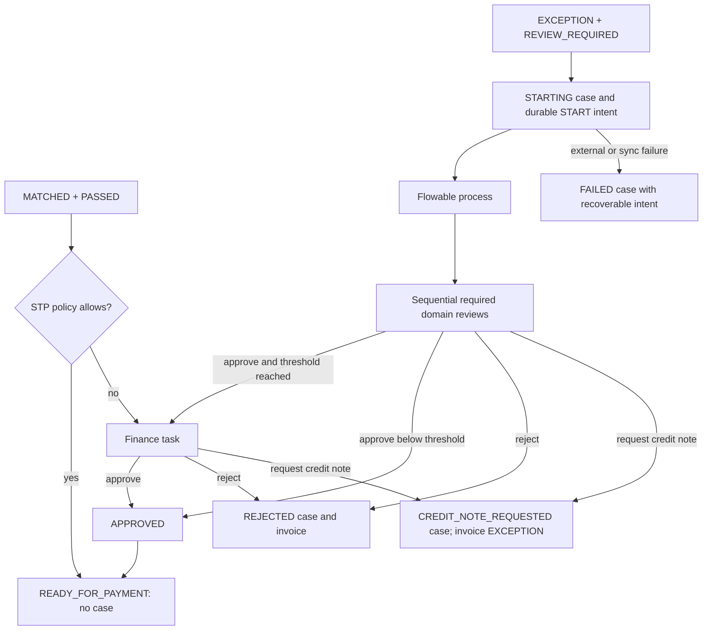

# Invoice approval and exception workflow (Issue #9, WF-1.0)

## Lifecycle and boundaries

Issue #8 supplies completed immutable matching evidence. This module never reruns matching or edits PO, GRN, invoice monetary fields, matching results or semantic confidence. A MATCHED invoice with a PASSED result follows STP to READY_FOR_PAYMENT by default, without an approval case or Flowable process. READY_FOR_PAYMENT is clearance only, with no bank transfer, payment gateway or ERP disbursement. Issue #10 owns ImmuDB sealing.

An EXCEPTION invoice with REVIEW_REQUIRED evidence creates an exception case. The invoice remains EXCEPTION throughout active review; DISCREPANCY_REVIEW describes workflow/task state and is not an invoice status. Final approval records EXCEPTION → APPROVED → READY_FOR_PAYMENT in one PostgreSQL transaction with both invoice events. A configured clean finance case instead starts at MATCHED, then uses the same approval transitions.



## Policy and deterministic routing

The single active WORKFLOW_DEFAULT policy has autoReadyForPaymentMaxAmount=NULL and financeApprovalThreshold="100000000.00". NULL allows every clean matched invoice through STP, regardless of the exception finance threshold. A non-null cap is an inclusive STP maximum: total <= cap uses STP; total > cap creates CLEAN_FINANCE and a finance_manager task only. For exceptions, total >= financeApprovalThreshold requires finance approval after all domain reviews. Comparisons use decimal.js on PostgreSQL NUMERIC strings, never JavaScript floating point. These values use the document's stored currency units; the MVP has no currency conversion or currency-specific policy.

| Discrepancy | Domain role |
| --- | --- |
| MISSING_GRN, QUANTITY_MISMATCH | warehouse |
| PRICE_MISMATCH, ITEM_DESCRIPTION_MISMATCH, UNRECOGNIZED_ITEM, AMBIGUOUS_ITEM | buyer |
| TAX_MISMATCH, TOTAL_MISMATCH, SUPPLIER_MISMATCH, SELLER_TAX_CODE_MISSING, SELLER_TAX_CODE_MISMATCH, CURRENCY_MISMATCH | accountant |

Unique roles run sequentially in warehouse → buyer → accountant order. This keeps one active task per case and represents every required responsibility. Unknown discrepancy codes fail closed with UNSUPPORTED_DISCREPANCY; they need an explicit adapter. Early rejection or a credit-note request ends the process before later roles are created.

The immutable case snapshot contains matchResultId, matchStatus, discrepancyCodes, the matching policySnapshot/ruleVersion, invoiceTotal, requiredRoles, requiresFinanceApproval and workflowPolicySnapshot. Later policy edits do not alter existing routing. Admin PATCH accepts only strict nonnegative decimal strings fitting NUMERIC(18,2); cap also accepts NULL. Policy update and WORKFLOW_POLICY_UPDATED previous/new audit share a transaction.

## Flowable deployment and BPMN

Flowable OSS **8.0.0**, Apache-2.0, runs as smartprocure-flowable using the official flowable/flowable-rest image, pinned to manifest digest sha256:708dfa32f27b93180bb6e7a30684d881d995fe257f5b8413e14b20a55c25672d. The separate smartprocure-flowable-postgres service has a persistent named volume and no host database port. Engine REST binds to 127.0.0.1:8088 for development; the API uses the private Docker URL. The REST edition provides orchestration APIs; this integration adds no Flowable UI. See [component provenance](../../OPEN_SOURCE_COMPONENTS.md#flowable-issue-9-provenance).

The BPMN source is infra/flowable/processes/invoice-exception-workflow.bpmn20.xml, process key invoiceExceptionWorkflow, application rule version WF-1.0. Engine definition versions are deployment-local integers (fresh deployment version 1); each case records the observed version. Explicit bootstrap validates XML, process key, four user tasks, eight gateways and terminal nodes. It deploys only when the key is absent and reuses a byte-equivalent definition. An existing differing definition stops bootstrap for operator review. Every workflow operation verifies the deployed resource SHA-256 against the packaged BPMN, after normalizing line endings.

```bash
# Start the stack, then deploy once (safe to repeat).
docker compose up -d
node infra/workflow/bootstrap-flowable.cjs
```

BPMN uses four candidate-group user tasks and gateways for required warehouse/buyer/accountant roles, finance threshold and decisions. Process variables contain case/invoice/match IDs, invoice total as string, discrepancy codes and routing booleans. Completion adds the decision and a task-local applicationOperationId used to recover an uncertain response. No JWT, raw invoice document, credentials or reason text is sent to Flowable.

FLOWABLE_URL, FLOWABLE_USERNAME, FLOWABLE_PASSWORD, FLOWABLE_PROCESS_KEY and FLOWABLE_TIMEOUT_MS configure the API. HTTP timeout is bounded to 100..30000 ms; default 10000. Full engine history is required for recovery and must not be purged before application reconciliation. Production must provide managed credentials, isolate both databases and the engine on private networks, remove development host publishing, and protect any remote transport with TLS. The bundled defaults are development/CI credentials; the service account has engine administration privileges for this MVP. Production should separate deployment credentials from runtime access and disable direct human engine writes.

## PostgreSQL ownership and migration 013

Only additive migration 013 is introduced. Old migrations remain unchanged. Duplicate historical cases for an invoice fail migration explicitly. approval_cases retains PENDING/APPROVED/REJECTED/CANCELLED and adds STARTING, FAILED and CREDIT_NOTE_REQUESTED. New fields record case type, role/stage, decision/reason, initiator/resolver subjects, immutable evidence and process key/version. UNIQUE(invoice_id) is the MVP boundary: no second workflow or reopen endpoint is provided.

approval_tasks mirrors engine tasks with globally unique flowable_task_id, role, claimant, OPEN/CLAIMED/COMPLETED/CANCELLED status, action/reason and timestamps. approval_decisions holds one append-only completion per application task with actor/roles and previous/new case/invoice states. A trigger prevents ordinary SQL UPDATE/DELETE of decision records, and another preserves case snapshots. These are relational guards, not cryptographic or database-administrator tamper protection. Every business FK is ON DELETE RESTRICT.

workflow_operations stores durable START/CLAIM/COMPLETE intent, original authenticated actor, decision payload, PENDING/APPLIED/FAILED state, dispatch timestamp, safe error code and retry-safety evidence. A partial unique index permits one unapplied operation per case. A separate partial index permits one active workflow policy. No API updates or deletes decisions, snapshots or operation history.

## Non-ACID boundary, concurrency and recovery

PostgreSQL and Flowable have separate transactions. The implementation does not claim shared atomicity.

```mermaid
sequenceDiagram
  actor User
  participant API
  participant DB as Application PostgreSQL
  participant F as Flowable and engine PostgreSQL
  User->>API: Authenticated start or task action
  API->>DB: Lock invoice, case, task; validate state and JWT role/owner
  API->>DB: Commit case/operation intent
  API->>DB: Acquire session advisory lock for this case
  API->>F: Query process/task and history before dispatch
  API->>DB: Persist dispatch timestamp
  API->>F: Start, claim or complete
  F-->>API: Engine evidence and resulting tasks
  API->>DB: One transaction: task mirrors, decision, states, audits, APPLIED
  API-->>User: Confirmed result
  Note over API,DB: On uncertainty: keep intent and return safe 503
```

Invoice row locks and UNIQUE(invoice_id) serialize concurrent starts. A session advisory lock serializes execution/reconciliation across application instances; the lock ends on disconnect/crash. Preparation refuses another operation until the previous one is applied. Task claim locks the application task after its invoice/case. Concurrent starts/claims/completions yield one winner and one 409, with one case/process/decision. No automatic HTTP retry replays side effects.

Business key approval-case:<caseId> is stable. Flowable itself does not enforce its uniqueness; application uniqueness and serialized durable commands provide the protection. Recovery queries history, including completed processes, and refuses duplicate business keys. Engine task IDs come from PostgreSQL ownership, never the client. Before completion the API verifies expected process/business key, packaged BPMN, task key, candidate role and claimant. Synchronization accepts only engine-confirmed active tasks or completion history; it does not invent a task or terminal outcome.

Failures before dispatch are safe to retry via explicit reconciliation. Connection refusal/DNS failure from a POST is also recorded as safe. Timeouts or uncertain POST failures are not blindly replayed. A started engine process with failed local sync is discovered by business key. A successful claim with failed local sync is verified by its engine assignee. A completed task with failed local persistence requires the task-local operation marker before a decision can be written.

```bash
# Read-only report (default); use existing API container credentials.
docker compose exec -T smartprocure-api node infra/workflow/reconcile-workflows.cjs

# Read-only report for one operation.
docker compose exec -T smartprocure-api node infra/workflow/reconcile-workflows.cjs --operation UUID

# Explicit operator action: reconcile one original intent.
docker compose exec -T smartprocure-api node infra/workflow/reconcile-workflows.cjs --apply --operation UUID
```

A failed START becomes FAILED, with no false active case or fake tasks; the invoice remains at its prior state. A failed CLAIM/COMPLETE preserves the application's last confirmed task/case/invoice state and blocks subsequent actions until reconciliation. If persisting the failure itself is unavailable, the original PENDING intent remains discoverable.

For a dispatched operation with no conclusive engine evidence, the CLI refuses replay. The operator must inspect engine history/logs and ensure prior requests/workers have stopped; restore lost engine history or resolve the external inconsistency before retry. There is deliberately no force-replay or automatic production mutation. If both databases lose their evidence, this MVP cannot reconstruct business history. Back up both stores consistently and monitor unapplied operations. Remote engine edits, purged history and indefinite network ambiguity require operator intervention.

## Task actions and authorization

| Endpoint | Roles / rules |
| --- | --- |
| POST /invoices/:invoiceId/workflow/start | accountant, admin; empty body; trusted DB evidence |
| GET /approval-cases; GET /approval-cases/:id; GET /approval-cases/:id/tasks | accountant, admin, finance_manager, buyer, warehouse |
| GET /my-approval-tasks | Same roles; available/owned tasks; admin sees all |
| POST /approval-tasks/:taskId/claim | Assigned role or admin; empty body |
| POST /approval-tasks/:taskId/complete | Assigned role and claimant, or explicit audited admin override |
| GET /workflow/policy | All read roles |
| PATCH /workflow/policy | admin |

Case and task lists return at most 200 entries per call in this MVP; detail/task history can be read by known case ID. Claiming OPEN assigns the current JWT subject. The same claimant may claim again idempotently; another subject gets TASK_ALREADY_CLAIMED. Completing a finished task gives TASK_ALREADY_COMPLETED. Admin may complete an unclaimed task or another user's task, with override=true in completion/finalization audit. Roles never come from request bodies.

| Action | Reason | Result |
| --- | --- | --- |
| APPROVE | Optional | Continue required reviews; final case APPROVED and invoice APPROVED → READY_FOR_PAYMENT |
| APPROVE_WITH_ADJUSTMENT | Required, nonblank | Same approval path; recorded rationale, no financial line changes or adjustment posting |
| REJECT | Required, nonblank | Terminal case/invoice REJECTED; no payment clearance event |
| REQUEST_CREDIT_NOTE | Required, nonblank | Terminal case CREDIT_NOTE_REQUESTED, invoice EXCEPTION; no fabricated supplier credit note |

Reasons are limited to 2000 characters. Credit-note requests resolve this MVP workflow into a terminal waiting-for-vendor outcome; creating or linking an actual replacement credit note and reopening review are future work. A credit-note request on optional CLEAN_FINANCE likewise places the invoice in EXCEPTION.

Success is HTTP 200, including STP and business decisions. Invalid DTOs/body/UUIDs give 400, unauthenticated 401, wrong roles/claim ownership 403, missing IDs 404, duplicate start/claim/completion or invalid state 409, and engine/persistence uncertainty safe 503. Error responses do not disclose credentials, raw SQL or engine payloads.

## Audit and validation

WORKFLOW_START_REQUESTED records committed intent. Confirmed changes emit WORKFLOW_STARTED, WORKFLOW_START_FAILED, APPROVAL_TASK_CREATED, APPROVAL_TASK_CLAIMED, APPROVAL_TASK_COMPLETED, APPROVAL_CASE_APPROVED, APPROVAL_CASE_REJECTED, VENDOR_CREDIT_NOTE_REQUESTED, INVOICE_APPROVED, INVOICE_REJECTED, INVOICE_READY_FOR_PAYMENT and WORKFLOW_POLICY_UPDATED as applicable. Original authenticated actor subject/roles, reasons, operation IDs and timestamps are retained. STP logs route=STP and its policy snapshot. All local finalization records share one PostgreSQL transaction; an audit/decision write failure rolls back local transitions while retaining the earlier durable intent.

Unit tests cover role mapping, money/cap/threshold boundaries, policy snapshots, terminal semantics, identity checks, safe/unsafe retry and recovery markers. HTTP E2E explicitly mocks authentication, repository and engine while exercising validation, routing, guards and safe errors. Neither set is presented as real Flowable evidence.

infra/workflow/validate-invoice-workflow.sh runs the real Keycloak → APISIX → NestJS → PostgreSQL → Flowable stack. SQL fixtures create persisted matching evidence; all workflow operations use the authenticated API. Scenarios cover STP, all domain roles, multi-role order, below/exact-threshold approval, rejection, credit-note/adjustment semantics, real role/claim ownership, admin override, immutable snapshots/audits, and concurrent start/claim/complete using database barriers. It stops the actual engine to prove 503/FAILED and recovery, and injects PostgreSQL triggers after successful engine start/completion to prove business-key/operation-marker recovery. Bootstrap checks BPMN structure and deploys to the real engine. Existing build/lint/unit/HTTP/schema/Keycloak/APISIX/PO/GRN/invoice/MinIO/matching validations remain in CI.

