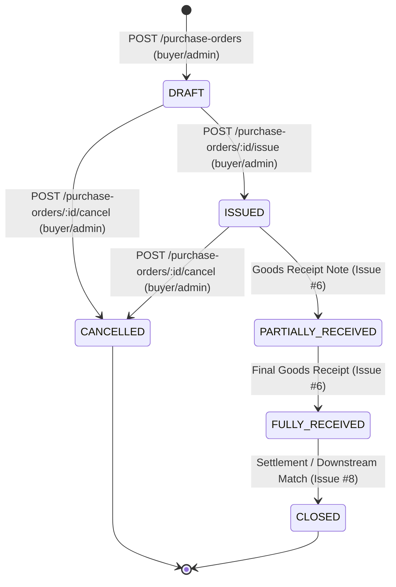

# Purchase Order Module Specification (Issue #5)

This document establishes the architectural, operational, and domain specifications for the **Purchase Order (PO) Module** in **SmartProcure-Pay**.

---

## 1. Module Overview & Responsibilities

The Purchase Order module provides lifecycle management, state transition enforcement, optimistic concurrency control, line-item arithmetic, and auditable event tracking for purchasing documents within SmartProcure-Pay.

### Key Architectural Boundaries:
- **Direct Ownership**: The module directly creates and governs the `DRAFT` ──► `ISSUED` transition and legitimate order cancellations (`DRAFT` ──► `CANCELLED`, `ISSUED` ──► `CANCELLED`).
- **Downstream Ownership**: Transition to `PARTIALLY_RECEIVED` and `FULLY_RECEIVED` is explicitly owned by the Goods Receipt module ([Issue #6](https://github.com/hieunofun/SmartProcure-Pay/issues/6)). Transition to `CLOSED` is orchestrated upon settlement of all physical and financial obligations.
- **Workflow Decoupling**: Formal approval workflows (e.g. multi-tier managerial sign-off via Flowable BPMN) and the intermediate `PENDING_APPROVAL` status are deferred to [Issue #9](https://github.com/hieunofun/SmartProcure-Pay/issues/9). The module avoids premature internal workflow mocks.

---

## 2. Status Lifecycle & State Machine

The Purchase Order lifecycle is strictly aligned with the canonical database domain schema merged in Issue #2 (`database/migrations/003_create_purchase_orders.sql`):



### Transition Ownership Matrix

| From Status | To Status | Allowed? | Owning Component / Module | Business Rules / Constraints |
|:---|:---|:---:|:---|:---|
| *(none)* | `DRAFT` | **Yes** | Purchase Orders Module (`POST /purchase-orders`) | Requires active supplier, >= 1 item, positive quantities. |
| `DRAFT` | `ISSUED` | **Yes** | Purchase Orders Module (`POST /purchase-orders/:id/issue`) | Requires supplier active, items >= 1, internally consistent totals. |
| `DRAFT` | `CANCELLED` | **Yes** | Purchase Orders Module (`POST /purchase-orders/:id/cancel`) | Requires non-empty `reason` string and matching `expectedVersion`. |
| `ISSUED` | `CANCELLED` | **Yes** | Purchase Orders Module (`POST /purchase-orders/:id/cancel`) | Prohibited once physical goods receipt notes exist downstream. |
| `DRAFT` | `DRAFT` (Edit) | **Yes** | Purchase Orders Module (`PATCH /purchase-orders/:id`) | Content mutable only while in `DRAFT`. Optimistic locking enforced. |
| `ISSUED` | *(Mutation)* | **No** | Rejected (HTTP 409 Conflict) | Line items, quantities, and pricing are immutable after issuance. |
| `ISSUED` | `PARTIALLY_RECEIVED` | Deferred | Goods Receipt Module ([Issue #6](https://github.com/hieunofun/SmartProcure-Pay/issues/6)) | Triggered when accepted quantity < ordered quantity on GRN. |
| `PARTIALLY_RECEIVED` | `FULLY_RECEIVED` | Deferred | Goods Receipt Module ([Issue #6](https://github.com/hieunofun/SmartProcure-Pay/issues/6)) | Triggered when cumulative accepted quantity reaches 100%. |
| `FULLY_RECEIVED` | `CLOSED` | Deferred | Downstream Settlement ([Issue #8](https://github.com/hieunofun/SmartProcure-Pay/issues/8)) | Triggered when 3-way match passes and invoice payments settle. |
| `CLOSED` | `CANCELLED` | **No** | Strictly Prohibited (HTTP 409 Conflict) | Cannot cancel completed business records. |

---

## 3. Server-Side Calculations & Arithmetic Precision

To prevent tampering and floating-point rounding inaccuracies:
1. **Frontend Disregard**: The server **never** trusts client-submitted monetary totals (`subtotal`, `taxAmount`, `totalAmount`). Any such client values are rejected by input whitelisting or recalculated from atomic line items.
2. **Fixed-Point Decimal Arithmetic**: Calculations enforce `NUMERIC(18,2)` rounding rules:
   $$\text{lineSubtotal} = \text{round}(\text{orderedQuantity} \times \text{unitPrice}, 2)$$
   $$\text{taxAmount} = \text{round}(\text{lineSubtotal} \times \text{taxRate}, 2)$$
   $$\text{lineTotal} = \text{lineSubtotal} + \text{taxAmount}$$
   $$\text{subtotal} = \sum \text{lineSubtotal}$$
   $$\text{totalTax} = \sum \text{taxAmount}$$
   $$\text{totalAmount} = \text{subtotal} + \text{totalTax}$$
3. **Tax Rate Representation**: Expressed as decimal fractions (e.g. `0.08` represents 8%, `0.10` represents 10%).

---

## 4. Optimistic Concurrency Control

To guarantee database integrity and prevent lost updates in multi-user concurrent procurement workflows:
1. **Schema**: The `purchase_orders` table includes a `version INTEGER NOT NULL DEFAULT 1` column with a non-negative constraint (`database/migrations/009_add_po_optimistic_lock.sql`).
2. **Mutation Query Pattern**:
   ```sql
   UPDATE purchase_orders
   SET ...,
       version = version + 1
   WHERE id = $id
     AND version = $expectedVersion;
   ```
3. **Conflict Handling**: If zero rows are affected by the update (meaning another user concurrently modified the record), the repository immediately aborts the transaction and throws:
   ```json
   {
     "statusCode": 409,
     "message": "Optimistic lock conflict: Purchase Order version is 2, expected 1. Please reload and retry."
   }
   ```

---

## 5. Concurrency-Safe PO Number Generation

PO numbers must be deterministic, auditable, and race-condition free:
1. **Sequence**: Controlled by dedicated PostgreSQL sequence `purchase_order_number_seq` (created in migration `009_add_po_optimistic_lock.sql`).
2. **Format**: `PO-YYYY-XXXXXX` (e.g., `PO-2026-000001`).
3. **Safety**: Generates via `SELECT 'PO-' || to_char(CURRENT_DATE, 'YYYY') || '-' || lpad(nextval('purchase_order_number_seq')::text, 6, '0')`, preventing duplicate numbers even under heavy concurrent creation.

---

## 6. Atomic Database Transactions & Audit Logging

Every state mutation in the Purchase Order module is executed inside a true PostgreSQL database transaction (`BEGIN ... COMMIT / ROLLBACK`):

### PO Creation:
```
BEGIN;
  INSERT INTO purchase_orders (...) RETURNING ...;
  INSERT INTO purchase_order_items (...) [for each item];
  INSERT INTO audit_records (
    entity_type = 'PURCHASE_ORDER',
    entity_id = ...,
    event_type = 'PO_CREATED',
    actor_subject = <sub from Keycloak>,
    actor_roles = <roles from Keycloak>,
    payload = { poNumber, status, totalAmount, ... }
  );
COMMIT;
```
If item insertion fails, the entire transaction rollbacks, preventing orphan header rows.

### Events Logged to `audit_records`:
- `PO_CREATED`: Record creation with initial item count and financial totals.
- `PO_UPDATED`: Line item or header updates, noting previous and new versions.
- `PO_ISSUED`: Formal order issuance to vendor with timestamp.
- `PO_CANCELLED`: Order cancellation with mandatory trimmed business reason.

---

## 7. Role-Based Access Control (RBAC)

Integration with Keycloak OIDC and Apache APISIX Gateway:
- **`buyer` / `admin`**: Full mutation authority (`POST /purchase-orders`, `PATCH /purchase-orders/:id`, `POST /purchase-orders/:id/issue`, `POST /purchase-orders/:id/cancel`).
- **`warehouse`, `accountant`, `finance_manager`**: Read-only access (`GET /purchase-orders`, `GET /purchase-orders/:id`). Mutations return HTTP `403 Forbidden`.
- **Unauthenticated**: Returns HTTP `401 Unauthorized`.

---

## 8. REST API Reference

All requests pass through the Apache APISIX Gateway (`http://localhost:9080/api/purchase-orders`) or directly to the NestJS backend during testing (`http://localhost:4000/purchase-orders`).

### 1. Create Purchase Order
- **Path**: `POST /purchase-orders`
- **Roles**: `buyer`, `admin`
- **Request Body**:
  ```json
  {
    "supplierId": "a0eebc99-9c0b-4ef8-bb6d-6bb9bd380a11",
    "currency": "USD",
    "orderDate": "2026-10-04",
    "expectedDeliveryDate": "2026-10-25",
    "items": [
      {
        "sku": "IT-SRV-01",
        "description": "Enterprise Rackmount Server 2U",
        "orderedQuantity": 2,
        "unitPrice": 4500.00,
        "taxRate": 0.10
      }
    ]
  }
  ```
- **Response**: `201 Created` with full entity and server-computed totals.

### 2. List Purchase Orders (Paginated)
- **Path**: `GET /purchase-orders?page=1&limit=20&status=DRAFT`
- **Roles**: `buyer`, `admin`, `warehouse`, `accountant`, `finance_manager`
- **Response**: `200 OK`
  ```json
  {
    "data": [...],
    "page": 1,
    "limit": 20,
    "total": 45
  }
  ```

### 3. Get Purchase Order Details
- **Path**: `GET /purchase-orders/:id`
- **Roles**: `buyer`, `admin`, `warehouse`, `accountant`, `finance_manager`
- **Response**: `200 OK` with header details and line items.

### 4. Update DRAFT Purchase Order
- **Path**: `PATCH /purchase-orders/:id`
- **Roles**: `buyer`, `admin`
- **Request Body**:
  ```json
  {
    "expectedVersion": 1,
    "currency": "EUR"
  }
  ```
- **Response**: `200 OK` (version incremented to 2) or `409 Conflict`.

### 5. Issue Purchase Order
- **Path**: `POST /purchase-orders/:id/issue`
- **Roles**: `buyer`, `admin`
- **Request Body**:
  ```json
  {
    "expectedVersion": 1
  }
  ```
- **Response**: `200 OK` (status set to `ISSUED`).

### 6. Cancel Purchase Order
- **Path**: `POST /purchase-orders/:id/cancel`
- **Roles**: `buyer`, `admin`
- **Request Body**:
  ```json
  {
    "expectedVersion": 2,
    "reason": "Supplier unable to meet strict delivery deadline."
  }
  ```
- **Response**: `200 OK` (status set to `CANCELLED`, `cancelled_at` set, `cancelled_reason` recorded).

---

## 9. Swagger / OpenAPI Documentation

Interactive Swagger documentation is exposed at:
- **Local Dev / Docker**: `http://localhost:4000/docs`
- **Gateway Dev**: `http://localhost:9080/docs` (when enabled via `ENABLE_SWAGGER=true`)

The documentation includes:
- Bearer token authentication schema
- Complete DTO models with descriptions, validation bounds, and examples
- Response schemas for `200`, `201`, `400`, `401`, `403`, `404`, and `409` status codes.

---

## 10. Future Integrations & Next Phases

1. **Issue #6 (Goods Receipt Notes)**:
   - GRN creation will reference existing `purchase_orders` and `purchase_order_items`.
   - Incoming delivery volume triggers state evolution: `ISSUED` ──► `PARTIALLY_RECEIVED` ──► `FULLY_RECEIVED`.
2. **Issue #9 (Flowable BPMN Approval Workflow)**:
   - If dynamic approval thresholds are enabled (e.g., PO amount > $10,000 requiring Finance Director approval), Flowable will intercept PO creation and maintain intermediate `PENDING_APPROVAL` status prior to `ISSUED`.
