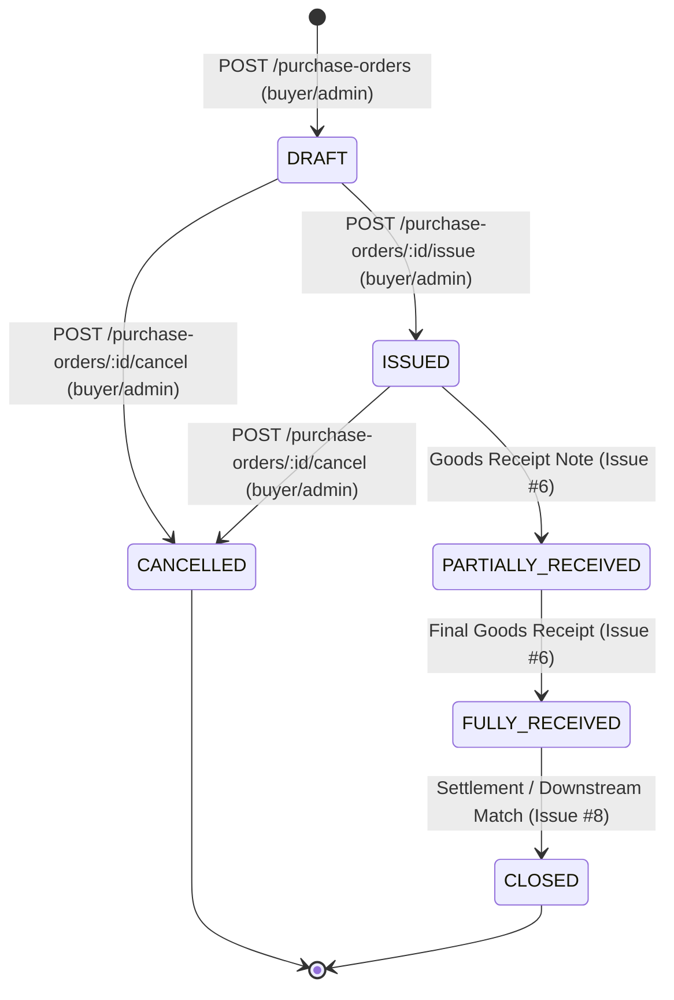

# Purchase Order Module Specification (Issue #5)

This document establishes the architectural, operational, and domain specifications for the **Purchase Order (PO) Module** in **SmartProcure-Pay**.

---

## 1. Module Overview & Responsibilities

The Purchase Order module provides lifecycle management, state transition enforcement, optimistic concurrency control, arbitrary-precision financial arithmetic, and auditable event tracking for purchasing documents within SmartProcure-Pay.

### Key Architectural Boundaries:
- **Direct Ownership**: The module directly creates and governs the `DRAFT` ──► `ISSUED` transition and legitimate order cancellations (`DRAFT` ──► `CANCELLED`, `ISSUED` ──► `CANCELLED`).
- **Downstream Ownership**: Transition to `PARTIALLY_RECEIVED` and `FULLY_RECEIVED` is explicitly owned by the Goods Receipt module ([Issue #6](https://github.com/hieunofun/SmartProcure-Pay/issues/6)). Transition to `CLOSED` is orchestrated upon settlement of all physical and financial obligations ([Issue #8](https://github.com/hieunofun/SmartProcure-Pay/issues/8)).
- **Workflow Decoupling**: Formal approval workflows (e.g. multi-tier managerial sign-off via Flowable BPMN) and the intermediate `PENDING_APPROVAL` status are deferred to [Issue #9](https://github.com/hieunofun/SmartProcure-Pay/issues/9). The module avoids premature internal workflow mocks.

---

## 2. Status Lifecycle & State Machine

The Purchase Order lifecycle is strictly aligned with the canonical database domain schema merged in Issue #2 (`database/migrations/003_create_purchase_orders.sql`):



### Transition Ownership Matrix

| From Status | To Status | Allowed? | Owning Component / Module | Business Rules / Constraints |
|:---|:---|:---:|:---|:---|
| *(none)* | `DRAFT` | **Yes** | Purchase Orders Module (`POST /purchase-orders`) | Requires active supplier, >= 1 item, strictly positive quantities. |
| `DRAFT` | `ISSUED` | **Yes** | Purchase Orders Module (`POST /purchase-orders/:id/issue`) | Requires supplier active, items >= 1, internally consistent totals. |
| `DRAFT` | `CANCELLED` | **Yes** | Purchase Orders Module (`POST /purchase-orders/:id/cancel`) | Requires non-empty `reason` string and matching `expectedVersion`. |
| `ISSUED` | `CANCELLED` | **Yes** | Purchase Orders Module (`POST /purchase-orders/:id/cancel`) | Prohibited once physical goods receipt notes exist downstream. |
| `DRAFT` | `DRAFT` (Edit) | **Yes** | Purchase Orders Module (`PATCH /purchase-orders/:id`) | Content mutable only while in `DRAFT`. Optimistic locking enforced. |
| `ISSUED` | *(Mutation)* | **No** | Rejected (HTTP 409 Conflict) | Line items, quantities, and pricing are immutable after issuance. |
| `ISSUED` | `PARTIALLY_RECEIVED` | Deferred | Goods Receipt Module ([Issue #6](https://github.com/hieunofun/SmartProcure-Pay/issues/6)) | Triggered when accepted quantity < ordered quantity on GRN. |
| `PARTIALLY_RECEIVED` | `FULLY_RECEIVED` | Deferred | Goods Receipt Module ([Issue #6](https://github.com/hieunofun/SmartProcure-Pay/issues/6)) | Triggered when cumulative accepted quantity reaches 100%. |
| `FULLY_RECEIVED` | `CLOSED` | Deferred | Downstream Settlement ([Issue #8](https://github.com/hieunofun/SmartProcure-Pay/issues/8)) | Triggered when 3-way match passes and invoice payments settle. |
| `CLOSED` | `CANCELLED` | **No** | Strictly Prohibited (HTTP 409 Conflict) | Cannot cancel completed business records. |

---

## 3. Server-Side Financial Arithmetic & Precision Strategy

Binary floating-point arithmetic (IEEE 754) is strictly prohibited across all financial calculations and persistence boundaries.

### Precision Engine: `decimal.js`
- **Library**: `decimal.js` (MIT, pinned at `^10.6.0`).
- **Rounding Mode**: `Decimal.ROUND_HALF_UP` (Standard accounting half-up rounding).
- **Persistence Boundary**: PostgreSQL `NUMERIC` fields (`ordered_quantity`, `unit_price`, `tax_rate`, `line_subtotal`, `tax_amount`, `line_total`, `subtotal`, `total_amount`) are queried and returned as **exact decimal strings** (e.g. `'399.75'`). Binary floating-point casting (`::float8`) is eliminated.

### Calculation Formulas:
$$\text{lineSubtotal} = \text{ROUND}(\text{orderedQuantity} \times \text{unitPrice}, 2)$$
$$\text{taxAmount} = \text{ROUND}(\text{lineSubtotal} \times \text{taxRate}, 2)$$
$$\text{lineTotal} = \text{lineSubtotal} + \text{taxAmount}$$
$$\text{PO subtotal} = \sum \text{lineSubtotal}$$
$$\text{PO taxAmount} = \sum \text{line taxAmount}$$
$$\text{PO totalAmount} = \text{subtotal} + \text{taxAmount}$$

- **Edge Case Protection**: Correctly handles edge cases that native JS fails (e.g. `10.075` rounds to `10.08`, `1.005` rounds to `1.01`).
- **Scale & Precision Boundaries at API Gateway**:
  - `orderedQuantity`: Decimal string, $> 0$, max 4 decimal places, fits `NUMERIC(18,4)`.
  - `unitPrice`: Decimal string, $\ge 0$, max 4 decimal places, fits `NUMERIC(18,4)`.
  - `taxRate`: Decimal string, $\ge 0$, max 4 decimal places, fits `NUMERIC(7,4)`.
  - **No Implicit Rounding**: Excess scale (e.g. `"1.00495"`) is strictly rejected at the validation boundary with **HTTP 400 Bad Request** to prevent database quantization discrepancies between creation and pre-issue verification.
  - **Strict String Type**: Only decimal strings are accepted; native JavaScript numbers are rejected to prevent IEEE-754 precision loss during JSON serialization.
- **Reconciliation Integrity**: Summing pre-rounded line values ensures that $\sum \text{lineSubtotal}$ exactly matches the sum of stored invoice lines without fractional drift.
- **Pre-Issue Total Verification**: Before transitioning `DRAFT` ──► `ISSUED`, the service recalculates line items and asserts exact decimal string equality against persisted `subtotal`, `tax_amount`, and `total_amount`. Mismatches are rejected with HTTP 409 Conflict.

---

## 4. Optimistic Concurrency Control

To prevent lost updates under multi-user concurrent operations:
1. **Schema**: `purchase_orders` contains `version INTEGER NOT NULL DEFAULT 1` (`database/migrations/009_add_po_optimistic_lock.sql`).
2. **Atomic Update Query Pattern**:
   ```sql
   UPDATE purchase_orders
   SET ...,
       version = version + 1
   WHERE id = $id
     AND version = $expectedVersion;
   ```
3. **Conflict Handling**: If `rowCount === 0` (indicating concurrent mutation or stale version), throws HTTP 409 Conflict:
   ```json
   {
     "statusCode": 409,
     "message": "Optimistic lock conflict: Purchase Order version is 2, expected 1. Please reload and retry."
   }
   ```

---

## 5. Concurrency-Safe PO Number Generation

PO numbers must be deterministic, auditable, and race-condition free:
1. **Sequence**: Controlled by dedicated PostgreSQL sequence `purchase_order_number_seq` (created in migration `009_add_po_optimistic_lock.sql`).
2. **Format**: `PO-YYYY-XXXXXX` (e.g., `PO-2026-000001`).
3. **Safety**: Generates via `SELECT 'PO-' || to_char(CURRENT_DATE, 'YYYY') || '-' || lpad(nextval('purchase_order_number_seq')::text, 6, '0')`, preventing duplicate numbers even under heavy concurrent creation.

---

## 6. Atomic Database Transactions & Audit Logging

Every state mutation executes inside an atomic PostgreSQL database transaction (`BEGIN ... COMMIT / ROLLBACK`):

### PO Creation:
```sql
BEGIN;
  INSERT INTO purchase_orders (...) RETURNING ...;
  INSERT INTO purchase_order_items (...) [for each item];
  INSERT INTO audit_records (
    entity_type,
    entity_id,
    event_type,
    actor_subject,
    metadata
  ) VALUES (
    'PURCHASE_ORDER',
    $1,
    'PO_CREATED',
    $2,
    $3::jsonb
  );
COMMIT;
```

### Audit Schema Alignment (Issue #2):
Conforms strictly to the canonical `audit_records` schema:
- `id UUID PRIMARY KEY`
- `entity_type VARCHAR(50) NOT NULL` ('PURCHASE_ORDER')
- `entity_id UUID NOT NULL` (PO UUID)
- `event_type VARCHAR(50) NOT NULL` (`PO_CREATED`, `PO_UPDATED`, `PO_ISSUED`, `PO_CANCELLED`)
- `actor_subject VARCHAR(100)` (Authenticated Keycloak `sub`)
- `payload_hash VARCHAR(128)` (NULL until Issue #10 ImmuDB integration)
- `metadata JSONB` (Structured context: `actorRoles`, `poNumber`, `status`, `totalAmount`, etc.)
- `created_at TIMESTAMPTZ NOT NULL`

---

## 7. Role-Based Access Control (RBAC)

- **`buyer` / `admin`**: Full mutation authority (`POST /purchase-orders`, `PATCH /purchase-orders/:id`, `POST /purchase-orders/:id/issue`, `POST /purchase-orders/:id/cancel`).
- **`warehouse`, `accountant`, `finance_manager`**: Read-only access (`GET /purchase-orders`, `GET /purchase-orders/:id`). Mutations return HTTP `403 Forbidden`.
- **Unauthenticated**: Returns HTTP `401 Unauthorized`.

---

## 8. REST API Reference

All requests pass through Apache APISIX Gateway (`http://localhost:9080/api/purchase-orders`) or directly to NestJS backend (`http://localhost:4000/purchase-orders`).

### 1. Create Purchase Order
- **Path**: `POST /purchase-orders`
- **Roles**: `buyer`, `admin`
- **Request Body**:
  ```json
  {
    "supplierId": "a0eebc99-9c0b-4ef8-bb6d-6bb9bd380a11",
    "currency": "USD",
    "orderDate": "2026-10-04",
    "expectedDeliveryDate": "2026-10-25",
    "items": [
      {
        "sku": "SENS-OPT-01",
        "description": "High Precision Optical Sensor",
        "orderedQuantity": "3",
        "unitPrice": "100.25",
        "taxRate": "0.10"
      }
    ]
  }
  ```
- **Response**: `201 Created` with full entity and server-computed exact decimal strings.

### 2. List Purchase Orders (Paginated)
- **Path**: `GET /purchase-orders?page=1&limit=20&status=DRAFT`
- **Roles**: `buyer`, `admin`, `warehouse`, `accountant`, `finance_manager`
- **Response**: `200 OK`

### 3. Get Purchase Order Details
- **Path**: `GET /purchase-orders/:id`
- **Roles**: `buyer`, `admin`, `warehouse`, `accountant`, `finance_manager`
- **Response**: `200 OK` with header details and line items.

### 4. Update DRAFT Purchase Order
- **Path**: `PATCH /purchase-orders/:id`
- **Roles**: `buyer`, `admin`
- **Request Body**:
  ```json
  {
    "expectedVersion": 1,
    "currency": "EUR"
  }
  ```
- **Response**: `200 OK` (version incremented to 2) or `409 Conflict`.

### 5. Issue Purchase Order
- **Path**: `POST /purchase-orders/:id/issue`
- **Roles**: `buyer`, `admin`
- **Request Body**:
  ```json
  {
    "expectedVersion": 2
  }
  ```
- **Response**: `200 OK` (status set to `ISSUED`, version incremented to 3).

### 6. Cancel Purchase Order
- **Path**: `POST /purchase-orders/:id/cancel`
- **Roles**: `buyer`, `admin`
- **Request Body**:
  ```json
  {
    "expectedVersion": 1,
    "reason": "Supplier announced inability to fulfill delivery schedule"
  }
  ```
- **Response**: `200 OK` (status set to `CANCELLED`, `cancelled_at` set, `cancelled_reason` recorded).

---

## 9. Swagger / OpenAPI Documentation

- **Hardened Production Default**: Swagger documentation is **OFF by default** in production (`NODE_ENV=production`) to minimize attack surface.
- **Activation**: Enabled if `ENABLE_SWAGGER=true` is explicitly set, or automatically enabled in non-production environments (`development`, `test`).
- **Endpoint**: `/docs` when enabled.

---

## 10. Testing & Verification Architecture

The module is verified across two distinct testing tiers:

1. **Unit & Controller E2E Tests** (`apps/api/test/`):
   - Fast isolated validation with mocked repository.
   - Asserts input validation, RBAC guards, lifecycle assertions, and Decimal arithmetic rounding edge cases.
2. **Real PostgreSQL & Gateway Integration Validation** (`infra/procurement/validate-purchase-orders.sh`):
   - Executed against the real running Docker stack (Keycloak + APISIX + NestJS + PostgreSQL).
   - Validates live SQL execution, actual `audit_records` inserts, optimistic lock races, and database transaction atomic rollback.
