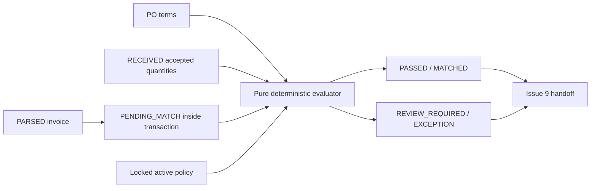

# Deterministic 3-Way Matching (Issue #8, 3WM-1.0)

Issue #34 extends new evaluations to **3WM-1.1** with effective pending/approved quantity claims. Historical 3WM-1.0 snapshots are preserved. See [quantity reservations](QUANTITY_RESERVATIONS.md) for current allocation, approval and release rules; the original module scope below describes Issue #8.

## Scope and lifecycle

The PostgreSQL PO defines purchase terms, RECEIVED GRNs define physically accepted stock, and the invoice defines the supplier claim. Issue #7's structured PARSED invoice is the input. Issue #8 never creates approval_cases or writes APPROVED/READY_FOR_PAYMENT. Issue #9 owns approval/payment routing. SmartProcureInvoice v1 and the verified Matbao/MIFI VAT subset remain Issue #7 ingestion profiles; matching makes no additional XML/provider/signature claim.



PENDING_MATCH is an intermediate transactional state, not an asynchronous queue. All results are completed synchronously. A technical failure rolls back to the original PARSED invoice with no result, partial mapping or successful audit. Completed business discrepancies return HTTP 200; repeated requests return 409 MATCH_ALREADY_EXISTS. The MVP allows one result per invoice and has no rematch endpoint.

## Exact item resolution

1. Verify a non-NULL po_item_id belongs to this PO, then use it.
2. Otherwise a present SKU requires exactly one normalized PO SKU candidate. Bad/blank present SKU never falls back to description.
3. Only NULL SKU falls back to exact normalized description.
4. Zero/multiple candidates give UNRECOGNIZED_ITEM/AMBIGUOUS_ITEM and keep the mapping NULL.
5. Resolved SKU or existing-reference description differences give ITEM_DESCRIPTION_MISMATCH while retaining the exact mapping.

Both normalizers use Unicode NFKC, trim, collapse internal whitespace to a single space and uppercase without locale-dependent collation. Punctuation, word boundaries and words remain meaningful. There is no translation, stemming, edit-distance, embedding, vector, LLM or fuzzy/AI fallback. Indexes in the pure resolver avoid scanning all PO lines for each invoice line.

## Accepted quantities and previous consumption

Only goods_receipts.status=RECEIVED contributes goods_receipt_items.accepted_quantity. Gross received_quantity, rejected_quantity and DRAFT/CANCELLED GRNs do not contribute. SQL loads set-based aggregates after locking the PO; the pure aggregation helpers also enforce the stated statuses.

Previous consumption follows match_result_items → match_results → invoices → invoice_items. It counts exact invoice quantities for PASSED results only while the invoice remains MATCHED, APPROVED or READY_FOR_PAYMENT. Exclude the current invoice and every PARSED/PENDING_MATCH/EXCEPTION/REJECTED/CANCELLED invoice. Historical MATCHED invoices without a PASSED result are not silently considered valid; they require explicit audited reconciliation/backfill. The original schema seed has such legacy data; real acceptance creates prior valid matches through the API.

For each mapped PO item:

```text
receivedAvailable = cumulativeAcceptedReceived - previousValidInvoicedQuantity
poAllowed = orderedQuantity * (1 + quantityTolerancePercent / 100)
poAvailable = poAllowed - previousValidInvoicedQuantity
availableToInvoice = max(0, min(receivedAvailable, poAvailable))
```

Sum all current invoice lines mapped to the same PO item before testing the ceiling. Partial invoices pass when within availability; matching does not require full ordered quantity. Zero accepted quantity gives MISSING_GRN; aggregate over availability gives QUANTITY_MISMATCH on every line in that group.

Allocation follows ascending unique invoice line_number. Persist orderedQuantity, cumulativeAcceptedReceived, previousValidInvoicedQuantity, quantityTolerancePercent, poAllowed, receivedAvailable, poAvailable, availableToInvoice, invoiceAggregateQuantity, allocatedReceivedQuantity and uncoveredQuantity. Allocation is rounded **down** to the representable four decimal places, preventing persistence from rounding a tiny tolerance into stock. Quantity tolerance permits over-PO billing only when the stock was physically accepted.

matched_received_quantity is an explanatory allocation, not a reservation. REVIEW_REQUIRED invoices consume nothing in later matching. Only PASSED results in valid downstream states consume their actual invoice quantity.

## Financial/document rules and precision

All PostgreSQL NUMERIC inputs are explicitly text strings. An isolated decimal.js clone uses 60-digit precision and ROUND_HALF_UP for explicit line money computations. There is no Number/parseFloat/Math.round in monetary or quantity decisions. Non-string, negative or non-finite legacy numeric inputs fail safely rather than bypassing comparisons.

- Price: abs(invoicePrice - poPrice) * 100 <= poPrice * priceTolerancePercent. This cross multiplication gives an inclusive exact decision without dividing. Zero PO price permits zero invoice price only.
- Tax: abs(invoiceTaxRate - poTaxRate) * 100 <= taxTolerancePercent, in **percentage points**. 0.1000 versus 0.0800 differs by 2 points.
- Totals: compare each invoice header subtotal/tax/total against sums of its own structured line fields, plus header conservation. Check legacy line subtotal/tax/total against quantity × invoice price (rounded to two places), line tax and line conservation. Never compare a partial invoice to the full PO total.
- Relative total comparison uses the same inclusive cross multiplication and totalTolerancePercent; zero expected value requires exact zero.
- Supplier: same supplier_id plus Issue #7's shared normalizeTaxCode for seller/PO supplier tax codes. No seller legal-name comparison exists because invoices lack a structured seller legal-name field.
- Currency: exact canonical stored currency equality.

Price/total percentage details include a 60-digit Decimal representation and exact numerator/denominator; repeating rational percentages cannot be represented by a finite decimal. Decisions use exact cross products, independently of displayed division.

Signed line unit_price_variance and tax_rate_variance compare invoice to PO. line_total_variance is signed invoice line total minus the PO-price/PO-tax expected amount for that invoice quantity; it is evidence, not a comparison to the whole PO. Header quantity_variance sums uncovered quantities, price_variance sums absolute unit-price differences, tax_variance sums signed actual minus PO-term line tax, and total_variance is signed declared invoice total minus sum(line_total). Codes, not cancelling signed summaries, determine pass/fail. Persist strings at quantity/price 18,4, rate 7,4 and money 18,2; values exceeding existing schema bounds cause safe transactional failure.

## Policy, snapshots and migration 012

Migration 012 adds total_tolerance_percent (5,2, 0..100), one active matching policy, per-invoice/per-line uniqueness, discrepancy arrays, historical policy JSON, completed_at, duration (12,3), line tax/total variances and explanatory JSON. It reuses all migration 006 tables and useful migration 008 indexes; composite receipt/consumption indexes support the new aggregates. No old migration changes.

When no active policy exists, seed MATCH_DEFAULT with quantity 0.00%, price 1.00%, tax 0.00 percentage points and total 0.00%. Existing active policies are preserved. Multiple active policies or multiple historical results for one invoice fail migration clearly; they are not silently repaired. An inactive historical MATCH_DEFAULT code collision also requires operator review. Legacy results keep empty snapshot defaults rather than fabricated historical evidence.

Every new result snapshots policyCode, all four tolerance strings and ruleVersion=3WM-1.0. Later policy edits do not change old results. PATCH accepts only supplied strict decimal **strings**, 0..100 with at most two decimal places; numeric JSON values, NULL, unknown fields and empty updates fail validation.

## Discrepancies and persisted results

The stable unique discrepancy priority is:
SUPPLIER_MISMATCH, SELLER_TAX_CODE_MISSING, SELLER_TAX_CODE_MISMATCH, CURRENCY_MISMATCH, UNRECOGNIZED_ITEM, AMBIGUOUS_ITEM, ITEM_DESCRIPTION_MISMATCH, MISSING_GRN, QUANTITY_MISMATCH, PRICE_MISMATCH, TAX_MISMATCH, TOTAL_MISMATCH.

Relevant blocking document codes propagate to every line. Every invoice line has one result line: MATCHED with no code, MISMATCHED for a resolved discrepancy or EXCEPTION for unresolved/ambiguous mapping. reason_code is the first priority code; discrepancy_codes contains all applicable codes. overall_confidence and semantic_confidence remain NULL. Details retain normalized document identity, currency, SKU/descriptions, allocation, price/tax/total evidence.

## Transaction, locks, audit and query bounds

```mermaid
sequenceDiagram
  actor Actor
  participant API as NestJS
  participant DB as PostgreSQL
  participant E as Pure evaluator
  Actor->>API: Authenticated match(invoiceId)
  API->>DB: BEGIN; lock invoice FOR UPDATE
  API->>DB: Reject existing result / non-PARSED
  API->>DB: Lock parent PO FOR UPDATE
  API->>DB: Lock policy/supplier FOR SHARE
  API->>DB: Read lines, accepted GRNs, prior PASSED quantities
  API->>DB: PARSED → PENDING_MATCH
  API->>E: Structured input and locked policy
  E-->>API: Deterministic result and line details
  API->>DB: Bulk result lines + exact mappings
  API->>DB: MATCHED or EXCEPTION + audits
  API->>DB: COMMIT (or ROLLBACK on technical failure)
  API-->>Actor: HTTP 200 PASSED or REVIEW_REQUIRED
```

The invoice lock gives one winner for the same invoice. The parent PO lock serializes different invoices sharing remaining stock and is compatible with the existing GRN receive/cancel PO locks. Matching explicitly sets PostgreSQL READ COMMITTED for its transaction, independently of the database/session default. Statements re-read availability **after** the PO lock; results from an earlier pre-lock snapshot are never used. Supplier/policy share locks stabilize their inputs. Admin policy updates take FOR UPDATE.

Matching uses 19 fixed client-issued SQL statements inside a successful transaction, excluding BEGIN/COMMIT, regardless of line count: bulk JSON recordset INSERT/UPDATE removes per-line round trips. Reads use at most three fixed statements. Index and in-memory grouping costs scale with data, but round trips are bounded.

MATCHING_COMPLETED records invoiceId/number, PO ID/number, statuses, snapshot/version, codes, total/matched/exception line counts, duration and actor roles. INVOICE_MATCHED/INVOICE_EXCEPTION captures PARSED → PENDING_MATCH → final state. MATCHING_POLICY_UPDATED records policyCode, previous/new snapshot values, authenticated admin subject and roles. All audits share the transaction; audit failure rolls back everything. No raw XML/PDF, secrets or JWTs enter the response/audit.

## API and RBAC

| Endpoint | Roles |
|---|---|
| POST /invoices/:invoiceId/match | accountant, admin |
| GET /invoices/:invoiceId/match-result | accountant, admin, finance_manager, buyer, warehouse |
| GET /match-results/:id | Same read roles |
| GET /matching/policy | Same read roles |
| PATCH /matching/policy | admin |

The match request has no business input body; only the path invoice UUID selects trusted PostgreSQL state. JwtAuthGuard, RolesGuard and CurrentUser are reused. Missing auth gives 401, disallowed roles 403, invalid input 400, missing records 404, existing result/invalid state 409, and sanitized technical failures 503. PENDING_MATCH is not externally committed on failure.

## Validation and performance scope

Every named standard scenario is tested: perfect match, partial receipt, price, quantity and tax mismatch. The pure matching/domain folder has V8 coverage targeting 100% statements/branches/functions/lines, measured explicitly by CI; this is **not** global repository coverage. Additional tests cover item resolution, missing GRN, receipt/prior-state exclusion, split allocation, quantity/price/tax/total tolerance boundaries, zero prices/totals, document identity, non-finite legacy input, determinism and ordering.

HTTP E2E explicitly mocks auth/repository and tests controller/service contracts, production implicit-conversion decimal validation and RBAC. Real acceptance is infra/matching/validate-three-way-matching.sh with the existing Keycloak → APISIX → NestJS → PostgreSQL stack and no matching repository mock. Synthetic SQL setup avoids rerunning upstream creation tests; existing PO/GRN/invoice acceptance scripts remain unchanged.

The real suite proves all 14 required scenarios, exact persistence/audits/mappings, document-level propagation, ambiguity, split lines and controlled technical/policy-audit rollback. Real row-lock barriers wait until both requests are blocked before release, proving same-invoice and cross-invoice overlap. Only explicit gateway 429 is retried with a bounded delay, preserving the existing security quota; no other errors are retried.

Warm the process with a separate 100-line match, then measure another fixture: 100 PO lines, 100 invoice lines and 200 accepted GRN-line records across two RECEIVED GRNs. evaluationDurationMs wraps only evaluateMatching with performance.now(), excluding token issuance, network, SQL, fixture setup and startup. Assert the persisted metric <1000ms and print its observed value. There is no artificial evaluator delay and no full HTTP sub-second claim.

Run the normal build/lint/unit/E2E/schema and existing real suites unchanged, plus the domain coverage and new matching acceptance CI steps. No new runtime dependencies were introduced.

## Remaining boundaries

No rematch/manual correction API, supplier legal-name field, workflow/approval routing, blacklist, payment integration, AI confidence or ImmuDB sealing is provided. Legacy records lacking seller tax code or historical PASSED evidence require explicit migration/backfill review. Direct external SQL writers must follow PO locking and trusted-state ownership; the supported application transactions serialize quantity changes. Issue #9 can consume MATCHED/EXCEPTION outcomes and immutable policy evidence without modifying matching decisions.
