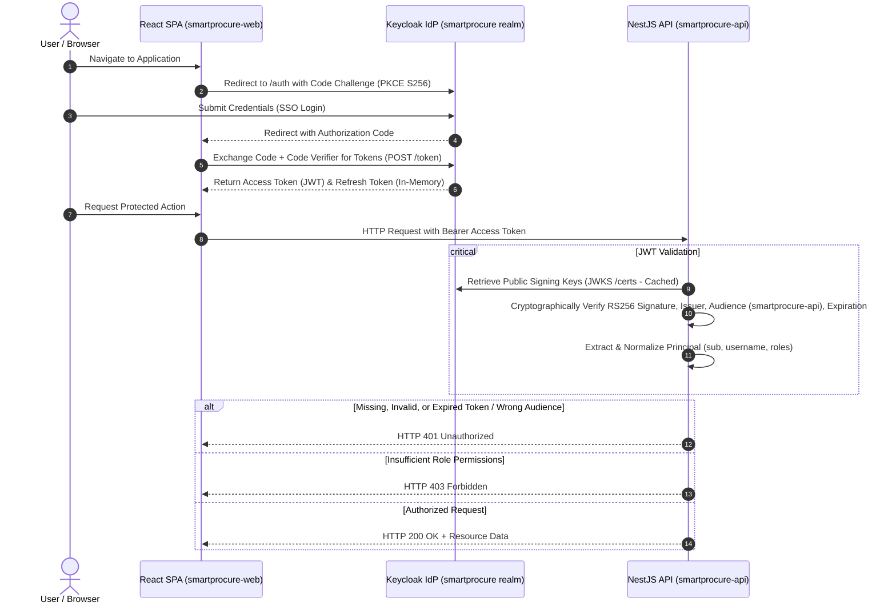

# Identity Architecture & Role-Based Access Control (RBAC)

This document specifies the identity, authentication, and authorization architecture for **SmartProcure-Pay**, implemented via **Keycloak** as the centralized Identity Provider (IdP) supporting OpenID Connect (OIDC) and OAuth 2.0 standards.

---

## 1. Architectural Overview & Boundaries

SmartProcure-Pay enforces a strict separation of concerns across authentication, application routing, and data storage:

- **Identity Provider (Keycloak)**: Sole authority managing identity records, authentication credentials, user sessions, OIDC token issuance, and realm roles.
- **Relational Domain Store (PostgreSQL)**: Stores business domain entities (Purchase Orders, Goods Receipts, Invoices, Reconciliations, Audit Records). No password hashes or authentication credentials exist in PostgreSQL. The Keycloak subject identifier (`sub`) acts as the immutable foreign identity reference.
- **Frontend SPA (React + Vite)**: Authenticates end users through OpenID Connect Authorization Code Flow with PKCE (`S256`). Access tokens are held exclusively in memory runtime. Direct password grants are disabled on the SPA client.
- **Backend API (NestJS)**: Stateless Bearer token resource server. Validates cryptographically signed JWTs using Keycloak JSON Web Key Sets (JWKS), enforces expected audience (`smartprocure-api`), normalizes user principals, and enforces fine-grained Role-Based Access Control (RBAC).



---

## 2. Keycloak Realm Configuration

- **Realm Name**: `smartprocure`
- **Configuration File**: [`infra/keycloak/realm-smartprocure.json`](../../infra/keycloak/realm-smartprocure.json)
- **Deployment Mode**: Automated import via Docker Compose (`start-dev --import-realm`).
- **Version Baseline**: Pinned known-working version `24.0.5` (Quarkus-based). Version `26.8.0` was evaluated; migration to the 26.x series is planned as a dedicated follow-up due to breaking changes in realm JSON schemas and Infinispan session marshalling.
- **Endpoints**:
  - OpenID Configuration: `http://localhost:8080/realms/smartprocure/.well-known/openid-configuration`
  - JWKS Endpoint: `http://localhost:8080/realms/smartprocure/protocol/openid-connect/certs`
  - Token Endpoint: `http://localhost:8080/realms/smartprocure/protocol/openid-connect/token`
  - Authorization Endpoint: `http://localhost:8080/realms/smartprocure/protocol/openid-connect/auth`

---

## 3. OIDC Clients

The realm defines three logical clients adhering to OAuth 2.0 / OIDC specifications:

| Client ID | Client Type | Authentication Flow | PKCE | Audience / Scope | Usage | Environment |
| :--- | :--- | :--- | :--- | :--- | :--- | :--- |
| `smartprocure-web` | Public | Authorization Code | S256 | `smartprocure-api` | React SPA browser sessions | All Environments |
| `smartprocure-ci` | Public | Direct Grant (Password) | N/A | `smartprocure-api` | Automated CI & local validation | DEV / CI ONLY |
| `smartprocure-api` | Bearer-Only | Bearer JWT Validation | N/A | Resource Server | NestJS backend API validation | All Environments |

### Client Security Specifications:
1. **Public Client (`smartprocure-web`)**:
   - `publicClient: true` — No client secret is ever stored or exposed in the client-side JavaScript bundle.
   - `standardFlowEnabled: true` — Standard Authorization Code Grant.
   - `directAccessGrantsEnabled: false` — Password grant is disabled on the production SPA client.
   - `pkceCodeChallengeMethod: "S256"` — Cryptographically prevents authorization code interception.
   - `redirectUris`: Strictly configured to `http://localhost:3000/*` and `http://127.0.0.1:3000/*`.
   - `webOrigins`: Restricted to `http://localhost:3000` and `http://127.0.0.1:3000`.
   - Includes audience protocol mapper injecting `smartprocure-api` into the `aud` claim.
2. **Dedicated CI Client (`smartprocure-ci`)**:
   - `directAccessGrantsEnabled: true` — Dedicated exclusively to automated CI integration scripts.
   - `standardFlowEnabled: false`, `implicitFlowEnabled: false`.
   - Includes audience protocol mapper injecting `smartprocure-api` into the `aud` claim.
   - **Must not be deployed or enabled in staging or production environments.**
3. **Resource Server (`smartprocure-api`)**:
   - `bearerOnly: true` — Only verifies incoming tokens; never acts as a login initiator.

---

## 4. Official Realm Roles

The `smartprocure` realm defines 5 official roles:

| Role Name | Scope & Responsibilities | Business Context |
| :--- | :--- | :--- |
| `admin` | Global system administration, configuration, audit oversight | Operational management, diagnostics |
| `buyer` | Purchase Order creation, PO amendment, vendor communications | Procurement lifecycle initiator |
| `warehouse` | Goods Receipt Note (GRN) generation, quantity inspection | Logistics & receiving intake |
| `accountant` | e-Invoice ingestion, 3-way matching reviews, dispute handling | AP accounting & reconciliation |
| `finance_manager` | Variance approval, payment authorization, treasury execution | Financial authority & release |

Internal Keycloak operational roles (`default-roles-smartprocure`, `offline_access`, `uma_authorization`) are explicitly filtered out by backend and frontend claim normalizers to ensure only business roles govern access control.

---

## 5. Development & Demo Accounts (DEV ONLY)

For automated CI validation and local developer evaluation, the realm provides 5 pre-configured demo accounts.

> [!WARNING]
> **DEVELOPMENT ONLY CREDENTIALS**: All demo accounts are strictly for local testing and CI demonstration. Never deploy these accounts to staging or production environments.

- **Default Password**: `DemoPassword123!` (Configured as non-temporary in dev realm export).

| Username | Email | Assigned Realm Role | Intended Verification |
| :--- | :--- | :--- | :--- |
| `admin.demo` | `admin.demo@smartprocure.local` | `admin` | Global administrative endpoints |
| `buyer.demo` | `buyer.demo@smartprocure.local` | `buyer` | Purchase order operations & general access |
| `warehouse.demo` | `warehouse.demo@smartprocure.local` | `warehouse` | Goods intake operations |
| `accountant.demo` | `accountant.demo@smartprocure.local` | `accountant` | Invoicing & reconciliation |
| `finance.demo` | `finance.demo@smartprocure.local` | `finance_manager` | Payment authorization & approvals |

---

## 6. Frontend Token Handling & Storage

1. **In-Memory Storage**:
   - Access tokens and refresh tokens remain strictly inside the runtime closure of the OIDC adapter (`keycloak-js`).
   - Tokens are **never** persisted to `localStorage` or `sessionStorage` to mitigate Cross-Site Scripting (XSS) token extraction.
2. **Lifecycle Management**:
   - The application invokes `keycloak.updateToken(30)` immediately prior to executing authenticated HTTP requests, refreshing the token transparently if its remaining validity is under 30 seconds.
   - If the refresh token expires or is revoked, the session is cleared in memory and the user is redirected to Keycloak login.
3. **Information Disclosure Prevention**:
   - Access tokens and refresh tokens are excluded from browser console output, crash reporting, and client logs.

---

## 7. Backend JWT Validation & RBAC Architecture

The backend authentication pipeline is implemented as a standalone, modular infrastructure package in `apps/api/src/auth/`:

```
apps/api/src/auth/
├── auth.controller.ts            # Technical verification endpoints (/auth/me, /auth/admin-test, /auth/buyer-test)
├── auth.module.ts                # NestJS module bundling and exporting auth providers
├── auth.service.ts               # Remote JWKS retrieval, caching, JWT signature & claim verification
├── decorators/
│   ├── current-user.decorator.ts # Param decorator extracting normalized AuthenticatedUser
│   ├── public.decorator.ts       # Decorator bypassing authentication for public routes
│   └── roles.decorator.ts        # Decorator declaring required realm roles
├── guards/
│   ├── jwt-auth.guard.ts         # Authentication guard enforcing valid Bearer JWT
│   └── roles.guard.ts            # RBAC guard enforcing required realm roles
└── interfaces/
    ├── authenticated-user.interface.ts # Normalized user principal contract
    └── keycloak-jwt-payload.interface.ts # Raw Keycloak token payload contract
```

### Verification Rules
Each incoming token must satisfy all of the following criteria cryptographically:
1. **Signature Verification**: Validated against RSA public keys fetched from Keycloak JWKS (`/certs`). Keys are cached with rate limiting to prevent denial-of-service on the IdP.
2. **Issuer Verification**: The `iss` claim must strictly match `KEYCLOAK_ISSUER`.
3. **Audience Verification**: The `aud` claim must match or contain the configured `KEYCLOAK_AUDIENCE` (`smartprocure-api`). Enforced cryptographically by `jwt.verify`.
4. **Expiration**: The `exp` claim must be in the future.
5. **Header Integrity**: The header must specify a valid Key ID (`kid`) corresponding to an active public key in the JWKS keystore.

### Principal Normalization
Upon successful cryptographic validation, the raw Keycloak payload is transformed into an application-neutral `AuthenticatedUser`:
```typescript
interface AuthenticatedUser {
  sub: string;       // Stable identity UUID from Keycloak
  username: string;  // preferred_username or sub fallback
  email?: string;    // User email address
  roles: string[];   // Normalized business realm roles
}
```

---

## 8. HTTP Status Code Semantics

The authentication and authorization layers maintain strict adherence to HTTP status specifications:

| Condition | HTTP Status | Response Payload | Description |
| :--- | :--- | :--- | :--- |
| Missing Authorization header | `401 Unauthorized` | `{ statusCode: 401, message: "Missing Authorization header", error: "Unauthorized" }` | Request lacked authentication credentials |
| Invalid token format / signature | `401 Unauthorized` | `{ statusCode: 401, message: "...", error: "Unauthorized" }` | Token is invalid, malformed, or signature check failed |
| Missing or wrong audience | `401 Unauthorized` | `{ statusCode: 401, message: "Token verification failed: jwt audience invalid...", error: "Unauthorized" }` | Token is not intended for smartprocure-api |
| Expired access token | `401 Unauthorized` | `{ statusCode: 401, message: "Token has expired", error: "Unauthorized" }` | Token is past expiration time |
| Valid token, missing role | `403 Forbidden` | `{ statusCode: 403, message: "Insufficient role permissions. Required one of: [...]", error: "Forbidden" }` | Identity is valid, but privileges are insufficient |
| Valid token & authorized role | `200 OK` | Endpoint-specific response | Operation permitted |

---

## 9. Technical Verification Endpoints

The API provides dedicated technical endpoints to prove authentication and authorization correctness:

- `GET /auth/me`: Requires authenticated user with audience `smartprocure-api`. Returns `{ sub, username, email, roles }`. Does not return raw tokens or internal secrets.
- `GET /auth/buyer-test`: Protected by `@Roles('buyer', 'admin')`. Allows access to `buyer` or `admin`. Returns `403 Forbidden` for other roles.
- `GET /auth/admin-test`: Protected by `@Roles('admin')`. Strictly accessible by `admin` only. Returns `403 Forbidden` for `buyer.demo`, `warehouse.demo`, etc.

---

## 10. Docker Compose Integration & Ports

The full stack operates seamlessly via Docker Compose:

| Container Service | Image | Internal Port | Host Port | Purpose |
| :--- | :--- | :--- | :--- | :--- |
| `smartprocure-postgres` | `postgres:16-alpine` | 5432 | 5432 | PostgreSQL Relational Database |
| `smartprocure-keycloak` | `quay.io/keycloak/keycloak:24.0.5` | 8080 | 8080 | Keycloak Identity Provider |
| `smartprocure-api` | Built from `apps/api/Dockerfile` | 4000 | 4000 | NestJS Application API |
| `smartprocure-web` | Built from `apps/web/Dockerfile` | 80 | 3000 | React + Nginx Web Application |

### Startup & Healthcheck Details
- **Docker Compose TCP Healthcheck**: `smartprocure-keycloak` uses a TCP socket probe (`exec 3<>/dev/tcp/127.0.0.1/8080 || exit 1`) to ensure reliable daemon port readiness within the minimal container base image (which omits curl/wget).
- **HTTP Realm & OIDC Readiness Validation**: Automated CI scripts (`infra/keycloak/validate-keycloak-auth.sh`) perform actual HTTP polling against `http://localhost:8080/realms/smartprocure` and `/.well-known/openid-configuration` before executing backend integration tests.

---

## 11. Production Hardening Checklist

When transitioning from development to staging/production:

1. **Disable Development Mode**: Switch Keycloak entrypoint from `start-dev` to `start --optimized`.
2. **Enforce HTTPS / TLS**: Configure TLS certificates across all endpoints. Set Keycloak `sslRequired: "external"` or `"all"`.
3. **Rotate Secrets**: Replace all development passwords and credentials with securely generated secrets managed via cloud key vaults or secrets managers.
4. **Disable CI Client**: Do not deploy or enable `smartprocure-ci` in staging/production environments.
5. **Enforce SPA PKCE Only**: Verify `smartprocure-web` has `directAccessGrantsEnabled: false` in production.
6. **Restrict Admin Console**: Do not expose Keycloak master realm admin console (`/admin`) on public internet ingress. Bind to internal VPN/bastion network only.
7. **Database Persistence for Keycloak**: In production, back Keycloak with a dedicated PostgreSQL database rather than ephemeral storage.
8. **Keycloak Version Upgrade**: Schedule migration from pinned known-working version `24.0.5` to the `26.x` series as a dedicated follow-up task.
